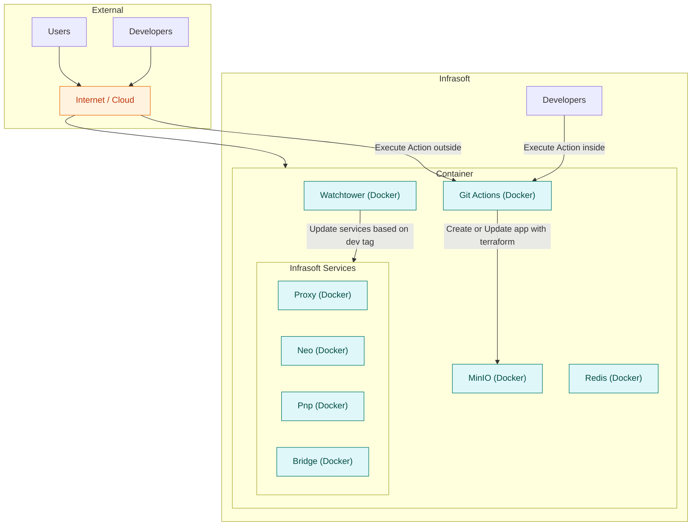

```mermaid
flowchart TB

    %% --- Main Groups ---

    subgraph Infrasoft ["Infrasoft"]

      i_Devs["Developers"]

      subgraph DockerContainer ["Container"]

          subgraph InfrasoftServices ["Infrasoft Services"]

              Proxy["Proxy (Docker)"]

              Neo["Neo (Docker)"]

              Pnp["Pnp (Docker)"]

              Bridge["Bridge (Docker)"]

          end


          MinIO["MinIO (Docker)"]

          Redis["Redis (Docker)"]

          GitActions["Git Actions (Docker)"]

          Watchtower["Watchtower (Docker)"]

      end

    end

    %% --- External Elements ---

    subgraph External

        o_users["Users"]

        o_Devs["Developers"]

        Cloud["Internet / Cloud"]

    end


    Watchtower -->|"Update services based on dev tag"| InfrasoftServices


    %% --- GitActions / Redis / MinIO Flows ---

    i_Devs["Developers"] -->|"Execute Action inside"| GitActions
    GitActions -->|"Create or Update app with terraform"| MinIO


    %% --- External Execution ---

   o_Devs["Developers"] --> Cloud -->|"Execute Action outside"| GitActions
   o_users["Users"] --> Cloud --> DockerContainer

    %% --- Styles ---

    classDef docker fill:#e0f7fa,stroke:#00796b,stroke-width:1px,color:#004d40;

    class Proxy,Neo,Pnp,Bridge,MinIO,Redis,GitActions,Watchtower docker;

    classDef external fill:#fff3e0,stroke:#ef6c00,stroke-width:1px,color:#bf360c;

    class Devs,Cloud,Acc external;
```
