Dans un projet de grande envergure, les transits de données doivent être validés.
Ainsi, dans le projet VNV, une multitude de processus de validation prennent place tant la donnée initiale doit être mise dans la bonne forme pour que le système puisse correctement interpréter et processer la data.

## Types de données

Notre système supporte quatre formats de données principaux, chacun ayant un rôle spécifique dans le cycle de vie des projets.

> **📖 Pour une description détaillée des formats Excel et ZIP (ESS), consultez le [Guide des formats ESS et VPI](../guide-ess-and-vpi-import-format).**

### Vue d'ensemble des formats

| Format | Description | Rôle |
|--------|-------------|------|
| **Excel (.xlsx)** | Format de base avec worksheets structurés | Import initial, export, archivage |
| **ZIP (ESS)** | Archive complète avec fichiers et arborescence | Session de travail, transfert, backup |
| **JSON Dataset** | Format pivot avec métadonnées inline (`@meta.*`) | Validation, transformation, debugging |
| **JSON VPI** | Format hiérarchique pour base de données | Stockage Neo4j, opérations métier |

### Hiérarchie des formats


**Caractéristiques clés :**

- **Excel** : Worksheets `#Project`, `#Itm#*`, `#Str#*`, `#Lst#*`, `#Rel` (voir [guide détaillé](../guide-ess-and-vpi-import-format#vpi---excel-format))
- **Dataset** : Même structure qu'Excel mais en JSON avec `@meta.*` flatten
- **VPI** : Structure `{ self, data: { nodes, meta, structures, lists, relations } }`
- **ZIP ESS** : Contient le projet (`.xlsx` ou `.json`) + arborescence de fichiers (voir [structure ZIP](../guide-ess-and-vpi-import-format/#ess---zip-format))

## Transformations

La data entrante peut être un Excel, ZIP ou JSON. Tous ces formats sont transformables entre eux via le **Dataset** qui agit comme format pivot central.


### Parsers disponibles

Le système fournit un ensemble complet de parsers bidirectionnels via la classe `ProjectEngineParsers` :

#### **Excel ↔ Dataset**
```typescript
// Excel → Dataset
ProjectEngineParsers.XlsBufferToDataset(buffer: Buffer): Promise<JSONDataset>

// Dataset → Excel
ProjectEngineParsers.DatasetToXls(dataset: JSONDataset): Promise<ExcelDocument>
```

#### **Dataset ↔ VPI**
```typescript
// Dataset → VPI
ProjectEngineParsers.DatasetToVpi(dataset: JSONDataset): Promise<ProxyProjectInstance>

// VPI → Dataset
ProjectEngineParsers.VpiToDataset(vpi: ProxyProjectInstance): Promise<JSONDataset>
```

#### **Excel ↔ VPI (Raccourcis)**
```typescript
// Excel → VPI (via Dataset)
ProjectEngineParsers.XlsBufferToVpi(buffer: Buffer): Promise<ProxyProjectInstance>

// VPI → Excel (via Dataset)
ProjectEngineParsers.VpiToXls(vpi: ProxyProjectInstance): Promise<ExcelDocument>
```

#### **ZIP ↔ VPI**
```typescript
// ZIP → VPI
ProjectEngineParsers.ZipBufferToVpi(buffer: Buffer): Promise<ProxyProjectInstance>

// VPI → ZIP
ProjectEngineParsers.VpiToZip(vpi: ProxyProjectInstance): Promise<Buffer>
```

### Pipeline de transformation

Voici les étapes détaillées pour chaque transformation :

#### 1. Excel → Dataset → VPI

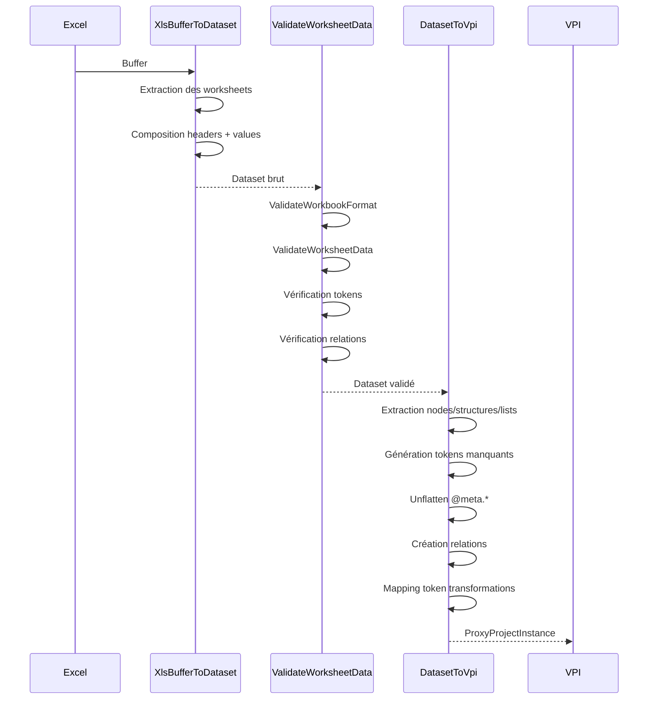

**Étapes clés :**

1. **Extraction** : Lecture des worksheets Excel et conversion en objets JSON
2. **Composition** : Alignement des headers avec les valeurs
3. **Validation format** : Vérification des noms de worksheets
4. **Validation données** : Vérification de la structure des données
5. **Unflatten** : Conversion `@meta.prop` → `meta: { prop: value }`
6. **Génération tokens** : Création de tokens valides si absents ou invalides
7. **Création VPI** : Construction de l'instance avec nœuds, métadonnées et relations

#### 2. VPI → Dataset → Excel

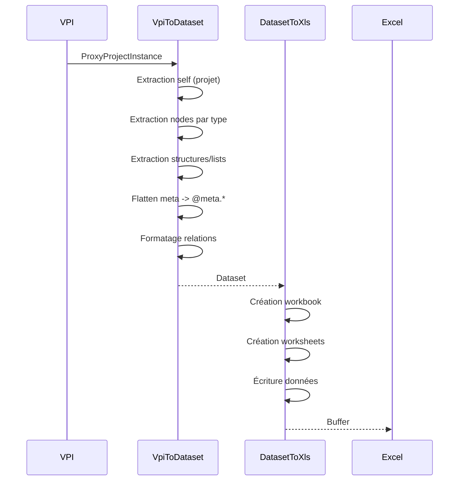

**Étapes clés :**

1. **Extraction** : Récupération des nœuds, structures, listes depuis le VPI
2. **Flatten** : Conversion `meta: { prop }` → `@meta.prop`
3. **Groupement** : Organisation par type dans des worksheets
4. **Formatage relations** : Ajout des types from/to
5. **Génération Excel** : Création du fichier avec en-têtes et données

#### 3. ZIP → VPI

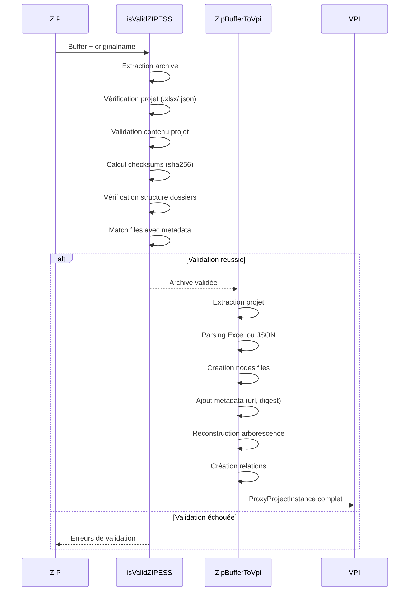

**Étapes clés :**

1. **Extraction** : Décompression du ZIP
2. **Validation structure** : Vérification présence du fichier projet
3. **Validation checksums** : Calcul SHA256 et comparaison avec métadonnées
4. **Parsing projet** : Conversion Excel/JSON → VPI
5. **Enrichissement files** : Ajout des métadonnées de fichiers (digest, url)
6. **Reconstruction arborescence** : Création des structures et enfants
7. **Création relations** : Linking files avec structures

#### 4. VPI → ZIP

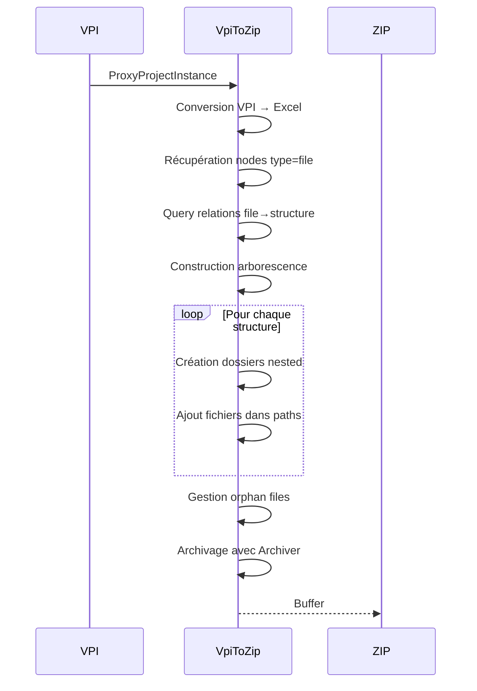

**Étapes clés :**

1. **Export Excel** : Conversion VPI → Dataset → Excel
2. **Query files** : Récupération de tous les nœuds de type `file`
3. **Résolution paths** : Détermination du path de chaque fichier via relations
4. **Construction arborescence** : Création récursive des dossiers
5. **Archivage** : Compression avec archiver (jszip)

## Validations

Le système implémente plusieurs couches de validation pour garantir l'intégrité des données à chaque étape.

### Architecture de validation

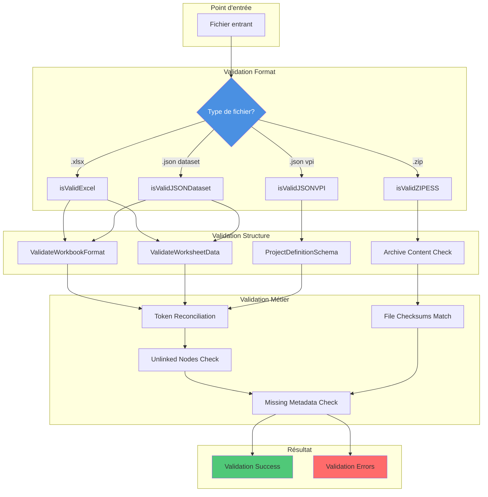

### 1. Validation Excel

**Fonction :**
```typescript
isValidExcel(excel: Buffer, collect: boolean): Promise<ValidationResult | boolean>
```

**Processus :**

1. **Conversion** : Excel Buffer → Dataset via `XlsBufferToDataset`
2. **Validation Dataset** : Appel de `isValidJSONDataset`

**Retourne :**
- `collect = false` : `boolean` (valide ou non)
- `collect = true` : `ValidationResult` détaillé avec erreurs

### 2. Validation JSON Dataset

**Fonction :**
```typescript
isValidJSONDataset(jsonData: Record<string, any>, collect: boolean): ValidationResult | boolean
```

**Validations effectuées :**

#### a. Format du Workbook (`ValidateWorkbookFormat`)
```typescript
refiners.isProjectTabName(data, context)
// ✓ Présence obligatoire du worksheet "#Project"

refiners.isValidTabsNames(data, context)
// ✓ Noms de worksheets conformes aux patterns
// ✓ #Itm#[Type]s pour les items
// ✓ #Str#[Nom] pour les structures
// ✓ #Lst#[Nom] pour les listes
// ✓ #Rel pour les relations
```

#### b. Données du Worksheet (`ValidateWorksheetData`)
```typescript
refiners.isValidNodeList(nodes, context)
// ✓ Validation schéma Zod pour chaque node
// ✓ Propriétés obligatoires : token, type, name

refiners.isValidStructureStack(structures, context)
// ✓ Validation schéma structures
// ✓ Propriétés : token, type, name

refiners.isValidListStack(lists, context)
// ✓ Validation schéma lists

refiners.isValidRelationList(relations, context)
// ✓ Validation schéma relations
// ✓ Propriétés : from_token, to_token, r_type, from_type, to_type

refiners.isValidChildsList(childs, context)
// ✓ Validation enfants de structures/lists
```

#### c. Cohérence Métier
```typescript
refiners.checkForTokenReconcilationValidity(data, context)
// ✓ Si token valide fourni → external_token obligatoire
// ✓ Si external_token fourni → token doit être valide
// ✓ Détecte les incohérences de synchronisation

refiners.checkForUnlinkedNodes(data, context)
// ✓ Tous les tokens référencés dans relations existent
// ✓ from_token doit matcher un node existant
// ✓ to_token doit matcher un node existant

refiners.checkForRelationsKinds(data, context)
// ✓ Types de relations valides (CONTAINS, HAS_LINK, HAS_CHILD, etc.)

refiners.checkForMissingMetadata(data, context)
// ✓ Métadonnées obligatoires présentes selon le type
```

**Structure de ValidationResult :**
```typescript
{
  success: boolean,
  msg?: string,
  errors?: ZodError[] // Détails des erreurs par path
}
```

### 3. Validation JSON VPI

**Fonction :**
```typescript
isValidJSONVPI(jsonData: Record<string, any>, collect: boolean): Promise<ValidationResult | boolean>
```

**Validations effectuées :**

#### a. Schéma VPI
```typescript
refiners.isValidVPI(jsonData, context)
// ✓ Structure conforme au ProjectDefinitionSchema
// ✓ Présence de self
// ✓ Présence de data { nodes, meta, relations, structures, lists }
```

#### b. Cohérence des tokens
```typescript
refiners.checkForTokenReconcilationValidity(jsonData, context)
// ✓ Mapping token ↔ external_token dans metadata
// ✓ Tokens valides pour nodes synchronisés
```

#### c. Réconciliation et validation finale
```typescript
// Conversion VPI → Dataset → VPI pour test de cohérence
let reconciliationResult = await reconciliateDumpTokens(jsonData)
return reconciliationResult.isValid()
```

**La fonction `reconciliateDumpTokens` :**
- Reconstruit un VPI complet depuis le dump
- Applique les métadonnées
- Reconstruit les structures et listes avec enfants
- Reformate les relations
- Retourne un `ProxyProjectInstance` validé

### 4. Validation ZIP ESS

**Fonction :**
```typescript
isValidZIPESS(file: { buffer: Buffer, originalname: string }): Promise<ValidationResult>
```

**Validations effectuées :**

#### a. Structure de l'archive
```typescript
archiveSchema.refine((files) => {
  // ✓ Présence de {token}/{token}.xlsx OU {token}/{token}.json
})
```

#### b. Validation du fichier projet
```typescript
if (ext == '.xlsx') {
  projectDefValidation = await isValidExcel(fileContentBuffer, true)
} else if (ext == '.json') {
  projectDefValidation = await isValidJSONVPI(JSON.parse(jsonString), true)
}
// ✓ Le fichier projet doit être valide
```

#### c. Calcul des checksums
```typescript
for (const filekey of Object.keys(files)) {
  files[filekey]['digest'] = `sha256-${toHex(sha256(compressedContent))}`
}
// ✓ Calcul SHA256 pour chaque fichier
```

#### d. Vérification de l'arborescence
```typescript
// Construction des paths attendus depuis les structures de type 'file'
let deductedDirPathsLists = await (async () => {
  let vpi = await ProjectEngine.DatasetToVpi(projectDefValidation.data)
  
  // Récupération des structures de type 'file'
  const document_structures = structures.filter(str => 
    str.meta.type == "file"
  )
  
  // Construction récursive des paths
  let composeDirPaths = (strNodes, basePath) => {
    // Retourne tous les paths possibles
  }
  
  return dirs
})()
```

#### e. Validation des paths
```typescript
directoriesAndStructuresValidator
  .superRefine((data, ctx) => {
    // ✓ Tous les paths attendus existent dans l'archive
    pathPatterns.forEach((pattern) => {
      const hasMatch = fsPaths.some(fsPath => pattern.test(fsPath))
      if (!hasMatch) {
        ctx.addIssue({ message: `Missing dir path: ${path}` })
      }
    })
  })
  .superRefine((data, ctx) => {
    // ✓ Pas de fichiers/dossiers en trop
    fsPaths.forEach((fsPath) => {
      const isMatched = pathPatterns.some(pattern => pattern.test(fsPath))
      if (!isMatched) {
        ctx.addIssue({ message: `Extra dir: ${fsPath}` })
      }
    })
  })
```

#### f. Matching files avec metadata
```typescript
const x_files = vpi_files.filter((file_node) => {
  const correspondance = Object.values(files).find(
    filekey => file_node.meta['contentDigest'] == filekey['digest']
  )
  if (correspondance) return true
})

if (x_files.length < Object.values(files).length) {
  console.warn('Not all files in archive are referenced in project definition')
}
// ✓ Tous les fichiers ont un contentDigest matchant
```

**Résultat de validation ZIP :**
```typescript
{
  success: boolean,
  msg?: string,
  errors?: {
    code: string,
    message: string,
    path: string[]
  }[]
}
```

## Validation steps

### Fonctionnalités

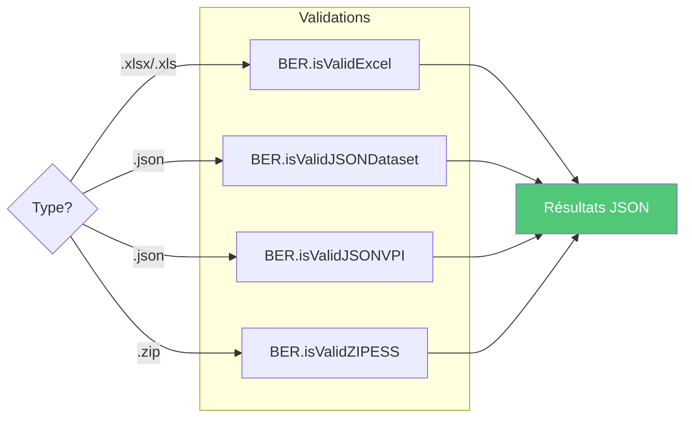

## Import et utilisation dans les contrôleurs

### Contrôleur d'import ESS

Ce contrôleur orchestre l'import de projets depuis différents formats.

#### Méthodes principales

##### 1. `createProjectFromDataset`

Crée un projet depuis un Dataset JSON ou Excel.

**Workflow :**
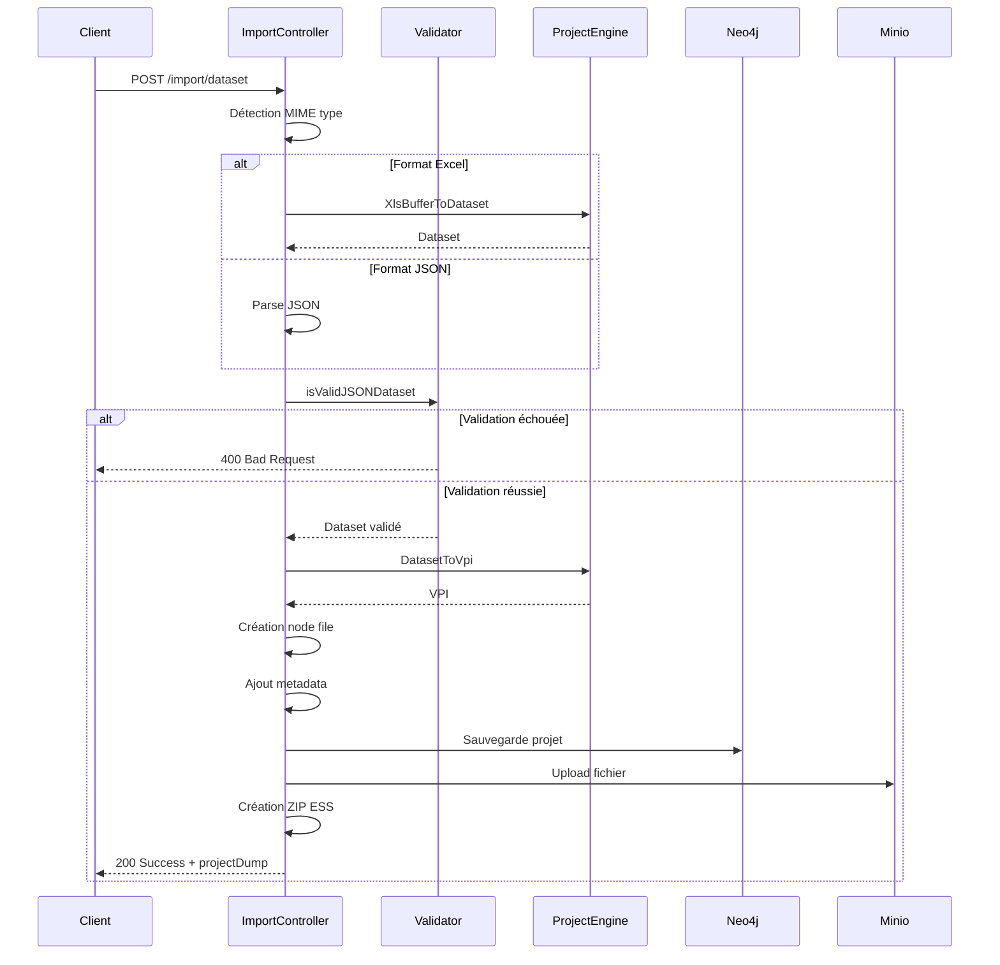

**Opérations effectuées :**
- Validation du format et des données
- Conversion en VPI
- Création d'un nœud `file` pour le fichier source
- Ajout des métadonnées (digest, URL, timestamps)
- Création d'une relation `CONTAINS` projet→file
- Sauvegarde dans Neo4j
- Upload du fichier dans Minio
- Génération d'un ZIP ESS

##### 2. `createProjectFromZipArchive`

Crée un projet depuis une archive ZIP ESS.

**Workflow :**
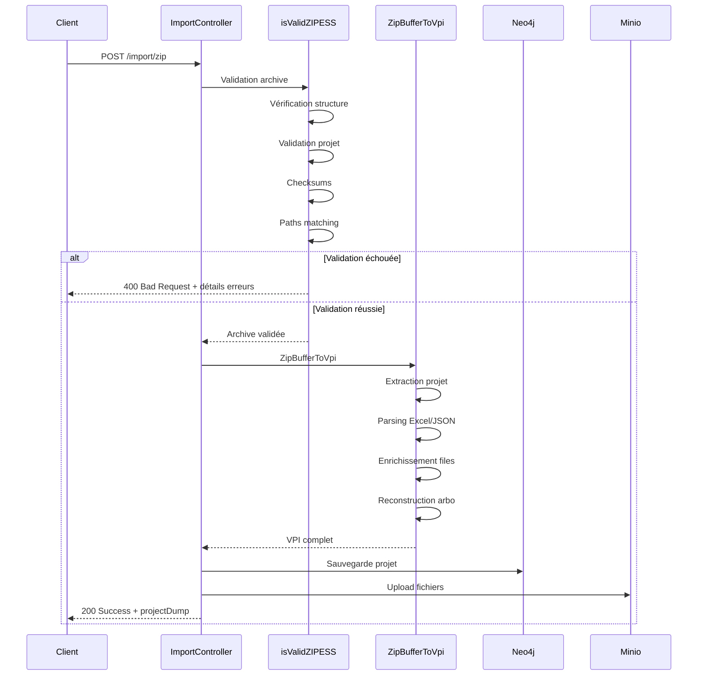

**Opérations effectuées :**
- Validation complète de l'archive (structure, checksums, paths)
- Extraction et parsing du fichier projet
- Reconstruction du VPI avec tous les fichiers
- Matching des fichiers avec leurs métadonnées
- Sauvegarde dans Neo4j
- Upload des fichiers dans Minio avec préservation de l'arborescence

##### 3. Fonction `mergeProjects`

Fusionne un projet source dans un projet cible (update).

**Workflow :**
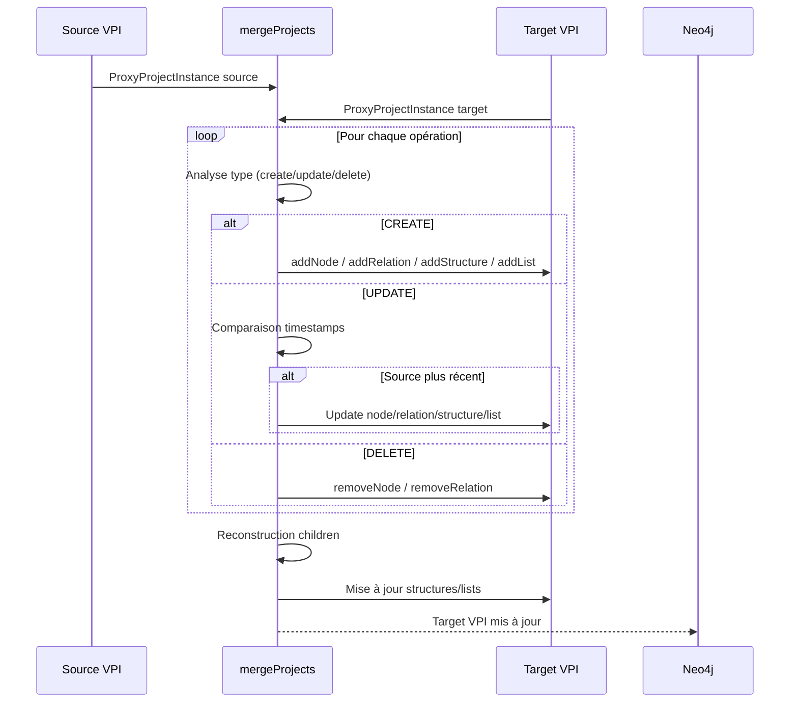

**Logique de merge :**

```typescript
// Pour chaque nœud
if (operationType === 'create') {
  target_projectInstance.addNode(data)
} else if (operationType === 'update') {
  let source_node = source_projectInstance.getNodeByToken(data.token)
  
  // Comparaison timestamps
  if (sourceCDT > targetCDT || sourceUDT > targetUDT) {
    target_projectInstance.updateNode(data)
  }
} else if (operationType === 'delete') {
  target_projectInstance.removeNode(data.token)
}
```

**Gestion des enfants de structures/lists :**
- Récupération des opérations sur les enfants
- Reconstruction complète des children
- Mise à jour des métadonnées structures/lists
- Préservation de l'ordre et de la hiérarchie

## Résumé des flux de données

### Import initial

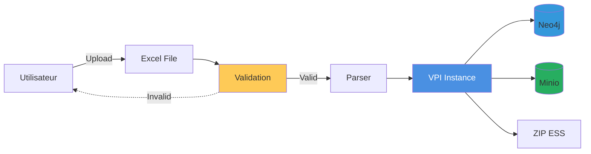

### Update depuis ZIP

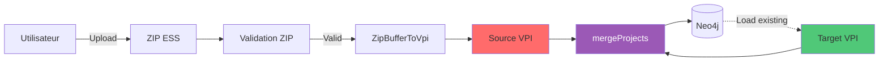

## Bonnes pratiques

### Pour les développeurs

1. **Toujours valider avant transformation**
   ```typescript
   const validation = await BER.isValidExcel(buffer, true)
   if (!validation.success) {
     throw new Error(validation.msg)
   }
   const vpi = await ProjectEngineParsers.XlsBufferToVpi(buffer)
   ```

2. **Utiliser le mode `collect` pour le debugging**
   ```typescript
   // En production : retour boolean rapide
   const isValid = await BER.isValidExcel(buffer, false)
   
   // En dev : détails complets
   const result = await BER.isValidExcel(buffer, true)
   console.log(result.errors)
   ```

3. **Préférer le Dataset comme pivot**
   ```typescript
   // ✓ Bon : Excel → Dataset → VPI
   const dataset = await ProjectEngineParsers.XlsBufferToDataset(buffer)
   const vpi = await ProjectEngineParsers.DatasetToVpi(dataset)
   
   // ✗ Éviter : Excel → VPI direct sans contrôle
   ```

4. **Vérifier les checksums pour les ZIP**
   ```typescript
   const validation = await BER.isValidZIPESS({
     buffer,
     originalname: file.name
   })
   // Contient la validation des checksums et paths
   ```

### Pour les utilisateurs

1. **Format Excel** : Respecter la nomenclature des worksheets
   - `#Project` : obligatoire
   - `#Itm#[Type]s` : pour les items
   - `#Str#[Nom]` : pour les enfants de structures
   - `#Lst#[Nom]` : pour les enfants de listes
   - `#Rel` : pour les relations

2. **Format ZIP** : Structure attendue
   ```
   {token}.zip
   └── {token}/
       ├── {token}.xlsx
       └── Files/
           └── [structures]/
   ```

3. **Tokens** : Laisser vides pour génération automatique
   - Le système génère des tokens valides
   - Utiliser `external_token` pour la traçabilité

4. **Relations** : Toujours référencer des tokens existants
   - `from_token` et `to_token` doivent exister dans les nœuds

## Conclusion

Le système de validation et transformation VNV offre :

**Flexibilité** : Multiples formats supportés (Excel, JSON, ZIP)  
**Robustesse** : Validations multi-niveaux (format, structure, métier)  
**Traçabilité** : External tokens et timestamps  
**Intégrité** : Checksums et vérifications de cohérence  
**Debugging** : Application de validation dédiée  
**Performance** : Transformations optimisées avec mapping de tokens  

Le format **Dataset** agit comme pivot central, permettant des conversions bidirectionnelles entre tous les formats tout en garantissant la cohérence et la validité des données à chaque étape.
