In a large-scale project, data transfers must be validated.
Thus, in the VNV project, a multitude of validation processes take place as the initial data must be formatted correctly so that the system can properly interpret and process the data.

## Data Types

Our system supports four main data formats, each with a specific role in the project lifecycle.

> **📖 For a detailed description of Excel and ZIP (ESS) formats, see the [ESS and VPI Format Guide](./excel-zip-format.md).**

### Format Overview

| Format | Description | Role |
|--------|-------------|------|
| **Excel (.xlsx)** | Base format with structured worksheets | Initial import, export, archiving |
| **ZIP (ESS)** | Complete archive with files and directory tree | Work session, transfer, backup |
| **JSON Dataset** | Pivot format with inline metadata (`@meta.*`) | Validation, transformation, debugging |
| **JSON VPI** | Hierarchical format for database | Neo4j storage, business operations |

### Format Hierarchy

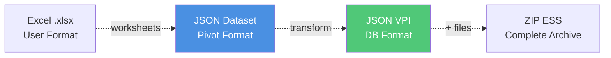

**Key Characteristics:**

- **Excel**: Worksheets `#Project`, `#Itm#*`, `#Str#*`, `#Lst#*`, `#Rel` (see [detailed guide](./excel-zip-format.md#vpi---excel-format))
- **Dataset**: Same structure as Excel but in JSON with flattened `@meta.*`
- **VPI**: Structure `{ self, data: { nodes, meta, structures, lists, relations } }`
- **ZIP ESS**: Contains the project (`.xlsx` or `.json`) + file directory tree (see [ZIP structure](./excel-zip-format.md#ess---zip-format))

## Transformations

Input data can be Excel, ZIP, or JSON. All these formats are transformable into each other via the **Dataset** which acts as a central pivot format.

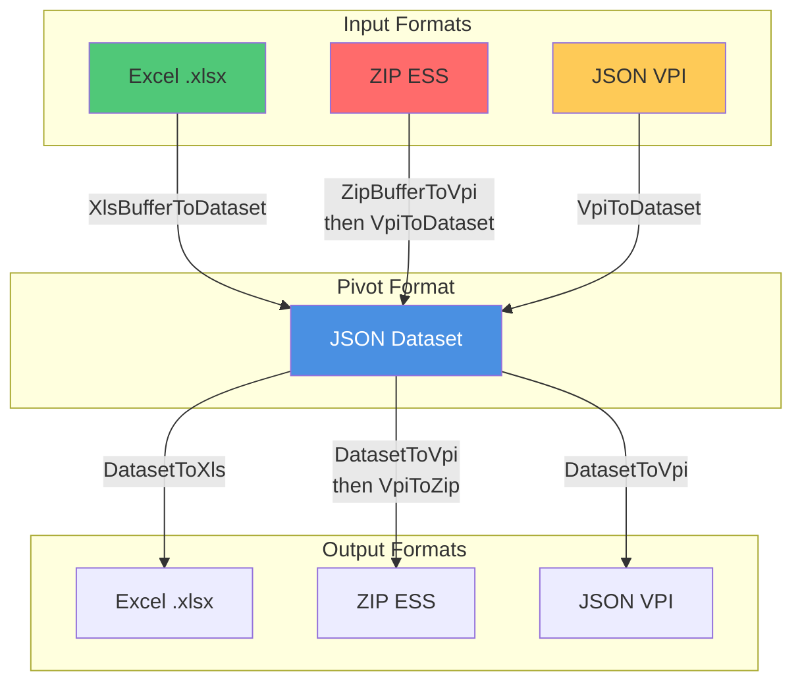

### Available Parsers

The system provides a complete set of bidirectional parsers via the `ProjectEngineParsers` class:

#### **Excel ↔ Dataset**
```typescript
// Excel → Dataset
ProjectEngineParsers.XlsBufferToDataset(buffer: Buffer): Promise<JSONDataset>

// Dataset → Excel
ProjectEngineParsers.DatasetToXls(dataset: JSONDataset): Promise<ExcelDocument>
```

#### **Dataset ↔ VPI**
```typescript
// Dataset → VPI
ProjectEngineParsers.DatasetToVpi(dataset: JSONDataset): Promise<ProxyProjectInstance>

// VPI → Dataset
ProjectEngineParsers.VpiToDataset(vpi: ProxyProjectInstance): Promise<JSONDataset>
```

#### **Excel ↔ VPI (Shortcuts)**
```typescript
// Excel → VPI (via Dataset)
ProjectEngineParsers.XlsBufferToVpi(buffer: Buffer): Promise<ProxyProjectInstance>

// VPI → Excel (via Dataset)
ProjectEngineParsers.VpiToXls(vpi: ProxyProjectInstance): Promise<ExcelDocument>
```

#### **ZIP ↔ VPI**
```typescript
// ZIP → VPI
ProjectEngineParsers.ZipBufferToVpi(buffer: Buffer): Promise<ProxyProjectInstance>

// VPI → ZIP
ProjectEngineParsers.VpiToZip(vpi: ProxyProjectInstance): Promise<Buffer>
```

### Transformation Pipeline

Here are the detailed steps for each transformation:

#### 1. Excel → Dataset → VPI

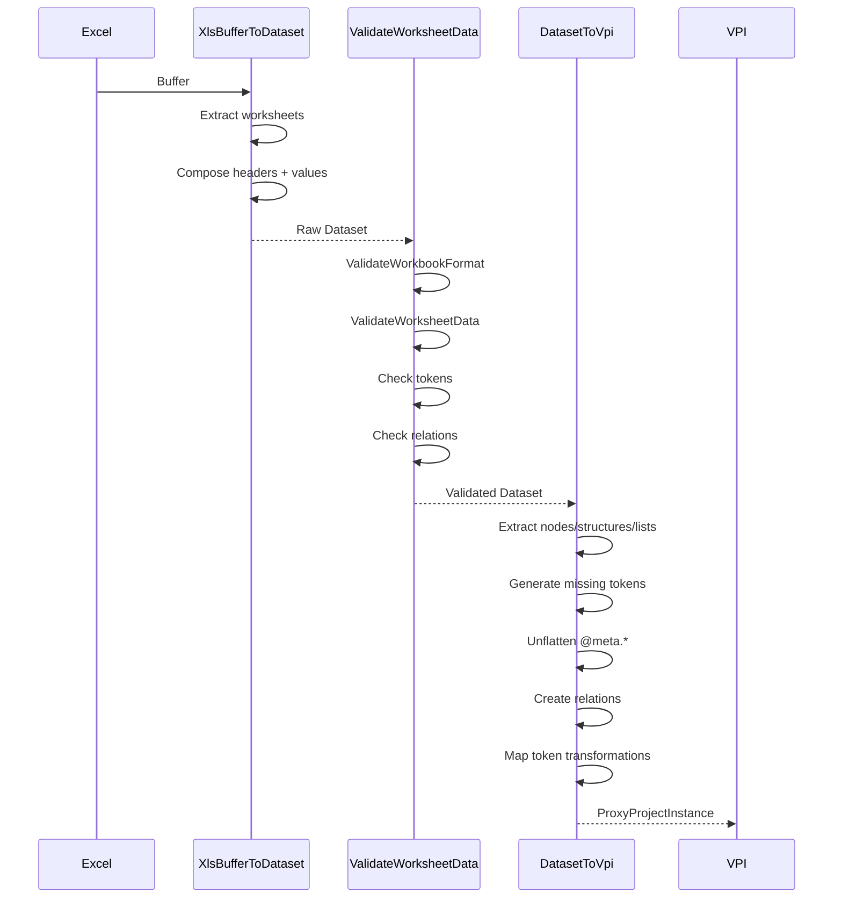

**Key Steps:**

1. **Extraction**: Read Excel worksheets and convert to JSON objects
2. **Composition**: Align headers with values
3. **Format Validation**: Verify worksheet names
4. **Data Validation**: Verify data structure
5. **Unflatten**: Convert `@meta.prop` → `meta: { prop: value }`
6. **Token Generation**: Create valid tokens if missing or invalid
7. **VPI Creation**: Build instance with nodes, metadata, and relations

#### 2. VPI → Dataset → Excel

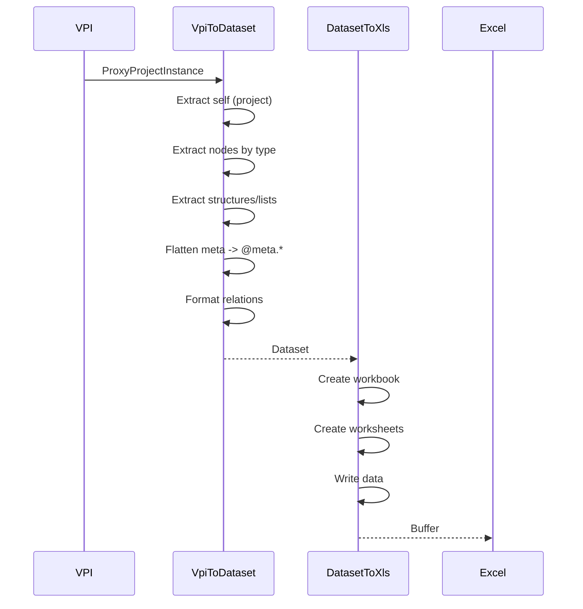

**Key Steps:**

1. **Extraction**: Retrieve nodes, structures, lists from VPI
2. **Flatten**: Convert `meta: { prop }` → `@meta.prop`
3. **Grouping**: Organize by type into worksheets
4. **Relation Formatting**: Add from/to types
5. **Excel Generation**: Create file with headers and data

#### 3. ZIP → VPI

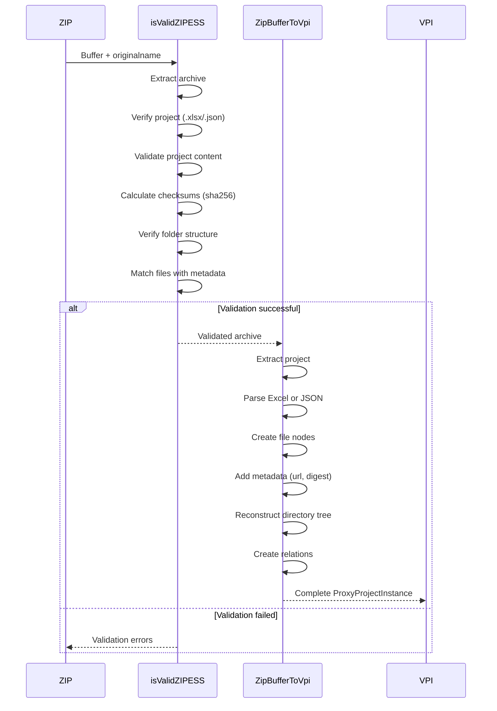

**Key Steps:**

1. **Extraction**: Decompress ZIP
2. **Structure Validation**: Verify project file presence
3. **Checksum Validation**: Calculate SHA256 and compare with metadata
4. **Project Parsing**: Convert Excel/JSON → VPI
5. **File Enrichment**: Add file metadata (digest, url)
6. **Tree Reconstruction**: Create structures and children
7. **Relation Creation**: Link files with structures

#### 4. VPI → ZIP

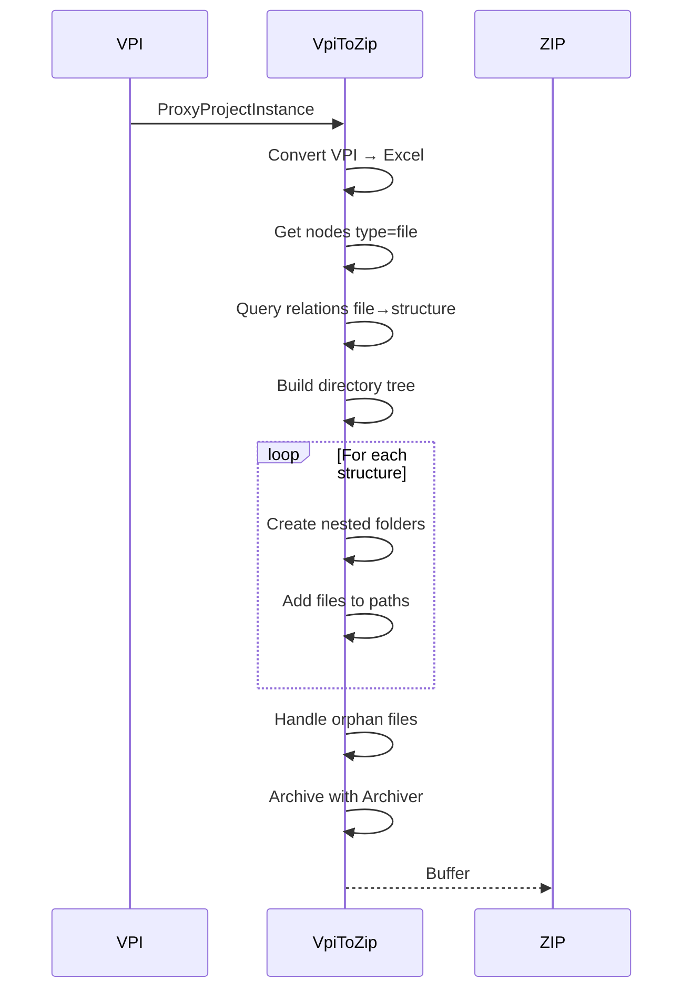

**Key Steps:**

1. **Excel Export**: Convert VPI → Dataset → Excel
2. **Query Files**: Retrieve all nodes of type `file`
3. **Path Resolution**: Determine path for each file via relations
4. **Tree Construction**: Recursively create folders
5. **Archiving**: Compress with archiver (jszip)

## Validations

The system implements multiple validation layers to ensure data integrity at each step.

### Validation Architecture

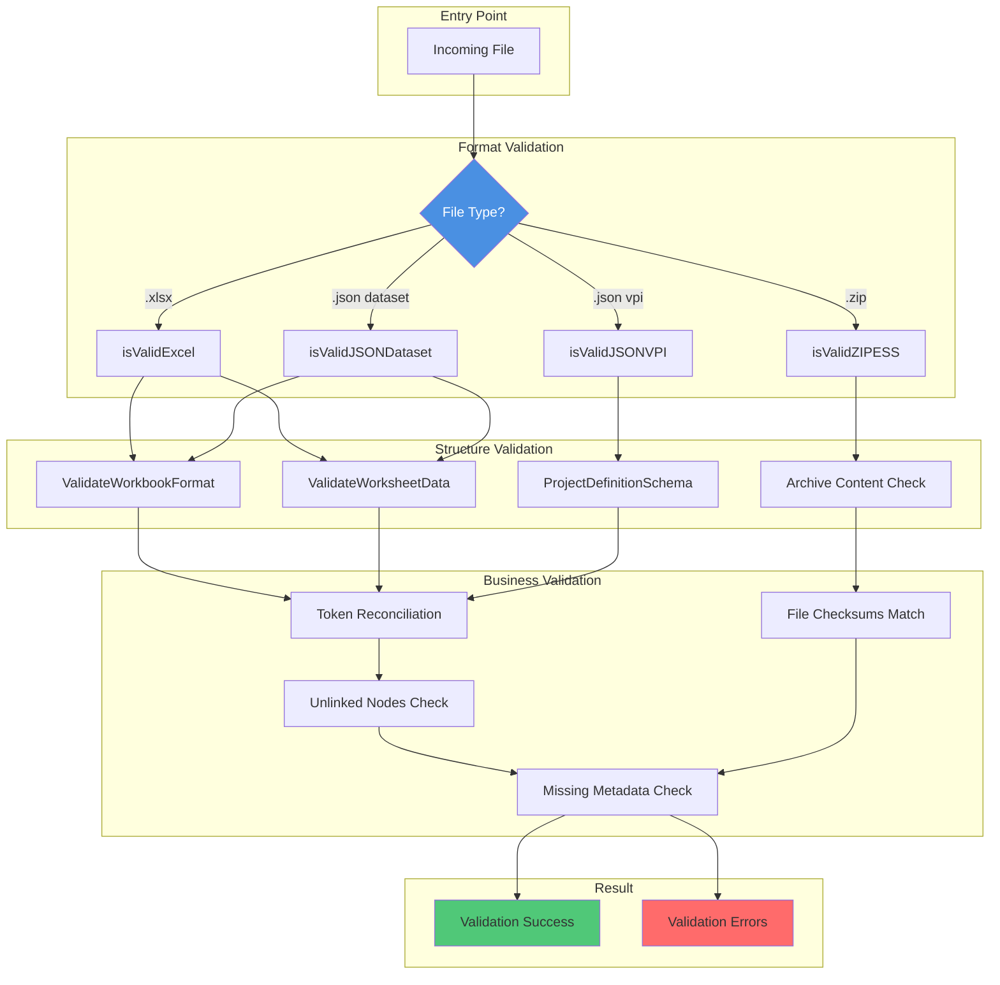

### 1. Excel Validation

**Function:**
```typescript
isValidExcel(excel: Buffer, collect: boolean): Promise<ValidationResult | boolean>
```

**Process:**

1. **Conversion**: Excel Buffer → Dataset via `XlsBufferToDataset`
2. **Dataset Validation**: Call `isValidJSONDataset`

**Returns:**
- `collect = false`: `boolean` (valid or not)
- `collect = true`: Detailed `ValidationResult` with errors

### 2. JSON Dataset Validation

**Function:**
```typescript
isValidJSONDataset(jsonData: Record<string, any>, collect: boolean): ValidationResult | boolean
```

**Validations Performed:**

#### a. Workbook Format (`ValidateWorkbookFormat`)
```typescript
refiners.isProjectTabName(data, context)
// ✓ Mandatory presence of worksheet "#Project"

refiners.isValidTabsNames(data, context)
// ✓ Worksheet names conform to patterns
// ✓ #Itm#[Type]s for items
// ✓ #Str#[Name] for structures
// ✓ #Lst#[Name] for lists
// ✓ #Rel for relations
```

#### b. Worksheet Data (`ValidateWorksheetData`)
```typescript
refiners.isValidNodeList(nodes, context)
// ✓ Zod schema validation for each node
// ✓ Required properties: token, type, name

refiners.isValidStructureStack(structures, context)
// ✓ Structure schema validation
// ✓ Properties: token, type, name

refiners.isValidListStack(lists, context)
// ✓ List schema validation

refiners.isValidRelationList(relations, context)
// ✓ Relation schema validation
// ✓ Properties: from_token, to_token, r_type, from_type, to_type

refiners.isValidChildsList(childs, context)
// ✓ Structure/list children validation
```

#### c. Business Consistency
```typescript
refiners.checkForTokenReconcilationValidity(data, context)
// ✓ If valid token provided → external_token required
// ✓ If external_token provided → token must be valid
// ✓ Detects synchronization inconsistencies

refiners.checkForUnlinkedNodes(data, context)
// ✓ All tokens referenced in relations exist
// ✓ from_token must match an existing node
// ✓ to_token must match an existing node

refiners.checkForRelationsKinds(data, context)
// ✓ Valid relation types (CONTAINS, HAS_LINK, HAS_CHILD, etc.)

refiners.checkForMissingMetadata(data, context)
// ✓ Required metadata present according to type
```

**ValidationResult Structure:**
```typescript
{
  success: boolean,
  msg?: string,
  errors?: ZodError[] // Error details by path
}
```

### 3. JSON VPI Validation

**Function:**
```typescript
isValidJSONVPI(jsonData: Record<string, any>, collect: boolean): Promise<ValidationResult | boolean>
```

**Validations Performed:**

#### a. VPI Schema
```typescript
refiners.isValidVPI(jsonData, context)
// ✓ Structure conforms to ProjectDefinitionSchema
// ✓ Presence of self
// ✓ Presence of data { nodes, meta, relations, structures, lists }
```

#### b. Token Consistency
```typescript
refiners.checkForTokenReconcilationValidity(jsonData, context)
// ✓ Token ↔ external_token mapping in metadata
// ✓ Valid tokens for synchronized nodes
```

#### c. Reconciliation and Final Validation
```typescript
// Convert VPI → Dataset → VPI for consistency test
let reconciliationResult = await reconciliateDumpTokens(jsonData)
return reconciliationResult.isValid()
```

**The `reconciliateDumpTokens` function:**
- Rebuilds a complete VPI from the dump
- Applies metadata
- Rebuilds structures and lists with children
- Reformats relations
- Returns a validated `ProxyProjectInstance`

### 4. ZIP ESS Validation

**Function:**
```typescript
isValidZIPESS(file: { buffer: Buffer, originalname: string }): Promise<ValidationResult>
```

**Validations Performed:**

#### a. Archive Structure
```typescript
archiveSchema.refine((files) => {
  // ✓ Presence of {token}/{token}.xlsx OR {token}/{token}.json
})
```

#### b. Project File Validation
```typescript
if (ext == '.xlsx') {
  projectDefValidation = await isValidExcel(fileContentBuffer, true)
} else if (ext == '.json') {
  projectDefValidation = await isValidJSONVPI(JSON.parse(jsonString), true)
}
// ✓ Project file must be valid
```

#### c. Checksum Calculation
```typescript
for (const filekey of Object.keys(files)) {
  files[filekey]['digest'] = `sha256-${toHex(sha256(compressedContent))}`
}
// ✓ Calculate SHA256 for each file
```

#### d. Directory Tree Verification
```typescript
// Build expected paths from 'file' type structures
let deductedDirPathsLists = await (async () => {
  let vpi = await ProjectEngine.DatasetToVpi(projectDefValidation.data)
  
  // Get 'file' type structures
  const document_structures = structures.filter(str => 
    str.meta.type == "file"
  )
  
  // Recursively build paths
  let composeDirPaths = (strNodes, basePath) => {
    // Returns all possible paths
  }
  
  return dirs
})()
```

#### e. Path Validation
```typescript
directoriesAndStructuresValidator
  .superRefine((data, ctx) => {
    // ✓ All expected paths exist in archive
    pathPatterns.forEach((pattern) => {
      const hasMatch = fsPaths.some(fsPath => pattern.test(fsPath))
      if (!hasMatch) {
        ctx.addIssue({ message: `Missing dir path: ${path}` })
      }
    })
  })
  .superRefine((data, ctx) => {
    // ✓ No extra files/folders
    fsPaths.forEach((fsPath) => {
      const isMatched = pathPatterns.some(pattern => pattern.test(fsPath))
      if (!isMatched) {
        ctx.addIssue({ message: `Extra dir: ${fsPath}` })
      }
    })
  })
```

#### f. File Matching with Metadata
```typescript
const x_files = vpi_files.filter((file_node) => {
  const correspondance = Object.values(files).find(
    filekey => file_node.meta['contentDigest'] == filekey['digest']
  )
  if (correspondance) return true
})

if (x_files.length < Object.values(files).length) {
  console.warn('Not all files in archive are referenced in project definition')
}
// ✓ All files have matching contentDigest
```

**ZIP Validation Result:**
```typescript
{
  success: boolean,
  msg?: string,
  errors?: {
    code: string,
    message: string,
    path: string[]
  }[]
}
```

## Validation in application

Validation can be performed at various stages in the application, such as during file upload or project import. Below is a sample implementation of how validation can be integrated into a React application.

### Features

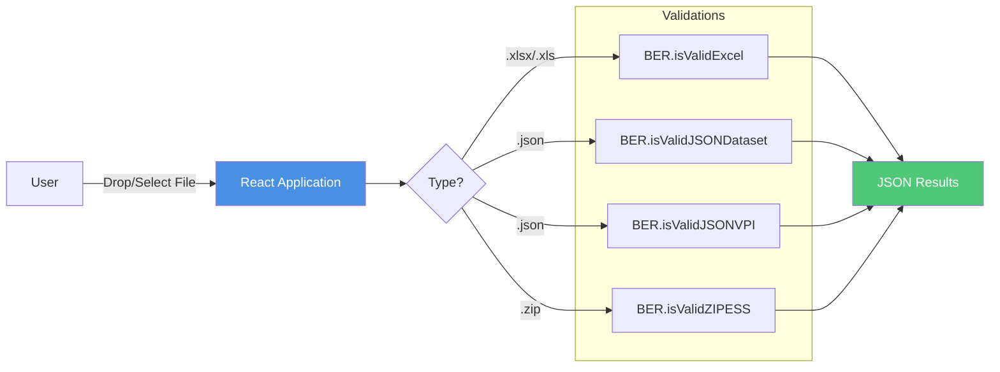

### Validation Code

```typescript
const validateFile = async (file: File) => {
  const fileExtension = file.name.split('.').pop()?.toLowerCase()

  if (fileExtension === 'json') {
    // Try JSON Dataset
    const dataset_result = await BER.isValidJSONDataset(jsonData, true)
    
    // Try JSON VPI
    const vpi_result = await BER.isValidJSONVPI(jsonData, true)
    
    // Return first success or both errors
    
  } else if (['xlsx', 'xls'].includes(fileExtension)) {
    // Excel validation
    const result = await BER.isValidExcel(uint8Array, true)
    
  } else if (fileExtension === 'zip') {
    // ZIP ESS validation
    const result = await BER.isValidZIPESS({
      buffer: Buffer.from(arrayBuffer),
      originalname: file.name
    })
  }
}
```

## Import and Controller Usage

### ESS Import Controller

This controller orchestrates project imports from different formats.

#### Main Methods

##### 1. `createProjectFromDataset`

Creates a project from a JSON Dataset or Excel.

**Workflow:**
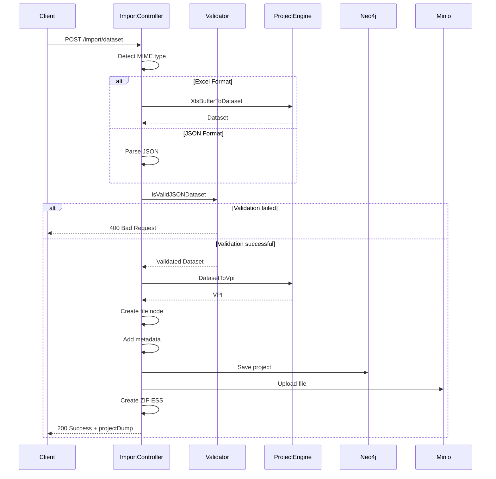

**Operations Performed:**
- Format and data validation
- Conversion to VPI
- Creation of a `file` node for the source file
- Addition of metadata (digest, URL, timestamps)
- Creation of a `CONTAINS` relation project→file
- Save in Neo4j
- Upload file to Minio
- Generation of a ZIP ESS

##### 2. `createProjectFromZipArchive`

Creates a project from a ZIP ESS archive.

**Workflow:**
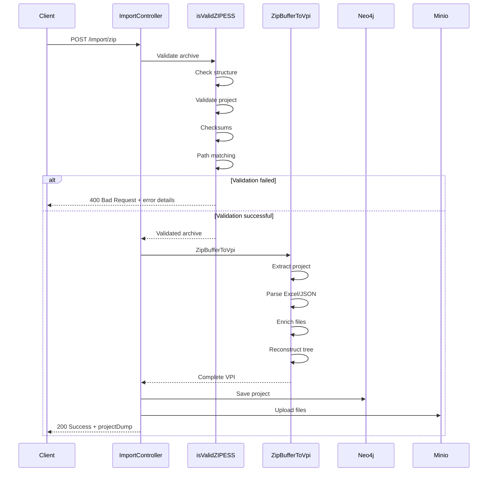

**Operations Performed:**
- Complete archive validation (structure, checksums, paths)
- Extraction and parsing of project file
- Reconstruction of VPI with all files
- Matching files with their metadata
- Save in Neo4j
- Upload files to Minio preserving directory tree

##### 3. `mergeProjects` Function

Merges a source project into a target project (update).

**Workflow:**
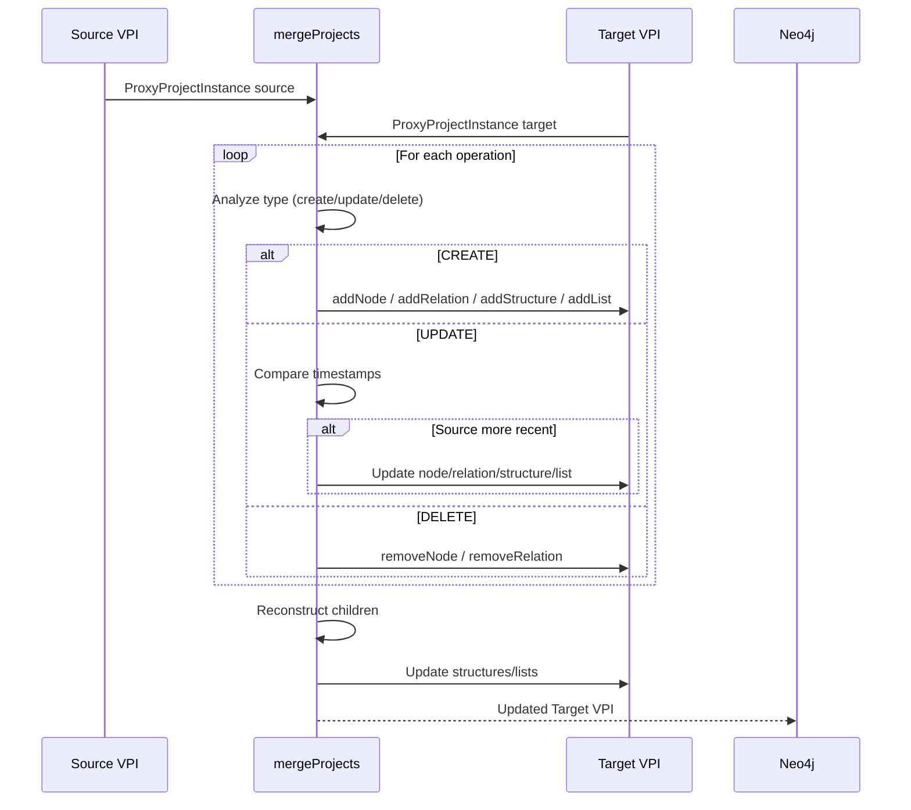

**Merge Logic:**

```typescript
// For each node
if (operationType === 'create') {
  target_projectInstance.addNode(data)
} else if (operationType === 'update') {
  let source_node = source_projectInstance.getNodeByToken(data.token)
  
  // Compare timestamps
  if (sourceCDT > targetCDT || sourceUDT > targetUDT) {
    target_projectInstance.updateNode(data)
  }
} else if (operationType === 'delete') {
  target_projectInstance.removeNode(data.token)
}
```

**Structure/List Children Management:**
- Retrieve operations on children
- Complete reconstruction of children
- Update structure/list metadata
- Preserve order and hierarchy

## Data Flow Summary

### Initial Import

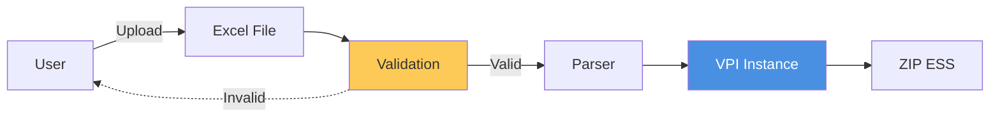

### Update from ZIP

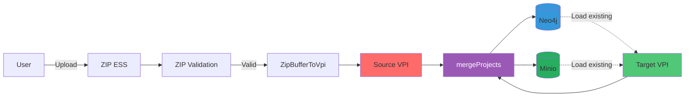

## Best Practices

### For Developers

1. **Always validate before transformation**
   ```typescript
   const validation = await BER.isValidExcel(buffer, true)
   if (!validation.success) {
     throw new Error(validation.msg)
   }
   const vpi = await ProjectEngineParsers.XlsBufferToVpi(buffer)
   ```

2. **Use `collect` mode for debugging**
   ```typescript
   // Production: fast boolean return
   const isValid = await BER.isValidExcel(buffer, false)
   
   // Development: full details
   const result = await BER.isValidExcel(buffer, true)
   console.log(result.errors)
   ```

3. **Prefer Dataset as pivot**
   ```typescript
   // ✓ Good: Excel → Dataset → VPI
   const dataset = await ProjectEngineParsers.XlsBufferToDataset(buffer)
   const vpi = await ProjectEngineParsers.DatasetToVpi(dataset)
   
   // ✗ Avoid: Excel → VPI direct without control
   ```

4. **Verify checksums for ZIP**
   ```typescript
   const validation = await BER.isValidZIPESS({
     buffer,
     originalname: file.name
   })
   // Contains checksum and path validation
   ```

### For Users

1. **Excel Format**: Respect worksheet nomenclature
   - `#Project`: mandatory
   - `#Itm#[Type]s`: for items
   - `#Str#[Name]`: for structure children
   - `#Lst#[Name]`: for list children
   - `#Rel`: for relations

2. **ZIP Format**: Expected structure
   ```
   {token}.zip
   └── {token}/
       ├── {token}.xlsx
       └── Files/
           └── [structures]/
   ```

3. **Tokens**: Leave empty for automatic generation
   - System generates valid tokens
   - Use `external_token` for traceability

4. **Relations**: Always reference existing tokens
   - `from_token` and `to_token` must exist in nodes

## Conclusion

The VNV validation and transformation system offers:

**Flexibility**: Multiple supported formats (Excel, JSON, ZIP)  
**Robustness**: Multi-level validations (format, structure, business)  
**Traceability**: External tokens and timestamps  
**Integrity**: Checksums and consistency checks  
**Debugging**: Dedicated validation application  
**Performance**: Optimized transformations with token mapping  

The **Dataset** format acts as a central pivot, enabling bidirectional conversions between all formats while ensuring data consistency and validity at each step.
