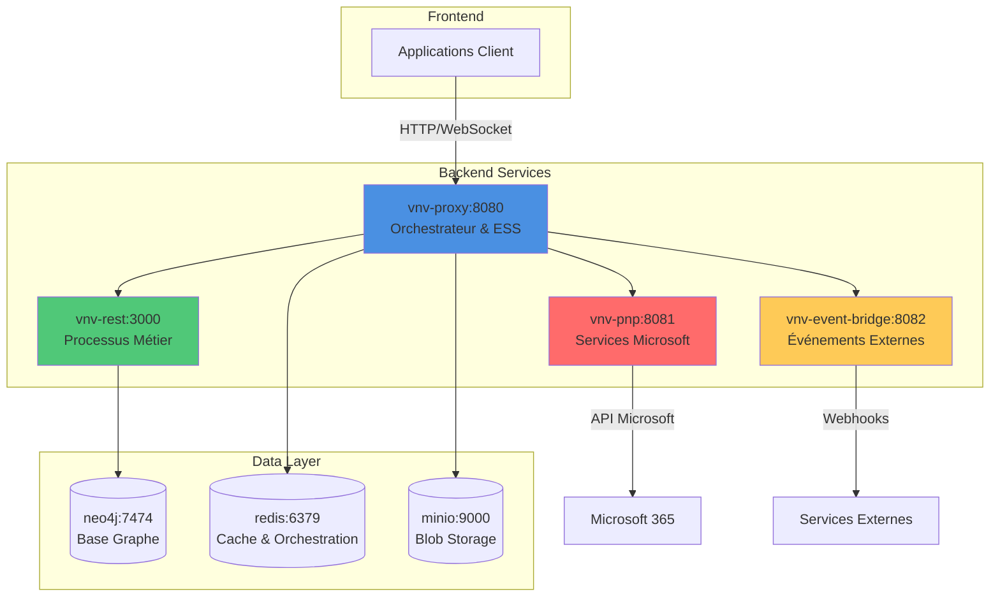
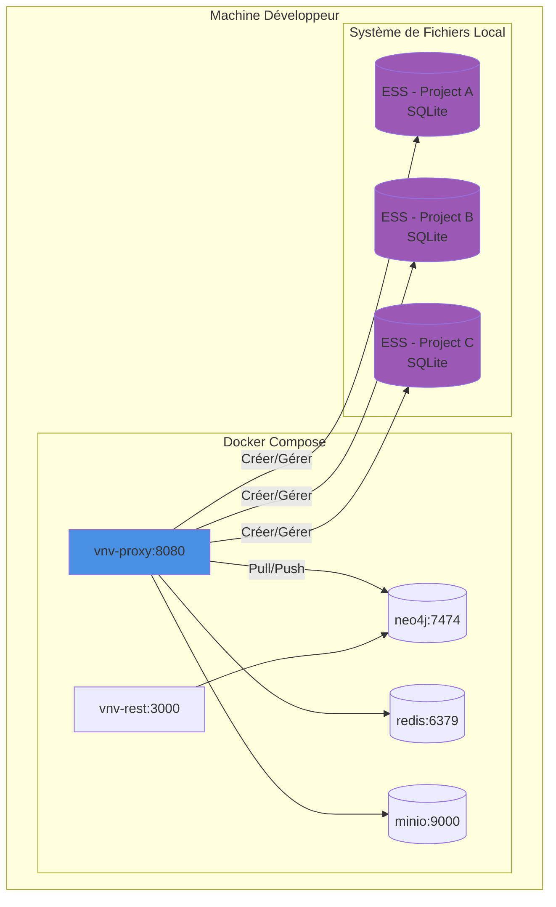
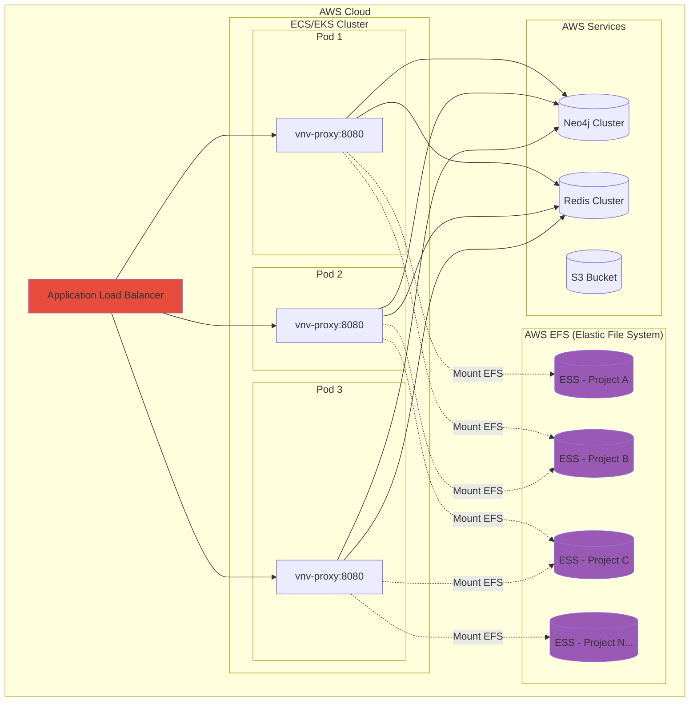

# Infrastructure

Voici un descriptif de l'architecture de notre système VNV (Validation & Verification).

## Context

Notre infrastructure est composée de plusieurs serveurs interconnectés qui travaillent ensemble pour fournir une plateforme complète de gestion de projets et de documents.

#### Servers
- **vnv-rest** (port 3000) - Serveur principal contenant les processus métier qui interagissent avec la base de données Neo4j. Il expose une API REST pour toutes les opérations métier.
- **vnv-proxy** (port 8080) - Serveur proxy central qui gère les Elastic Session Systems (ESS), orchestre la communication entre tous les services et agit comme point d'entrée principal de l'infrastructure.
- **vnv-pnp** (port 8081) - Serveur dédié à la communication avec les services Microsoft (SharePoint, OneDrive, Teams, etc.).
- **vnv-event-bridge** (port 8082) - Serveur dédié à la réception et au traitement des signaux et événements externes (webhooks, notifications, etc.).
- **minio** (port 9000) - Serveur de stockage d'objets (blob storage) compatible avec l'API S3 d'Amazon.
- **neo4j** (port 7474) - Base de données orientée graphe servant de base de données globale pour toutes les entités métier.
- **redis** (port 6379) - Base de données en mémoire utilisée pour l'orchestration, la gestion de cache et la synchronisation inter-services.

#### Packages
- **vnv-sdk** - Librairie partagée permettant tous les traitements métier, modèles métier, etc. Elle est utilisée à la fois en front-end et back-end. Elle permet de manipuler des modèles de données qui transitent entre les services et d'uniformiser l'utilisation des processus métier dans tous les services et applications. Elle contient aussi un client fetch permettant d'interagir avec l'infrastructure au travers de layers API dédiés.

## Data Layer

### Minio

Minio est un serveur de stockage d'objets open-source compatible avec l'API Amazon S3. Il permet de stocker et gérer des fichiers de toute taille de manière scalable et performante.

**Utilisation dans notre système :**
- **Développement local** : Minio est déployé localement via Docker pour simuler un environnement S3
- **Production cloud** : AWS S3 remplace Minio pour bénéficier de la scalabilité et de la fiabilité d'AWS

**Cas d'usage :**
- Stockage des documents de projets (PDF, Word, Excel, etc.)
- Stockage des fichiers temporaires générés par les processus métier
- Stockage des exports et rapports
- Gestion des versions de fichiers
- Hébergement des assets statiques

### Neo4j

Neo4j est une base de données orientée graphe qui stocke les données sous forme de nœuds et de relations. Elle est particulièrement adaptée pour modéliser des structures complexes et interconnectées.

**Utilisation dans notre système :**
Neo4j est notre base de rétention de données inter-cluster. Elle stocke toutes les entités métier et leurs relations de manière persistante.

**Cas d'usage :**
- Modélisation des projets et de leur hiérarchie
- Gestion des relations entre entités (documents, utilisateurs, tâches, etc.)
- Traçabilité et historique des modifications
- Requêtes complexes sur les relations entre entités
- Gestion des droits et permissions
- Navigation dans l'arborescence des projets

**Avantages :**
- Performance élevée pour les requêtes de traversée de graphe
- Flexibilité du schéma de données
- Langage de requête Cypher intuitif et puissant

### Redis

Redis est une base de données clé-valeur en mémoire ultra-rapide, utilisée principalement pour le cache et l'orchestration.

**Utilisation dans notre système :**
Redis est notre base de rétention d'orchestration mise en place par le proxy. Il permet au proxy de créer des flux d'interaction complexes avec les autres services.

**Cas d'usage :**
- **Orchestration des services** : Coordination des appels entre vnv-proxy et les autres services
- **Cache de sessions** : Stockage temporaire des sessions utilisateur
- **Gestion d'état** : Stockage des états des ressources provenant de SharePoint pour calculer les différences
- **File d'attente** : Gestion des tâches asynchrones et des jobs en arrière-plan
- **Pub/Sub** : Communication en temps réel entre services
- **Rate limiting** : Limitation du nombre de requêtes par utilisateur/service
- **Locks distribués** : Synchronisation des accès concurrents aux ressources

**Avantages :**
- Performances exceptionnelles (opérations en microsecondes)
- Support natif des structures de données complexes (listes, sets, hashes)
- Persistance optionnelle des données
- Scalabilité horizontale via clustering

## Elastic Session System (ESS)

Le concept d'Elastic Session System vise à centraliser les données de session (une session = travail sur un projet mis dans une session). Une session de travail comporte des documents ainsi que des données métier. Un ESS est une base de données SQL contenant toutes ces informations, permettant ainsi de capturer une image d'un projet pour faire des modifications avant de faire un commit par la suite.

### Context

La sauvegarde de l'information se fait en plusieurs étapes, similaire au workflow Git :

1. **Pull** : Je récupère mon projet depuis la source de vérité (Neo4j)
2. **Modify** : Je modifie les données et documents dans ma session isolée
3. **Commit** : Je valide mes modifications localement
4. **Push** : Je propage mes modifications vers la source de vérité

Pour cela, il faut un système qui découple ce qui est prévu pour retenir l'information de manière à le mettre dans un autre système qui pourra faire une rétention des modifications pour les propager correctement. C'est le but de l'Elastic Session System.

**Caractéristiques clés :**
- **Isolation** : Chaque session est isolée dans sa propre base de données SQLite
- **Versionning** : Gestion de l'historique des modifications au sein d'une session
- **Concurrence** : Plusieurs utilisateurs peuvent travailler sur différentes sessions du même projet
- **Performance** : Les opérations sont rapides car elles sont locales à la session
- **Merge** : Système de résolution de conflits lors du push vers Neo4j

Pour comprendre le placement de l'Elastic Session System, il faut comprendre comment il sera mis en place en dev et en prod. En développement, on pourrait croire que c'est un système de rétention d'information intra-cluster. Mais en production, les ESS sont stockés dans un Elastic File System (EFS), permettant d'avoir une interaction inter-cluster.

### Local Development

En développement local, chaque ESS est stocké localement sur le système de fichiers du serveur vnv-proxy.

### Cloud Production

En production cloud, les ESS sont stockés dans AWS EFS (Elastic File System), permettant un accès partagé entre tous les pods du cluster.

**Avantages de l'approche cloud :**
- **Scalabilité** : N'importe quel pod peut accéder à n'importe quel ESS
- **Haute disponibilité** : Si un pod tombe, un autre peut reprendre la session
- **Performance** : EFS offre un accès rapide et concurrent
- **Persistence** : Les ESS survivent aux redémarrages de pods

### Global Cloud Infrastructure

Ici on peut voir que l'infrastructure décrite plus haut est en fait un cluster orchestré et déployé par AWS. Le système est scalable et c'est pourquoi on parle de système intra/inter cluster.

**Architecture Cloud - Caractéristiques :**

- **Multi-AZ (Availability Zones)** : Répartition sur plusieurs zones de disponibilité pour la haute disponibilité
- **Auto-scaling** : Ajustement automatique du nombre de pods selon la charge
- **Load Balancing** : Distribution intelligente du trafic entre les instances
- **Managed Services** : Utilisation de services managés AWS (EFS, S3, ElastiCache)
- **Monitoring & Observabilité** : CloudWatch pour les métriques et logs, X-Ray pour le tracing distribué
- **Security** : VPC isolé, Security Groups, IAM roles, encryption at rest et in transit
- **Disaster Recovery** : Backups automatiques, snapshots, réplication inter-régions possible

**Flux de données :**

1. L'utilisateur se connecte via HTTPS au Load Balancer
2. Le Load Balancer route vers un pod vnv-proxy disponible
3. vnv-proxy orchestre les appels vers les autres services
4. Les ESS sont partagés via EFS entre tous les pods
5. Neo4j centralise les données persistantes
6. Redis gère l'orchestration et le cache
7. S3 stocke les fichiers et documents
8. CloudWatch et X-Ray collectent les métriques et traces

Cette architecture permet une scalabilité horizontale infinie tout en maintenant la cohérence des données et des sessions utilisateur.