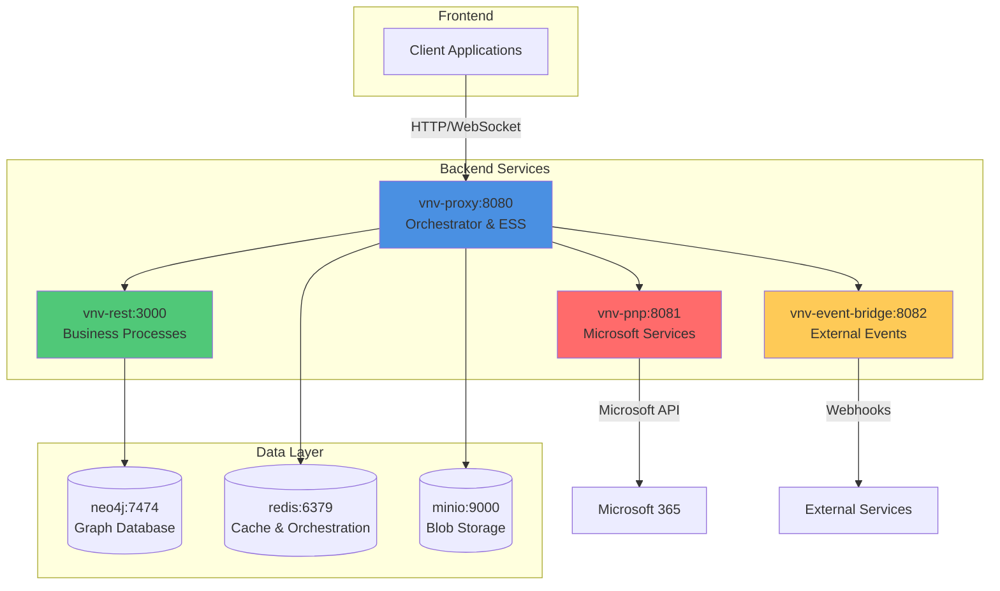
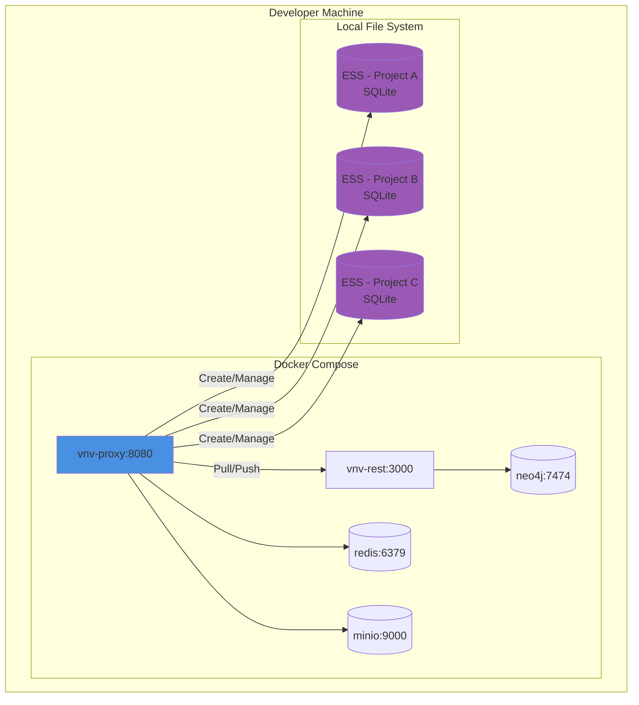
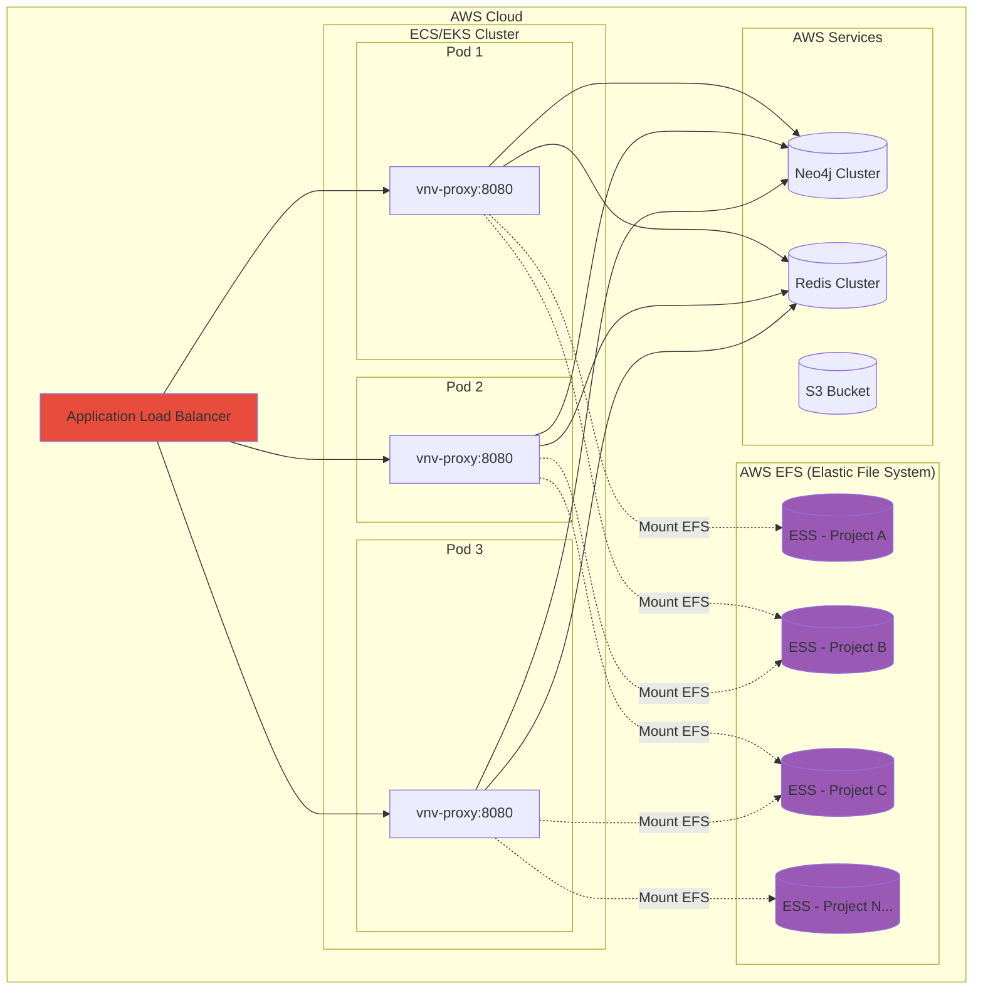
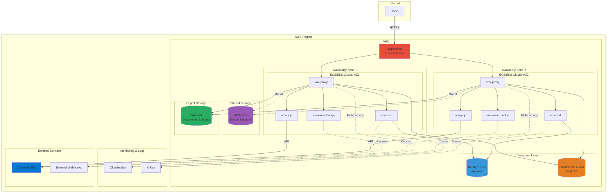

# Infrastructure

Here is a description of the architecture of our VNV (Validation & Verification) system.

## Context

Our infrastructure consists of several interconnected servers that work together to provide a complete platform for project and document management.

#### Servers
- **vnv-rest** (port 3000) - Main server containing business processes that interact with the Neo4j database. It exposes a REST API for all business operations.
- **vnv-proxy** (port 8080) - Central proxy server that manages Elastic Session Systems (ESS), orchestrates communication between all services, and acts as the main entry point of the infrastructure.
- **vnv-pnp** (port 8081) - Server dedicated to communication with Microsoft services (SharePoint, OneDrive, Teams, etc.).
- **vnv-event-bridge** (port 8082) - Server dedicated to receiving and processing external signals and events (webhooks, notifications, etc.).
- **minio** (port 9000) - Object storage server (blob storage) compatible with Amazon's S3 API.
- **neo4j** (port 7474) - Graph-oriented database serving as the global database for all business entities.
- **redis** (port 6379) - In-memory database used for orchestration, cache management, and inter-service synchronization.

#### Packages
- **vnv-sdk** - Shared library enabling all business processing, business models, etc. It is used in both front-end and back-end. It allows manipulation of data models that transit between services and standardizes the use of business processes across all services and applications. It also contains a fetch client for interacting with the infrastructure through dedicated API layers.

## Data Layer

### Minio

Minio is an open-source object storage server compatible with Amazon's S3 API. It allows storing and managing files of any size in a scalable and performant manner.

**Usage in our system:**
- **Local Development**: Minio is deployed locally via Docker to simulate an S3 environment
- **Cloud Production**: AWS S3 replaces Minio to benefit from AWS scalability and reliability

**Use Cases:**
- Storage of project documents (PDF, Word, Excel, etc.)
- Storage of temporary files generated by business processes
- Storage of exports and reports
- File version management
- Hosting static assets

### Neo4j

Neo4j is a graph-oriented database that stores data as nodes and relationships. It is particularly suited for modeling complex and interconnected structures.

**Usage in our system:**
Neo4j is our inter-cluster data retention database. It stores all business entities and their relationships persistently.

**Use Cases:**
- Modeling projects and their hierarchy
- Managing relationships between entities (documents, users, tasks, etc.)
- Traceability and modification history
- Complex queries on relationships between entities
- Rights and permissions management
- Navigation in project tree structure

**Advantages:**
- High performance for graph traversal queries
- Flexible data schema
- Intuitive and powerful Cypher query language

### Redis

Redis is an ultra-fast in-memory key-value database, used primarily for caching and orchestration.

**Usage in our system:**
Redis is our orchestration retention database implemented by the proxy. It allows the proxy to create complex interaction flows with other services.

**Use Cases:**
- **Service Orchestration**: Coordination of calls between vnv-proxy and other services
- **Session Cache**: Temporary storage of user sessions
- **State Management**: Storage of resource states from SharePoint to calculate differences
- **Queue**: Management of asynchronous tasks and background jobs
- **Pub/Sub**: Real-time communication between services
- **Rate Limiting**: Limiting the number of requests per user/service
- **Distributed Locks**: Synchronization of concurrent access to resources

**Advantages:**
- Exceptional performance (operations in microseconds)
- Native support for complex data structures (lists, sets, hashes)
- Optional data persistence
- Horizontal scalability via clustering

## Elastic Session System (ESS)

The Elastic Session System concept aims to centralize session data (a session = work on a project placed in a session). A work session includes documents as well as business data. An ESS is an SQL database containing all this information, thus allowing to capture a snapshot of a project to make modifications before committing later.

### Context

Information is saved in several steps, similar to the Git workflow:

1. **Pull**: I retrieve my project from the source of truth (Neo4j)
2. **Modify**: I modify data and documents in my isolated session
3. **Commit**: I validate my modifications locally
4. **Push**: I propagate my modifications to the source of truth

For this, we need a system that decouples what is intended to retain information in order to put it in another system that can retain modifications to propagate them correctly. This is the purpose of the Elastic Session System.

**Key Characteristics:**
- **Isolation**: Each session is isolated in its own SQLite database
- **Versioning**: Management of modification history within a session
- **Concurrency**: Multiple users can work on different sessions of the same project
- **Performance**: Operations are fast because they are local to the session
- **Merge**: Conflict resolution system when pushing to Neo4j

To understand the placement of the Elastic Session System, you need to understand how it will be set up in dev and prod. In development, one might think it's an intra-cluster information retention system. But in production, ESS are stored in an Elastic File System (EFS), allowing inter-cluster interaction.

### Local Development

In local development, each ESS is stored locally on the file system of the vnv-proxy server.

### Cloud Production

In cloud production, ESS are stored in AWS EFS (Elastic File System), allowing shared access between all pods in the cluster.

**Advantages of the cloud approach:**
- **Scalability**: Any pod can access any ESS
- **High Availability**: If a pod fails, another can take over the session
- **Performance**: EFS offers fast and concurrent access
- **Persistence**: ESS survive pod restarts

### Global Cloud Infrastructure

Here we can see that the infrastructure described above is actually a cluster orchestrated and deployed by AWS. The system is scalable, which is why we talk about intra/inter cluster system.

**Cloud Architecture - Characteristics:**

- **Multi-AZ (Availability Zones)**: Distribution across multiple availability zones for high availability
- **Auto-scaling**: Automatic adjustment of the number of pods according to load
- **Load Balancing**: Intelligent traffic distribution between instances
- **Managed Services**: Use of AWS managed services (EFS, S3, ElastiCache)
- **Monitoring & Observability**: CloudWatch for metrics and logs, X-Ray for distributed tracing
- **Security**: Isolated VPC, Security Groups, IAM roles, encryption at rest and in transit
- **Disaster Recovery**: Automatic backups, snapshots, possible inter-region replication

**Data Flow:**

1. The user connects via HTTPS to the Load Balancer
2. The Load Balancer routes to an available vnv-proxy pod
3. vnv-proxy orchestrates calls to other services
4. ESS are shared via EFS between all pods
5. Neo4j centralizes persistent data
6. Redis manages orchestration and cache
7. S3 stores files and documents
8. CloudWatch and X-Ray collect metrics and traces

This architecture allows infinite horizontal scalability while maintaining data consistency and user sessions.
