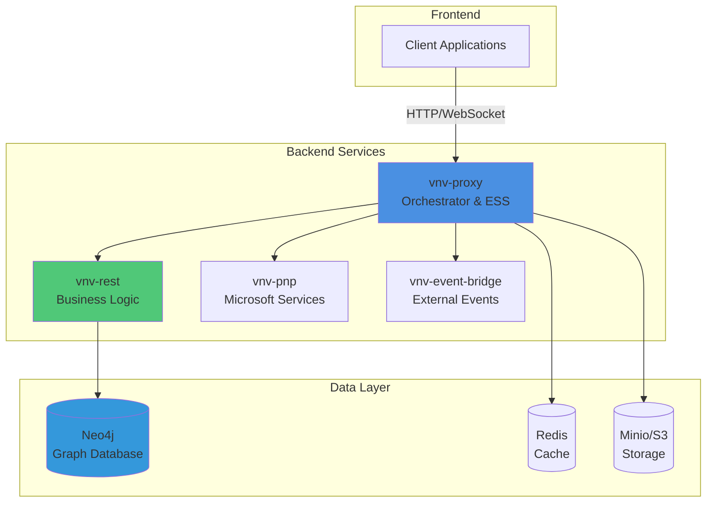

# Welcome to VNV Documentation

The VNV (Validation & Verification) system provides a comprehensive platform for project and document management with robust validation and transformation capabilities.

## Getting Started

### [Introduction](./introduction/)
Get started with VNV system overview, key components, and architecture fundamentals.

### [Infrastructure](./infrastructure/)
Understand the distributed system architecture, cloud deployment, and microservices.

### [Guides](./guides/)
Step-by-step tutorials, how-to guides, and best practices for using VNV.

### [Packages](./packages/)
SDK documentation, API references, and code examples for developers.

## Key Features

### Data Validation
Multi-level validation processes for Excel, JSON Dataset, JSON VPI, and ZIP ESS formats. Comprehensive error detection and reporting.

### Transformation Pipeline
Bidirectional conversion between different data formats with Dataset as the central pivot. Supports Excel ↔ JSON ↔ VPI ↔ ZIP transformations.

### Elastic Session System (ESS)
Git-like workflow for project management with isolated sessions, versioning, and conflict resolution. Works seamlessly in local and cloud environments.

### Cloud Infrastructure
AWS-based scalable architecture with Multi-AZ deployment, auto-scaling, and high availability. Managed services for storage, database, and caching.

## System Components

**Backend Services:**
- **vnv-rest** - Business logic and Neo4j database interaction
- **vnv-proxy** - Central orchestrator and ESS manager
- **vnv-pnp** - Microsoft 365 services integration
- **vnv-event-bridge** - External events handler

**Data Layer:**
- **Neo4j** - Graph database for business entities and relationships
- **Redis** - In-memory cache and orchestration
- **Minio/S3** - Object storage for files and documents

**SDK:**
- **vnv-sdk** - Shared library for business logic, data models, and API client

## Quick Links

- [Validation Procedures](/blog/validation-procedures/) - Deep dive into data validation
- [Excel & ZIP Format Guide](/blog/excel-zip-format/) - File format specifications
- [Data Validator Tool](http://vnv-databuild-helper.s3-website.eu-central-1.amazonaws.com/) - Test and validate your files
- [CLI Editor](http://vnv-cli-scf-ui.s3-website.eu-central-1.amazonaws.com/) - Command-line interface
- [API Documentation](/API/vnv-sdk) - Complete SDK reference

## Architecture Overview

## What's Next?

1. **Start with [Introduction](./introduction/)** to understand the system basics
2. **Explore [Infrastructure](./infrastructure/)** for architecture details
3. **Follow the [Guides](./guides/)** for practical tutorials
4. **Check [Packages](./packages/)** for SDK integration

## Support & Community

- **GitHub**: [thuliteio/doks](https://github.com/thuliteio/doks)
- **Tools**: Use our validation and CLI tools for development
- **Documentation**: Browse the complete guide in the sidebar

---

**Ready to dive in?** Start with the [Introduction →](./introduction/)
