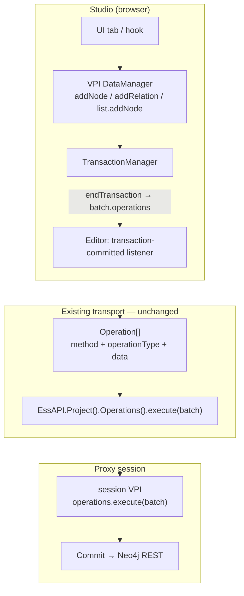
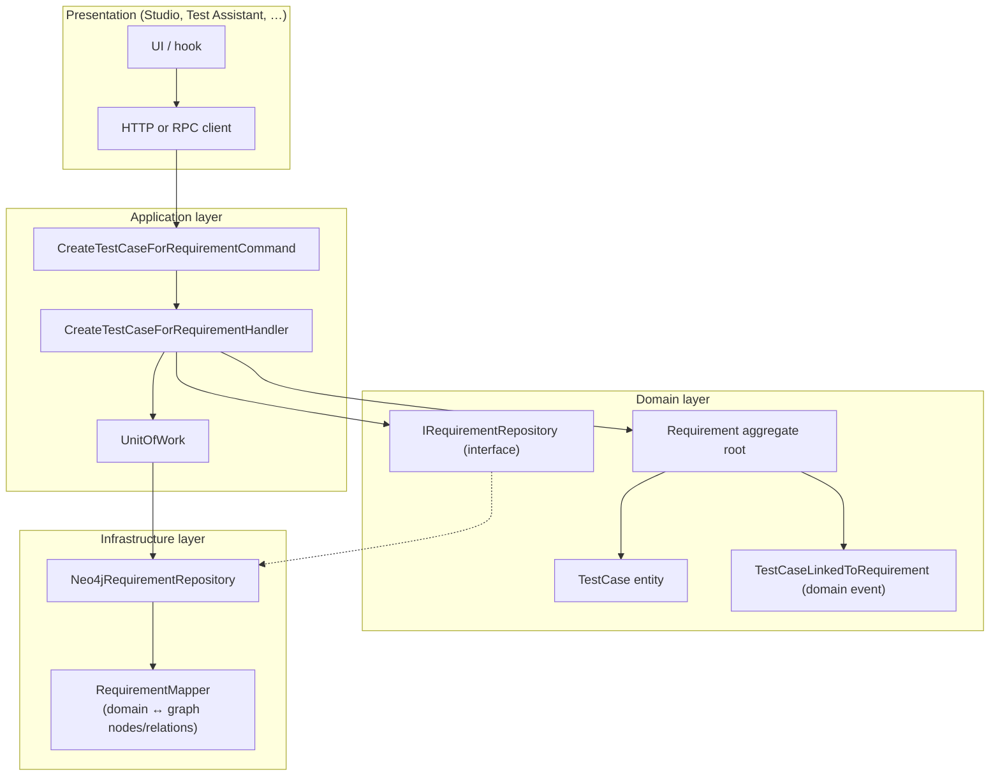
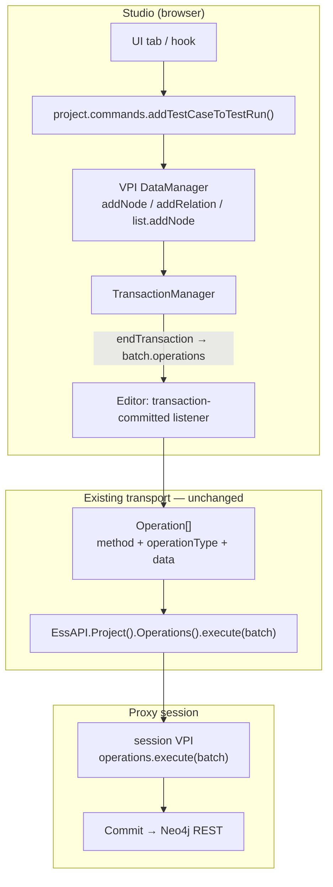

# Domain layer

The current application lacks a clear domain layer enforcing a bounded context and domain invariants. In the current approach, clients (like the React FE) create operations in terms of nodes and relations.

Example: Creation of a test case for a requirement

The FE dispatches the following operations first (Items tab):
- Creation of orphan node `Test case`
- Creation of metadata for that node

Secondly it creates relations between a requirement and the testcase (Linker tab):
- Create IS_TEST_CASE_FOR_REQUIREMENT
- Create IS_REQUIREMENT_FOR_TEST_CASE

This implies:
- That an orphan node Test case can exist, which makes no sense in our domain model
- The frontend (or other clients like the test assistant) each need to have specific knowledge of the domain, domain invariants, ... .
  - This also means that different clients are responsible to understand and maintain the integrity of the domain.
 

## As IS



## Example
### FE creates orphan test case
```typescript
// ItemsTab.tsx — user picks type "test_case", submits form
const creation = createStackEntity({
  projectInstance,
  stack: "node",
  payload: {
    type: "test_case",
    name: "TC-FAT-023",
    create_dt: Date.now(),
    update_dt: Date.now(),
  },
  nodeType: "test_case",
  transactionMode: "always",
  flowPolicy: "off",
  metadataForCreated: { description: "Opening time <= 90s" },
});
```

### FE: Create relation in Linker
```typescript
// User draws link test_case → requirement in Linker
const fromToken = "TCAS2026-001-042";
const toToken = "REQ2026-001-001";
const r_type = "IS_TEST_CASE_FOR_REQUIREMENT";

// Direct EssAPI — bypasses Operations().execute batch in some paths
await EssAPI(sessionId).Project().Relations().create({
  f_token: fromToken,
  t_token: toToken,
  r_type,
});

await EssAPI(sessionId).Project().Relations().create({
  f_token: toToken,
  t_token: fromToken,
  r_type: "IS_REQUIREMENT_FOR_TEST_CASE",
});

syncRelationToLocalData(projectInstance.data, fromToken, toToken, r_type);
syncRelationToLocalData(projectInstance.data, toToken, fromToken, "IS_REQUIREMENT_FOR_TEST_CASE");
```

### Problems in current approach:

- FE must know relation types and bidirectional pairing
- Two steps → orphan TC possible if user skips Linker
- Mixed persistence: operations batch (step 1) vs direct Relations().create() (step 2)
- No single invariant: “test case must have requirement”

## Classical DDD (greenfield — no legacy)

If we were starting from scratch — no VPI fragments, no `Operation[]` transport, no Neo4j node/relation vocabulary leaking into clients — the same use case would be modelled as a **bounded context** with clear layers. The frontend would call an **application command**; domain invariants would live inside **aggregates**; persistence would be hidden behind **repository interfaces** implemented in infrastructure.



Design choices for this use case:

- **`Requirement` is the aggregate root** — a test case cannot exist outside a requirement; creation goes through `requirement.addTestCase(…)`.
- **`TestCase` has no public constructor** — only `TestCase.createFor(requirementId, …)` inside the aggregate, so orphan instances are unrepresentable in the domain model.
- **Relation types (`IS_TEST_CASE_FOR_REQUIREMENT`, …) are an infrastructure concern** — the domain speaks in terms of `RequirementId` / `TestCaseId`, not graph edge labels.
- **One transaction** — handler loads aggregate, mutates, saves, commits; clients never orchestrate multiple low-level writes.

### Presentation layer (FE — any client)

```typescript
// RequirementMatrix.tsx — requirement context is mandatory; no node/relation knowledge
const response = await traceabilityApi.createTestCaseForRequirement({
  projectId: "PR2026-001",
  requirementId: "REQ2026-001-001",
  name: "TC-FAT-023",
  description: "Opening time <= 90s",
});

if (!response.ok) {
  showError(response.error.message);
  return;
}

// Optional read model (DTO or query-side projection — not the write aggregate)
const detail = await traceabilityApi.getRequirementTraceability("REQ2026-001-001");
console.log(detail.testCases.map((tc) => tc.name));
```

### Application layer (command + handler)

```typescript
// application/commands/create-test-case-for-requirement.command.ts
export type CreateTestCaseForRequirementCommand = {
  projectId: ProjectId;
  requirementId: RequirementId;
  name: string;
  description?: string;
};

// application/handlers/create-test-case-for-requirement.handler.ts
export class CreateTestCaseForRequirementHandler {
  constructor(
    private readonly requirements: IRequirementRepository,
    private readonly unitOfWork: IUnitOfWork,
    private readonly idGenerator: IIdGenerator,
  ) {}

  async execute(
    command: CreateTestCaseForRequirementCommand,
  ): Promise<Result<TestCaseId>> {
    const requirement = await this.requirements.findById(
      command.projectId,
      command.requirementId,
    );

    if (!requirement) {
      return Result.fail(new RequirementNotFoundError(command.requirementId));
    }

    const testCaseId = this.idGenerator.nextTestCaseId();

    // Domain mutation — invariant enforced inside aggregate
    const testCase = requirement.addTestCase({
      id: testCaseId,
      name: TestCaseName.create(command.name),
      description: command.description
        ? Description.create(command.description)
        : Description.empty(),
    });

    await this.requirements.save(requirement);
    await this.unitOfWork.commit();

    return Result.ok(testCase.id);
  }
}
```

### Domain layer (aggregate, entity, value objects, events)

```typescript
// domain/traceability/value-objects.ts
export class RequirementId {
  private constructor(readonly value: string) {}
  static of(value: string): RequirementId {
    if (!value.trim()) throw new DomainError("RequirementId cannot be empty");
    return new RequirementId(value);
  }
}

export class TestCaseId {
  private constructor(readonly value: string) {}
  static of(value: string): TestCaseId {
    if (!value.trim()) throw new DomainError("TestCaseId cannot be empty");
    return new TestCaseId(value);
  }
}

export class TestCaseName {
  private constructor(readonly value: string) {}
  static create(raw: string): TestCaseName {
    const value = raw.trim();
    if (!value) throw new DomainError("Test case name is required");
    return new TestCaseName(value);
  }
}

// domain/traceability/requirement.aggregate.ts
export class Requirement {
  private readonly _testCases = new Map<string, TestCase>();
  private readonly _events: DomainEvent[] = [];

  private constructor(
    readonly id: RequirementId,
    readonly projectId: ProjectId,
    private _status: RequirementStatus,
  ) {}

  static reconstitute(props: RequirementProps): Requirement {
    const req = new Requirement(props.id, props.projectId, props.status);
    props.testCases.forEach((tc) => req._testCases.set(tc.id.value, tc));
    return req;
  }

  addTestCase(input: {
    id: TestCaseId;
    name: TestCaseName;
    description: Description;
  }): TestCase {
    if (!this._status.allowsNewTestCases()) {
      throw new DomainError(
        `Cannot add test case: requirement ${this.id.value} is ${this._status}`,
      );
    }

    // Factory is private on TestCase — orphan creation is impossible
    const testCase = TestCase.createFor(this.id, input);

    this._testCases.set(testCase.id.value, testCase);
    this.record(
      new TestCaseLinkedToRequirement({
        requirementId: this.id,
        testCaseId: testCase.id,
        occurredAt: Clock.now(),
      }),
    );

    return testCase;
  }

  testCases(): ReadonlyArray<TestCase> {
    return [...this._testCases.values()];
  }

  pullDomainEvents(): DomainEvent[] {
    const events = [...this._events];
    this._events.length = 0;
    return events;
  }

  private record(event: DomainEvent): void {
    this._events.push(event);
  }
}

// domain/traceability/test-case.entity.ts
export class TestCase {
  private constructor(
    readonly id: TestCaseId,
    private readonly _requirementId: RequirementId, // always set
    readonly name: TestCaseName,
    readonly description: Description,
    readonly createdAt: Instant,
  ) {}

  get requirementId(): RequirementId {
    return this._requirementId;
  }

  /** Only callable from Requirement aggregate — no orphan TestCase in the model */
  static createFor(
    requirementId: RequirementId,
    input: { id: TestCaseId; name: TestCaseName; description: Description },
  ): TestCase {
    return new TestCase(
      input.id,
      requirementId,
      input.name,
      input.description,
      Clock.now(),
    );
  }
}

// domain/traceability/requirement.repository.ts
export interface IRequirementRepository {
  findById(projectId: ProjectId, id: RequirementId): Promise<Requirement | null>;
  save(requirement: Requirement): Promise<void>;
}
```

### Infrastructure layer (Neo4j adapter — detail hidden from domain)

```typescript
// infrastructure/persistence/neo4j-requirement.repository.ts
export class Neo4jRequirementRepository implements IRequirementRepository {
  constructor(private readonly session: Neo4jSession) {}

  async findById(
    projectId: ProjectId,
    id: RequirementId,
  ): Promise<Requirement | null> {
    const row = await this.session.run(
      `
      MATCH (r:requirement { token: $id, project: $projectId })
      OPTIONAL MATCH (tc:test_case)-[:IS_TEST_CASE_FOR_REQUIREMENT]->(r)
      RETURN r, collect(tc) AS testCases
      `,
      { id: id.value, projectId: projectId.value },
    );
    if (!row) return null;
    return RequirementMapper.toDomain(row);
  }

  async save(requirement: Requirement): Promise<void> {
    const tx = this.session.beginTransaction();

    for (const testCase of requirement.testCases()) {
      // Map domain entity → graph primitives (labels, relation types)
      await tx.run(
        `
        MERGE (tc:test_case { token: $tcToken })
        SET tc.name = $name, tc.update_dt = timestamp()
        MERGE (r:requirement { token: $reqToken })
        MERGE (tc)-[:IS_TEST_CASE_FOR_REQUIREMENT]->(r)
        MERGE (r)-[:IS_REQUIREMENT_FOR_TEST_CASE]->(tc)
        `,
        {
          tcToken: testCase.id.value,
          reqToken: requirement.id.value,
          name: testCase.name.value,
        },
      );
    }

    await tx.commit();

    // Optional: publish domain events to outbox / message bus
    for (const event of requirement.pullDomainEvents()) {
      await this.eventOutbox.append(event);
    }
  }
}
```

### HTTP API (thin boundary — no domain logic)

```typescript
// infrastructure/http/requirements.controller.ts
router.post(
  "/projects/:projectId/requirements/:requirementId/test-cases",
  async (req, res) => {
    const result = await createTestCaseForRequirementHandler.execute({
      projectId: ProjectId.of(req.params.projectId),
      requirementId: RequirementId.of(req.params.requirementId),
      name: req.body.name,
      description: req.body.description,
    });

    if (result.isFailure) {
      return res.status(mapErrorToStatus(result.error)).json({
        code: result.error.code,
        message: result.error.message,
      });
    }

    return res.status(201).json({ testCaseId: result.value.value });
  },
);
```

### Contrast with legacy and with our pragmatic TO BE

| Aspect | AS-IS (legacy) | Classical DDD (greenfield) | TO BE (recommended) |
|--------|----------------|----------------------------|---------------------|
| FE vocabulary | `addNode`, `r_type`, EssAPI | `createTestCaseForRequirement({ requirementId, … })` | `project.commands.createTestCaseForRequirement(…)` |
| Orphan TC | Possible | Unrepresentable in domain | Blocked by command + validator |
| Relation types in client | Yes | No | No |
| Persistence | Mixed batch + direct API | Repository + UOW | VPI ops batch (unchanged transport) |
| Effort | — | Full rewrite of stack | Incremental on existing VPI |

The **TO BE** section below is the pragmatic variant: same **command + domain entity** ergonomics for clients, but orchestration still goes through VPI `DataManager` and the existing `Operation[]` → Neo4j pipeline instead of a standalone aggregate repository.

## TO BE


### FE

```typescript
// RequirementMatrix.tsx or ItemsTab — requirement context is required
const result = await project.commands.createTestCaseForRequirement({
  requirementToken: "REQ2026-001-001",
  name: "TC-FAT-023",
  meta: { description: "Opening time <= 90s" },
});

if (!result.ok) {
  showError(result.error.message); // e.g. "Requirement not found" / "Orphan not allowed"
  return;
}

// Optional read via domain model
const tc = project.domain.testCase(result.data.testCaseToken);
const req = tc?.requirement();
console.log(req?.name, tc?.name);
```

### Command handler (packages/domain/commands)

```typescript
export function createTestCaseForRequirement(
  project: VPI.ProxyProjectInstance,
  input: CreateTestCaseForRequirementInput,
): DomainResult<{ testCaseToken: string }> {

  const requirement = project.domain.requirement(input.requirementToken);
  if (!requirement) {
    return { ok: false, error: { code: "REQUIREMENT_NOT_FOUND", message: "..." } };
  }

  project.transaction.startTransaction("CreateTestCaseForRequirement", {
    command: "CreateTestCaseForRequirement",
  });

  try {
    const testCase = TestCase.createLinkedToRequirement(project, requirement, {
      name: input.name,
      meta: input.meta,
    });

    project.transaction.endTransaction(); // → transaction-committed → Editor → EssAPI

    return { ok: true, data: { testCaseToken: testCase.token } };
  } catch (e) {
    project.transaction.rollbackTransaction?.();
    return { ok: false, error: { code: "COMMAND_FAILED", message: String(e) } };
  }
}
```

### Domain class (packages/domain/entities/test-case.ts)

```typescript
export class TestCase {
  constructor(
    private project: VPI.ProxyProjectInstance,
    readonly node: VPI.TestCaseFragment.Instance,
  ) {}

  get token() { return this.node.token; }

  static createLinkedToRequirement(
    project: VPI.ProxyProjectInstance,
    requirement: Requirement,
    input: { name: string; meta?: object },
  ): TestCase {
    const dm = project.data;
    const now = Date.now();

    const [, created] = dm.addNode({
      type: "test_case",
      name: input.name,
      create_dt: now,
      update_dt: now,
    });

    if (input.meta) {
      created.setMetadata(VPI.TestCaseMetadataFragment.assign(input.meta));
    }

    dm.addRelation({
      f_token: created.token,
      t_token: requirement.token,
      r_type: "IS_TEST_CASE_FOR_REQUIREMENT",
      create_dt: now,
      update_dt: now,
    });

    dm.addRelation({
      f_token: requirement.token,
      t_token: created.token,
      r_type: "IS_REQUIREMENT_FOR_TEST_CASE",
      create_dt: now,
      update_dt: now,
    });

    return new TestCase(project, created);
  }

  requirement(): Requirement | null {
    const rel = this.project.data.queryRelationAll({
      f_token: this.token,
      r_type: "IS_TEST_CASE_FOR_REQUIREMENT",
    })[0];
    return rel ? this.project.domain.requirement(rel.t_token) : null;
  }
}
```

