## Vue d'ensemble

Le **VNV Information Model** est le cœur du système de gestion de la validation et de la vérification. Il définit un modèle de graphe orienté qui structure l'information projet à travers des entités (nodes), des métadonnées, et des relations hiérarchiques ou séquentielles.

---

## Entités (Nodes)

Les entités sont les éléments fondamentaux du modèle. Chaque entité hérite d'une structure de base et possède des métadonnées spécifiques.

### Structure de base

Toutes les entités partagent ces propriétés fondamentales :

| Propriété | Type | Description |
|-----------|------|-------------|
| `type` | `string` | Type de l'entité (ex: "project", "requirement") |
| `name` | `string` | Nom de l'entité |
| `token` | `string` | Identifiant unique hiérarchique (voir format ci-dessous) |
| `id` | `string` | Identifiant UUID |
| `create_dt` | `number` | Timestamp de création |
| `update_dt` | `number` | Timestamp de dernière modification |

#### Format du Token

Le token suit une structure hiérarchique qui reflète l'organisation du projet :

**Format général :**
- **Projets :** `[PREFIX][YEAR]-[PROJECT-ITERATION]`
- **Entités :** `[PREFIX][YEAR]-[PROJECT-ITERATION]-[ITEM-ITERATION]`

**Visualisation :**

```/dev/null/token-format-visual.txt#L1-15
┌────────────────────────────────────────────────┐
│  PROJET TOKEN = PREFIX + YEAR + "-" + PROJECT │
├────────────────────────────────────────────────┤
│  Projet:     PR2024-008                       │
│              ↑  ↑   ↑                          │
│              │  │   └─ Projet n°8 de 2024     │
│              │  └───── Année                   │
│              └──────── Préfixe (Project)       │
└────────────────────────────────────────────────┘

┌────────────────────────────────────────────────────────┐
│  ENTITÉ TOKEN = PREFIX + YEAR + "-" + PROJECT + "-" + ITEM │
├────────────────────────────────────────────────────────┤
│  Entité:     REQ2024-008-042                          │
│              ↑  ↑   ↑   ↑                              │
│              │  │   │   └─ 42ème exigence du projet   │
│              │  │   └───── Projet n°8                  │
│              │  └───────── Année                       │
│              └──────────── Préfixe (Requirement)       │
└────────────────────────────────────────────────────────┘
```

**Composants :**
- `PREFIX` : Préfixe du type d'entité (ex: PR, REQ, WRK, TCAS)
- `YEAR` : Année de création du projet (4 chiffres)
- `PROJECT-ITERATION` : Numéro d'itération du projet dans l'année (3 chiffres, avec zéros en préfixe)
- `ITEM-ITERATION` : Numéro d'itération de l'entité dans le projet (3 chiffres, avec zéros en préfixe)
  - **Important :** Ce composant est **présent uniquement pour les entités**, pas pour les projets

**Exemples :**

```/dev/null/token-examples.txt#L1-20
# Projet (niveau racine)
PR2021-008
  ↓ 8ème projet créé en 2021

# Exigences du projet PR2021-008
REQ2021-008-001    ← 1ère exigence du projet PR2021-008
REQ2021-008-002    ← 2ème exigence du projet PR2021-008
REQ2021-008-150    ← 150ème exigence du projet PR2021-008

# Travaux du projet PR2021-008
WRK2021-008-001    ← 1ère tâche de travail du projet PR2021-008
WRK2021-008-042    ← 42ème tâche de travail du projet PR2021-008

# Cas de test du projet PR2021-008
TCAS2021-008-001   ← 1er cas de test du projet PR2021-008
TCAS2021-008-002   ← 2ème cas de test du projet PR2021-008

# Autre projet la même année
PR2021-009         ← 9ème projet créé en 2021
REQ2021-009-001    ← 1ère exigence du projet PR2021-009
```

**Hiérarchie et appartenance :**

Le format du token encode directement l'appartenance au projet. Toutes les entités d'un projet partagent le même segment `[PREFIX][YEAR]-[PROJECT-ITERATION]`.

```/dev/null/token-hierarchy.txt#L1-16
Projet: PR2024-015
├── Requirements:  REQ2024-015-001, REQ2024-015-002, REQ2024-015-003
├── Orders:        PO2024-015-001, PO2024-015-002
├── Deliverables:  DEL2024-015-001, DEL2024-015-002, DEL2024-015-003
├── Works:         WRK2024-015-001, WRK2024-015-002, WRK2024-015-003
├── Test Cases:    TCAS2024-015-001, TCAS2024-015-002
├── Files:         FIL2024-015-001, FIL2024-015-002
├── Structures:    STR2024-015-001, STR2024-015-002
└── Lists:         LST2024-015-001, LST2024-015-002

Projet: PR2024-016
├── Requirements:  REQ2024-016-001, REQ2024-016-002
├── Works:         WRK2024-016-001
├── Structures:    STR2024-016-001
└── Lists:         LST2024-016-001
```

**Avantages de ce format :**
- ✅ **Traçabilité immédiate** : le token révèle l'année et le projet d'appartenance
- ✅ **Unicité garantie** : combinaison unique dans tout le système
- ✅ **Lisibilité** : format structuré et prévisible
- ✅ **Tri naturel** : tri alphanumérique = ordre chronologique et hiérarchique

### Catalogue des entités

#### 1. Gestion de projet

| Entité | Préfixe | Description | Métadonnées clés |
|--------|---------|-------------|------------------|
| **project** | `PR` | Projet principal | status, responsible_intern, responsible_extern |
| **object** | `OBJ` | Objet du projet | status (Finaal/Niet Finaal) |
| **system** | `SYS` | Système du projet | - |
| **contact** | `CNT` | Contact/Stakeholder | responsible_intern, responsible_extern |
| **role** | `ROL` | Rôle dans le projet | - |
| **group** | `GRP` | Groupe de travail | - |
| **report** | `REP` | Rapport | - |

#### 2. Commandes et livrables

| Entité | Préfixe | Description | Métadonnées clés |
|--------|---------|-------------|------------------|
| **order** | `PO` | Commande/Order | startDate, endDate, estimateTime, estimateCost, budgetYear, content |
| **deliverable** | `DEL` | Livrable | status (Gealloceerd/Niet gealloceerd), estimateTime, estimateCost |
| **work** | `WRK` | Tâche de travail | status, estimateTime, estimateCost |
| **worklog** | `WRKLG` | Journal de travail | estimateTime, estimateCost |
| **material** | `MAT` | Matériel | status (Aangekocht/Niet aangekocht), estimateCost |
| **invoice** | `INV` | Facture | status (cycle de facturation) |

#### 3. Exigences et qualité

| Entité | Préfixe | Description | Métadonnées clés |
|--------|---------|-------------|------------------|
| **requirement** | `REQ` | Exigence | status (SMART/Niet SMART), author, category, content, dataQuality, consistency, completeness, correctness, rat |
| **register** | `REG` | Registre | project_id, register_dt, resolver_dt, category, assignee, remark, itemPath |

#### 4. Tests et validation

| Entité | Préfixe | Description | Métadonnées clés |
|--------|---------|-------------|------------------|
| **test_project** | `TPRJ` | Projet de test | status (Finaal/Niet Finaal), author, category, validationType, content, remark |
| **test_build** | `TBLD` | Build de test | status, author, category, validationType, content, remark |
| **test_plan** | `TPLN` | Plan de test | status, author, category, validationType, content, remark |
| **test_suite** | `TSUI` | Suite de tests | status, author, category, validationType, content, remark |
| **test_case** | `TCAS` | Cas de test | status (Revisie/Klaar voor test), author, category, validationType, content, remark, meta_raw |
| **test_case_execution** | `TCEX` | Exécution de cas de test | status (Niet uitgevoerd/Gepasseerd/Gefaald), author, category, validationType, content, remark, meta_raw |
| **test_run** | `TRN` | Run de test | status (Niet uitgevoerd/Uitgevoerd/Deels uitgevoerd), author, category, validationType, content, remark, meta_raw |

#### 5. Fichiers et utilisateurs

| Entité | Préfixe | Description | Métadonnées clés |
|--------|---------|-------------|------------------|
| **file** | `FIL` | Fichier/Document | extension, category, contentDigest, url, liveview, fileType, mimeType, modifiedBy, dateModified, fileSize, tags, consistency, completeness, correctness |
| **attachement** | `ATT` | Pièce jointe | estimateTime, estimateCost |
| **user** | `USR` | Utilisateur | first_name, last_name, email, mobile, alias, groups, officeLocation, businessPhones, preferredLanguage, jobTitle, userPrincipalName |

### États (Status) par type d'entité

Chaque type d'entité possède des valeurs de status spécifiques :

```/dev/null/status-values.txt#L1-40
project:
  - Niet gestart
  - Bezig
  - Geblokkeerd
  - Geannuleerd
  - Afgewerkt

object, test_project, test_build, test_plan, test_suite:
  - Finaal
  - Niet Finaal

deliverable:
  - Gealloceerd
  - Niet gealloceerd

material:
  - Niet aangekocht
  - Aangekocht

requirement:
  - SMART
  - Niet SMART

test_case:
  - Revisie
  - Klaar voor test

test_case_execution:
  - Niet uitgevoerd
  - Gepasseerd
  - Gefaald

test_run:
  - Niet uitgevoerd
  - Uitgevoerd
  - Deels uitgevoerd

invoice:
  - Vorderstaat opgemaakt
  - Vorderstaat goedgekeurd
  - Factuur opgemaakt
  - Factuur goedgekeurd
  - Factuur betaald
```

---

## Système de métadonnées

Le système de métadonnées offre plus de 70 champs configurables qui peuvent être attachés aux entités selon leur type.

### Métadonnées communes

| Clé | Nom de la clé | Type | Description |
|-----|---------------|------|-------------|
| `description` | `Description` | `string` | Description textuelle |
| `userGroup` | `UserGroup` | `Array<string>` | Groupes d'utilisateurs associés |
| `path` | `Path` | `Array<string>` | Chemin hiérarchique |
| `tags` | `Tags` | `Array<string>` | Tags/étiquettes |
| `category` | `Category` | `string` | Catégorie |

### Métadonnées de responsabilité

| Clé | Nom de la clé | Type | Description |
|-----|---------------|------|-------------|
| `responsible_intern` | `ResponsibleInternal` | `string` | Responsable interne |
| `responsible_extern` | `ResponsibleExternal` | `string` | Responsable externe |
| `assignee` | `AssignedTo` | `string` | Personne assignée |
| `author` | `Author` | `string` | Auteur |

### Métadonnées temporelles

| Clé | Nom de la clé | Type | Description |
|-----|---------------|------|-------------|
| `startDate` | `StartDate` | `string` | Date de début |
| `endDate` | `EndDate` | `string` | Date de fin |
| `dateModified` | `ModifiedDate` | `string` | Date de modification |
| `dateModifiedValue` | `ModifiedDateValue` | `number` | Date de modification (timestamp) |
| `register_dt` | `RegisterDate` | `number` | Date d'enregistrement |
| `resolver_dt` | `ResolverDate` | `number` | Date de résolution |

### Métadonnées budgétaires

| Clé | Nom de la clé | Type | Description |
|-----|---------------|------|-------------|
| `budgetYear` | `BudgetYear` | `string` | Année budgétaire |
| `estimateTime` | `EstimateTime` | `string` | Temps estimé |
| `estimateCost` | `EstimateCost` | `string` | Coût estimé |

### Métadonnées de qualité

| Clé | Nom de la clé | Type | Description |
|-----|---------------|------|-------------|
| `dataQuality` | `DataQuality` | `string` | Qualité des données |
| `consistency` | `ConsistencyStatus` | `string` | État de cohérence |
| `completeness` | `CompletenessStatus` | `string` | État de complétude |
| `correctness` | `CorrectnessStatus` | `string` | État de correction |

### Métadonnées RAT (Requirements Analysis Tool)

Structure complexe pour l'analyse qualité des exigences :

```/dev/null/rat-structure.ts#L1-15
rat: {
  qualityLevel: string,      // Niveau de qualité global
  numericQuality: number,    // Score numérique
  qualityDate: string,       // Date d'évaluation
  qualitySummary: string     // Résumé de l'évaluation
}

// Exemple
{
  qualityLevel: "High",
  numericQuality: 85,
  qualityDate: "2024-01-15",
  qualitySummary: "Exigence bien définie avec critères mesurables"
}
```

### Références externes

Le système supporte les références vers 6 plateformes externes :

```/dev/null/external-references.ts#L1-50
external: {
  excel: {
    token: string  // Token d'identification Excel
  },
  jira: {
    id: string,    // ID Jira
    url: string    // URL de l'issue Jira
  },
  relatics: {
    id: string,    // ID Relatics
    url: string    // URL Relatics
  },
  testlink: {
    id: string,    // ID TestLink
    url: string    // URL TestLink
  },
  sharepoint: {
    id: string,    // ID SharePoint
    url: string    // URL SharePoint
  },
  graph365: {
    id: string,    // ID Microsoft Graph
    url: string    // URL Graph365
  }
}

// Exemple d'utilisation
{
  external: {
    jira: {
      id: "VNV-1234",
      url: "https://jira.company.com/browse/VNV-1234"
    },
    testlink: {
      id: "TC-456",
      url: "https://testlink.company.com/tc-456"
    }
  }
}
```

### Métadonnées de fichiers

Spécifiques aux entités `file` :

| Clé | Nom de la clé | Type | Description |
|-----|---------------|------|-------------|
| `extension` | `Extension` | `string` | Extension du fichier |
| `fileType` | `FileType` | `string` | Type MIME du fichier |
| `mimeType` | `MimeType` | `string` | Type MIME détaillé |
| `fileSize` | `FileSize` | `number` | Taille en bytes |
| `fileSizeRaw` | `FileSizeRaw` | `string` | Taille formatée |
| `contentDigest` | `ContentDigest` | `string` | Hash du contenu |
| `url` | `Url` | `string` | URL d'accès |
| `liveview` | `LiveView` | `string` | URL de prévisualisation |
| `modifiedBy` | `ModifiedBy` | `string` | Dernière personne ayant modifié |

### Métadonnées d'utilisateur

Spécifiques aux entités `user` :

| Clé | Nom de la clé | Type | Description |
|-----|---------------|------|-------------|
| `first_name` | `FirstName` | `string` | Prénom |
| `last_name` | `LastName` | `string` | Nom de famille |
| `email` | `Email` | `string` | Email (validé) |
| `mobile` | `MobilePhone` | `string` | Téléphone mobile |
| `alias` | `Alias` | `string` | Alias/Surnom |
| `groups` | `Groups` | `string` | Groupes d'appartenance |
| `officeLocation` | `OfficeLocation` | `string` | Localisation bureau |
| `businessPhones` | `BuisnessPhone` | `string` | Téléphones professionnels |
| `preferredLanguage` | `PreferredLanguage` | `string` | Langue préférée |
| `jobTitle` | `JobTitle` | `string` | Titre du poste |
| `userPrincipalName` | `UserPrincipalName` | `string` | Nom principal utilisateur |

### Métadonnées de vues

Pour configurer les visualisations :

```/dev/null/views-structure.ts#L1-20
views: {
  bubble: string,              // Configuration vue bubble
  forceDirectedTree: string,   // Configuration arbre de force
  listView: {
    views: any                 // Configuration vues liste (flexible)
  }
}

// Exemple
{
  views: {
    bubble: "default",
    forceDirectedTree: "hierarchical",
    listView: {
      views: {
        columns: ["name", "status", "responsible_intern"],
        sorting: "name",
        groupBy: "category"
      }
    }
  }
}
```

---

## Stacks : Structures et Listes

Les **stacks** permettent de créer des groupements d'entités différents de l'organisation hiérarchique naturelle. Il existe deux types de stacks avec des comportements distincts.

### Structure (Hierarchical Stack)

Les **structures** organisent les entités de manière hiérarchique imbriquée (arborescente).

#### Caractéristiques

- **Préfixe** : `STR`
- **Mode** : `hierarchical`
- **Ordonné** : `false` (l'ordre n'est pas significatif)
- **Child Type** : `structure_child`

#### Métadonnées

| Métadonnée | Description |
|------------|-------------|
| `children` | Map des enfants (clé → entité) |
| `type` | Type d'entitiée pouvant être connecté aux `structure_child` |
| `views` | Configuration des vues |
| `default` | Indique si c'est la structure par défaut pour ce type d'entitiée dans un projet donné |

#### Exemple d'utilisation

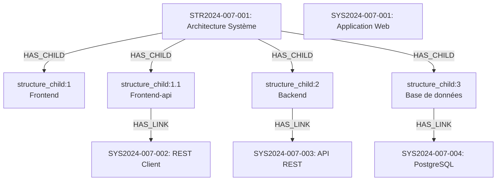

#### Nesting (Imbrication)

Les `structure_child` peuvent être **organisés hiérarchiquement** pour créer des arborescences complexes. Cependant, **tous les `structure_child` sont des enfants directs de la structure** via `HAS_CHILD`.

**Principe fondamental :** La hiérarchie n'est **pas encodée via des relations** entre `structure_child`, mais via une **propriété `child`** qui contient une valeur avec notation pointée (ex: `"1"`, `"1.1"`, `"1.2.3"`).

**Comment fonctionne le nesting :**
- Tous les `structure_child` ont une relation directe : `STRUCTURE --HAS_CHILD--> structure_child`
- Pas de relation `structure_child --HAS_CHILD--> structure_child` (cette relation n'existe pas)
- La propriété `child` de chaque `structure_child` encode son niveau :
  - `child: "1"` → niveau 1 (racine)
  - `child: "1.1"` → niveau 2 (enfant de "1")
  - `child: "1.2.3"` → niveau 4 (enfant de "1.2")
- Le nombre de points (`.`) détermine la profondeur
- **Seules les feuilles** (nœuds terminaux sans enfants) peuvent avoir une relation `HAS_LINK` vers une entité

**Schéma des relations réelles :**

```/dev/null/structure-nesting-relations.txt#L1-15
STR2024-008-001 (Structure racine)
  │
  ├── HAS_CHILD → structure_child { child: "1", name: "Module A" }
  ├── HAS_CHILD → structure_child { child: "1.1", name: "Sous-module A1" }
  ├── HAS_CHILD → structure_child { child: "1.1.1" } --HAS_LINK--> REQ2024-008-001 (feuille)
  ├── HAS_CHILD → structure_child { child: "1.2", name: "Sous-module A2" }
  ├── HAS_CHILD → structure_child { child: "1.2.1" } --HAS_LINK--> REQ2024-008-002 (feuille)
  ├── HAS_CHILD → structure_child { child: "2", name: "Module B" }
  ├── HAS_CHILD → structure_child { child: "2.1", name: "Sous-module B1" }
  ├── HAS_CHILD → structure_child { child: "2.1.1" } --HAS_LINK--> REQ2024-008-003 (feuille)
  └── HAS_CHILD → structure_child { child: "3" } --HAS_LINK--> REQ2024-008-004 (feuille)

Tous les structure_child sont au même niveau relationnel (enfants directs).
La hiérarchie visuelle est reconstruite à partir des valeurs de la propriété `child`.
Seuls les nœuds feuilles (sans enfants) ont une relation HAS_LINK vers une entité.
```

**Visualisation : Perception vs Réalité**

```/dev/null/structure-perception-vs-reality.txt#L1-25
┌─────────────────────────────────────────────────────────────┐
│  PERCEPTION (hiérarchie visuelle)                           │
├─────────────────────────────────────────────────────────────┤
│  Structure                                                  │
│    └─ structure_child "1"                                   │
│        ├─ structure_child "1.1"                             │
│        │   └─ structure_child "1.1.1"                       │
│        └─ structure_child "1.2"                             │
└─────────────────────────────────────────────────────────────┘

┌─────────────────────────────────────────────────────────────┐
│  RÉALITÉ (relations dans le graphe)                         │
├─────────────────────────────────────────────────────────────┤
│  Structure                                                  │
│    ├── HAS_CHILD → structure_child { child: "1" }          │
│    ├── HAS_CHILD → structure_child { child: "1.1" }        │
│    ├── HAS_CHILD → structure_child { child: "1.1.1" }      │
│    └── HAS_CHILD → structure_child { child: "1.2" }        │
│                                                             │
│  Tous au même niveau ! La hiérarchie est dans la propriété │
│  `child`, pas dans les relations.                          │
└─────────────────────────────────────────────────────────────┘
```

#### Relation HAS_LINK

La relation `HAS_LINK` connecte un `structure_child` à une entité du type défini dans la métadonnée `type` de la structure. Cette relation permet de grouper des entités dans une organisation hiérarchique sans modifier leur appartenance naturelle dans le graphe du projet.

**Caractéristiques de HAS_LINK :**
- **Unidirectionnelle** : du `structure_child` vers l'entité
- **Type-safe** : seules les entités du type spécifié peuvent être liées
- **Non-exclusive** : une même entité peut être référencée par plusieurs `structure_child`
- **Organisationnelle** : crée une vue alternative sans changer la structure du projet
- **Restriction** : seuls les `structure_child` feuilles (nœuds terminaux sans enfants) peuvent avoir `HAS_LINK`

#### Use case : Organisation par domaine fonctionnel

```/dev/null/structure-example.txt#L1-15
Structure: "Organisation par domaine" (type="requirement")
├── structure_child:1 "Gestion des utilisateurs"
│   ├── structure_child:1.1 "Authentification"
│   │   ├── structure_child:1.1.1 --HAS_LINK--> REQ2024-009-001: "SSO"
│   │   └── structure_child:1.1.2 --HAS_LINK--> REQ2024-009-002: "MFA"
│   └── structure_child:1.2 "Autorisation"
│       └── structure_child:1.2.1 --HAS_LINK--> REQ2024-009-003: "RBAC"
├── structure_child:2 "Gestion des documents"
│   ├── structure_child:2.1 --HAS_LINK--> REQ2024-009-004: "Upload"
│   └── structure_child:2.2 --HAS_LINK--> REQ2024-009-005: "Versioning"
└── structure_child:3 "Reporting"
    ├── structure_child:3.1 --HAS_LINK--> REQ2024-009-006: "Export Excel"
    └── structure_child:3.2 --HAS_LINK--> REQ2024-009-007: "Dashboard"
```

### Liste (Sequential Stack)

Les **listes** organisent les entités de manière séquentielle et plate (linéaire).

#### Caractéristiques

- **Préfixe** : `LST`
- **Mode** : `sequential`
- **Ordonné** : `true` (l'ordre est significatif)
- **Child Type** : `list_child`

#### Métadonnées

| Métadonnée | Description |
|------------|-------------|
| `children` | Map des enfants (clé → entité) |
| `type` | Type d'entité pouvant être connecté aux `list_child` |
| `views` | Configuration des vues |
| `default` | Indique si c'est la liste par défaut pour ce type d'entité dans un projet donné |

#### Exemple d'utilisation

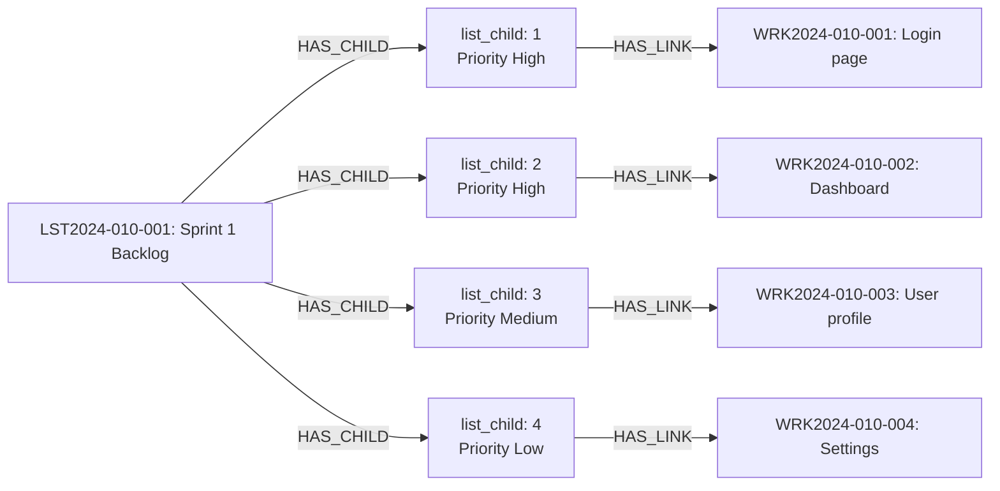

#### Nesting (Imbrication)

Contrairement aux structures, les `list_child` **ne peuvent PAS être imbriqués**. Une liste est toujours **plate** (un seul niveau de profondeur). Cette contrainte garantit la simplicité et la clarté de la séquence.

**Principe pour les listes :**
- Tous les `list_child` sont des enfants directs de la liste via `HAS_CHILD`
- La propriété `child` contient un **nombre entier** (ex: `1`, `2`, `3`, `42`)
- ✗ Pas d'imbrication : pas de notation pointée (pas de `"1.1"` ou `"2.3"`)
- ✓ Ordre significatif : la valeur numérique de `child` détermine la position dans la séquence

**Schéma des relations réelles :**

```/dev/null/list-organization-relations.txt#L1-10
LST2024-011-001 (Liste racine)
  │
  ├── HAS_CHILD → list_child { child: 1 } --HAS_LINK--> WRK2024-011-001
  ├── HAS_CHILD → list_child { child: 2 } --HAS_LINK--> WRK2024-011-002
  ├── HAS_CHILD → list_child { child: 3 } --HAS_LINK--> WRK2024-011-003
  ├── HAS_CHILD → list_child { child: 4 } --HAS_LINK--> WRK2024-011-004
  └── HAS_CHILD → list_child { child: 5 } --HAS_LINK--> WRK2024-011-005

Tous les list_child sont au même niveau relationnel.
L'ordre est déterminé par la valeur numérique de la propriété `child`.
```

#### Relation HAS_LINK

Identique aux structures, la relation `HAS_LINK` connecte un `list_child` à une entité du type défini dans la métadonnée `type` de la liste.

**Caractéristiques de HAS_LINK pour les listes :**
- **Unidirectionnelle** : du `list_child` vers l'entité
- **Type-safe** : seules les entités du type spécifié peuvent être liées
- **Non-exclusive** : une même entité peut apparaître dans plusieurs listes
- **Ordonnée** : la position du `list_child` dans la liste est significative
- **Séquentielle** : représente souvent un workflow, une priorité ou des étapes

#### Use case : Liste de tâches ordonnée

```/dev/null/list-example.txt#L1-10
Liste: "Checklist déploiement production" (type="work")
1. list_child:1 --HAS_LINK--> WRK2024-012-001: "Backup base de données"
2. list_child:2 --HAS_LINK--> WRK2024-012-002: "Arrêt des services"
3. list_child:3 --HAS_LINK--> WRK2024-012-003: "Déploiement artefacts"
4. list_child:4 --HAS_LINK--> WRK2024-012-004: "Migration DB"
5. list_child:5 --HAS_LINK--> WRK2024-012-005: "Redémarrage services"
6. list_child:6 --HAS_LINK--> WRK2024-012-006: "Tests smoke"
7. list_child:7 --HAS_LINK--> WRK2024-012-007: "Validation métier"
8. list_child:8 --HAS_LINK--> WRK2024-012-008: "Communication"
```

### Différences Structure vs Liste

| Aspect | Structure | Liste |
|--------|-----------|-------|
| **Organisation** | Hiérarchique (arbre) | Séquentielle (plate) |
| **Ordre** | Non significatif | Significatif |
| **Imbrication** | Plusieurs niveaux (via propriété `child` avec `.`) | Un seul niveau (propriété `child` entière) |
| **Relation vers entités** | `HAS_LINK` (depuis structure_child) | `HAS_LINK` (depuis list_child) |
| **Type d'entités** | Défini par métadonnée `type` | Défini par métadonnée `type` |
| **Use case** | Regroupement conceptuel, taxonomie | Workflow, checklist, priorités, séquence |
| **Exemple** | Architecture système, Organisation par domaine | Sprint backlog, Checklist, Étapes de processus |
| **Visualisation** | Arbre déployable | Liste ordonnée |

---

## Relations

Le modèle utilise des relations orientées pour connecter les entités. Le système implémente trois catégories de relations avec des règles strictes d'origine et de destination.

### Vue d'ensemble du système de relations

Le graphe VNV utilise **trois catégories de relations** distinctes :

1. **`HAS_{TYPE}`** : Appartenance au projet (toujours PROJECT → ENTITY)
2. **`IS_FOR`** : Structure logique (relations conceptuelles bidirectionnelles)
3. **`HAS_CHILD` / `HAS_LINK`** : Organisation par stacks (structures et listes)

**Tableau récapitulatif complet :**

| Catégorie | Relation | Origine | Destination | Sémantique | Exemple |
|-----------|----------|---------|-------------|------------|---------|
| **Appartenance** | `HAS_{TYPE}` | `:PROJECT` | `:ENTITY` | "Le projet possède" | `PROJECT -HAS_ORDER→ ORDER` |
| **Structure logique** | `IS_{A}_FOR_{B}` | `:ENTITY_A` | `:ENTITY_B` | "A détermine B" | `ORDER -IS_ORDER_FOR_DELIVERABLE→ DELIVERABLE` |
| **Structure logique** | `IS_{B}_FOR_{A}` | `:ENTITY_B` | `:ENTITY_A` | "B appartient à A" | `DELIVERABLE -IS_DELIVERABLE_FOR_ORDER→ ORDER` |
| **Stacks** | `HAS_CHILD` | `:STACK` | `:CHILD` | "Le stack contient" | `STRUCTURE -HAS_CHILD→ STRUCTURE_CHILD` |
| **Stacks** | `child` (propriété) | `:STRUCTURE_CHILD` | N/A | "Encodage hiérarchique" | `{ child: "1.2.3" }` (notation pointée) |
| **Stacks** | `HAS_LINK` | `:CHILD` | `:ENTITY` | "Référence organisationnelle" | `LIST_CHILD -HAS_LINK→ WORK` |

### Types de relations

#### Relations HAS_{TYPE} (Possession/Appartenance depuis le projet)

Les relations `HAS_{TYPE}` (ex: `HAS_ORDER`, `HAS_REQUIREMENT`, `HAS_WORK`) représentent une notion d'appartenance ou de conteneur.

**Règle importante :** Les relations `HAS_{TYPE}` partent **toujours d'un PROJECT vers une entité**.

**Exemples :**
- `:PROJECT` -`HAS_ORDER`→ `:ORDER`
- `:PROJECT` -`HAS_REQUIREMENT`→ `:REQUIREMENT`
- `:PROJECT` -`HAS_DELIVERABLE`→ `:DELIVERABLE`
- `:PROJECT` -`HAS_WORK`→ `:WORK`
- `:PROJECT` -`HAS_TEST_PROJECT`→ `:TEST_PROJECT`
- `:PROJECT` -`HAS_TEST_SUITE`→ `:TEST_SUITE`
- `:PROJECT` -`HAS_TEST_CASE`→ `:TEST_CASE`
- `:PROJECT` -`HAS_FILE`→ `:FILE`
- `:PROJECT` -`HAS_CONTACT`→ `:CONTACT`

**Caractéristiques :**
- **Origine** : Toujours depuis `:PROJECT`
- **Direction** : Unidirectionnelle (PROJECT → ITEM)
- **Sémantique** : "Le projet possède/contient cette entité"
- **Traçabilité** : Encode l'appartenance directe au projet (reflétée dans le token)

#### Relations HAS_CHILD et HAS_LINK (Exceptions pour les stacks)

Ces deux relations échappent à la règle précédente et sont spécifiques aux **stacks** (structures et listes).

**HAS_CHILD :** Relation d'une structure/liste vers ses enfants
- `:STRUCTURE` -`HAS_CHILD`→ `:STRUCTURE_CHILD`
- `:LIST` -`HAS_CHILD`→ `:LIST_CHILD`

**Important :** Il n'existe **PAS** de relation `HAS_CHILD` entre `structure_child`. Tous les `structure_child` sont des enfants directs de la structure. La hiérarchie est encodée dans la propriété `child` (ex: `"1"`, `"1.2"`, `"1.2.3"`).

**HAS_LINK :** Relation d'un child vers une entité cible
- `:STRUCTURE_CHILD` -`HAS_LINK`→ `:ENTITY` (selon type défini)
- `:LIST_CHILD` -`HAS_LINK`→ `:ENTITY` (selon type défini)

**Résumé des relations HAS :**

| Relation | Origine | Destination | Usage |
|----------|---------|-------------|-------|
| `HAS_{TYPE}` | `:PROJECT` | `:ENTITY` | Appartenance au projet |
| `HAS_CHILD` | `:STACK` | `:CHILD` | Le stack contient ses enfants directs |
| `HAS_LINK` | `:CHILD` | `:ENTITY` | Référence organisationnelle |
| `child` (propriété) | N/A | N/A | Encodage hiérarchique (structures: `"1.2.3"`, listes: `1`) |

#### Relations IS_FOR (Détermination/Association)

Les relations `IS_FOR` définissent une détermination ou une association entre entités. Elles sont souvent bidirectionnelles pour faciliter la navigation.

**Exemples :**
- `:PROJECT` -`IS_PROJECT_FOR_ORDER`→ `:ORDER`
- `:ORDER` -`IS_ORDER_FOR_PROJECT`→ `:PROJECT`
- `:ORDER` -`IS_ORDER_FOR_DELIVERABLE`→ `:DELIVERABLE`
- `:DELIVERABLE` -`IS_DELIVERABLE_FOR_ORDER`→ `:ORDER`

### Principe des relations multiples

Au premier niveau (PROJECT ↔ ORDER), les relations sont **triples** :

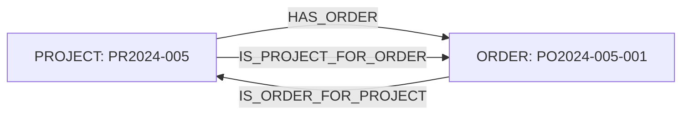

Aux niveaux plus profonds, les relations `IS_FOR` créent des **associations transitives** :

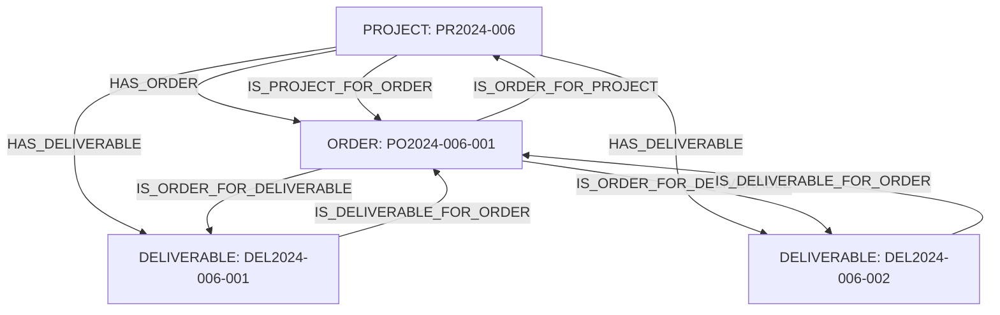

**Interprétation :**
> "Le projet **a** (HAS_ORDER, HAS_DELIVERABLE) un order et deux déliverables. C'est l'order du projet et c'est le projet de l'order (IS_FOR bidirectionnel). L'order **est l'order pour** les déliverables (IS_ORDER_FOR_DELIVERABLE) et les déliverables **sont les déliverables de** l'order (IS_DELIVERABLE_FOR_ORDER)."

**Note importante :** Remarquez que `HAS_DELIVERABLE` part du **PROJECT**, pas de l'ORDER. Les relations `HAS_{TYPE}` partent toujours du projet, même si logiquement les deliverables sont associés à un order via les relations `IS_FOR`.

### Schéma complet des relations HAS

Le diagramme suivant illustre comment **toutes** les relations `HAS_{TYPE}` partent du projet, tandis que `HAS_CHILD` et `HAS_LINK` sont spécifiques aux stacks :

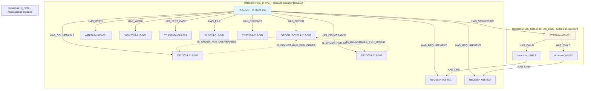

**Points clés du schéma :**

1. **HAS_{TYPE}** (bleu clair) : Toutes ces relations partent du `PROJECT`
   - Même les deliverables qui sont logiquement liés à un order
   - Reflète l'appartenance encodée dans le token (ex: `DEL2024-015-001`)

2. **IS_FOR** (pointillés) : Relations logiques/associatives
   - Bidirectionnelles pour faciliter la navigation
   - Créent les liens conceptuels entre entités

3. **HAS_CHILD/HAS_LINK** (jaune clair) : Relations de stacks
   - `HAS_CHILD` : Structure/Liste → Child
   - `HAS_LINK` : Child → Entité cible
   - Seules exceptions à la règle "HAS depuis PROJECT"

---

## Exemples de modèles d'information

### Exemple 1 : Projet de validation complet

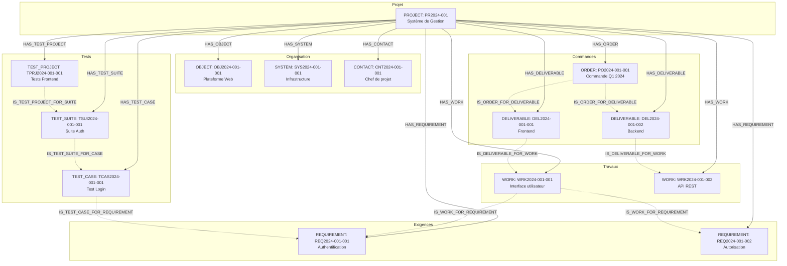

**Note sur ce diagramme :**

Ce diagramme illustre la règle fondamentale : **toutes les relations `HAS_{TYPE}` partent du PROJECT**. 

- ✅ `P -->|HAS_DELIVERABLE| D1` (depuis le projet)
- ✅ `P -->|HAS_WORK| W1` (depuis le projet)
- ❌ ~~`PO -->|HAS_DELIVERABLE| D1`~~ (incorrect, n'existe pas)
- ❌ ~~`D1 -->|HAS_WORK| W1`~~ (incorrect, n'existe pas)

Les relations logiques/conceptuelles entre entités sont exprimées via les relations **`IS_FOR`** (pointillés) :

**Relations IS_FOR dans cet exemple :**
- `IS_ORDER_FOR_DELIVERABLE` : L'order détermine les deliverables
- `IS_DELIVERABLE_FOR_WORK` : Les deliverables déterminent les travaux
- `IS_WORK_FOR_REQUIREMENT` : Les travaux implémentent les exigences
- `IS_TEST_PROJECT_FOR_SUITE` : Le projet de test organise les suites
- `IS_TEST_SUITE_FOR_CASE` : La suite contient les cas de test
- `IS_TEST_CASE_FOR_REQUIREMENT` : Les cas de test valident les exigences

Ces relations `IS_FOR` créent la **structure logique** du projet (qui dépend de quoi, qui implémente quoi), tandis que les relations `HAS_{TYPE}` établissent **l'appartenance au projet** (reflétée dans le token).

**Comparaison visuelle HAS_{TYPE} vs IS_FOR :**

```/dev/null/has-vs-isfor.txt#L1-20
┌──────────────────────────────────────────────────────────────────┐
│  Relations HAS_{TYPE} (Appartenance au projet)                   │
├──────────────────────────────────────────────────────────────────┤
│  PROJECT: PR2024-001                                             │
│      ├─ HAS_ORDER ──────────> PO2024-001-001                    │
│      ├─ HAS_DELIVERABLE ───> DEL2024-001-001                    │
│      ├─ HAS_DELIVERABLE ───> DEL2024-001-002                    │
│      ├─ HAS_WORK ──────────> WRK2024-001-001                    │
│      └─ HAS_WORK ──────────> WRK2024-001-002                    │
│                                                                   │
│  Sémantique: "Le projet possède ces entités"                     │
│  Encodage: Reflété dans le token (2024-001)                      │
└──────────────────────────────────────────────────────────────────┘

┌──────────────────────────────────────────────────────────────────┐
│  Relations IS_FOR (Structure logique)                            │
├──────────────────────────────────────────────────────────────────┤
│  PO2024-001-001 ──IS_ORDER_FOR_DELIVERABLE──> DEL2024-001-001  │
│  PO2024-001-001 ──IS_ORDER_FOR_DELIVERABLE──> DEL2024-001-002  │
│  DEL2024-001-001 ─IS_DELIVERABLE_FOR_WORK──> WRK2024-001-001   │
│  DEL2024-001-002 ─IS_DELIVERABLE_FOR_WORK──> WRK2024-001-002   │
│                                                                   │
│  Sémantique: "L'order détermine les deliverables"                │
│               "Les deliverables déterminent les travaux"          │
│  Encodage: Relations conceptuelles (non reflétées dans le token) │
└──────────────────────────────────────────────────────────────────┘
```

### Exemple 2 : Structure par domaine fonctionnel

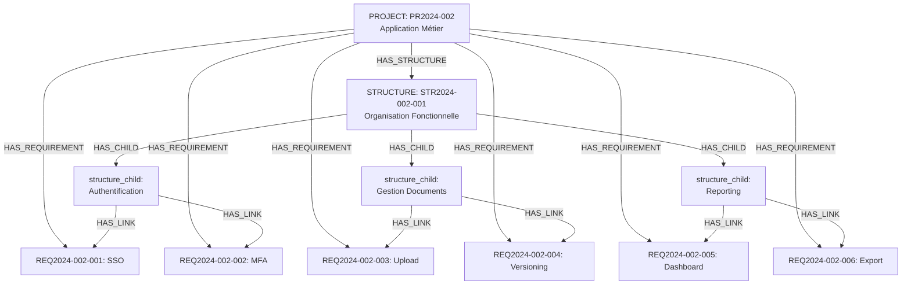

### Exemple 3 : Liste de sprint avec priorités

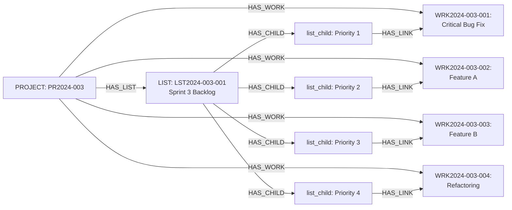

### Exemple 4 : Traçabilité exigence → test → exécution

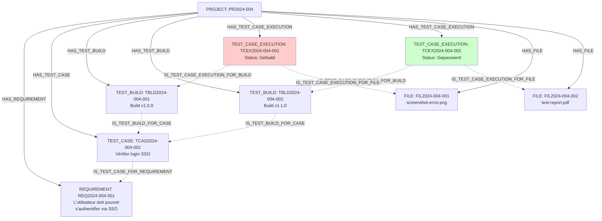

---

## Architecture multi-projets

### Vue d'ensemble

Le modèle d'information VNV supporte une **architecture multi-projets** permettant de créer des vues et des regroupements qui transcendent les frontières d'un projet unique. Cette capacité repose sur le fait que **`HAS_LINK` est la seule relation pouvant sortir d'un projet**.

### HAS_LINK : La passerelle inter-projets

**Règle fondamentale :** Toutes les relations `HAS_{TYPE}` et `IS_FOR` restent **intra-projet** (confinées à l'intérieur d'un projet). Seule la relation `HAS_LINK` peut **traverser les frontières de projet**.

**Caractéristiques de HAS_LINK inter-projet :**
- ✅ Peut pointer vers des entités d'un autre projet
- ✅ Permet de créer des vues consolidées
- ✅ Maintient la séparation logique des projets
- ✅ Offre des perspectives multiples sur l'information

### Pattern project_0 : Le méta-projet racine

Dans l'architecture VNV, le **`project_0`** représente l'**entreprise/organisation/activité globale**. Tous les autres projets sont conceptuellement des "sous-projets" de `project_0`.

**Structure hiérarchique :**

```/dev/null/project-0-architecture.txt#L1-15
PROJECT_0 (Organisation / Entreprise)
  │
  ├─ LIST: "Portfolio de projets" (type="project")
  │   ├─ list_child:1 --HAS_LINK--> PR2024-001 (Infrastructure)
  │   ├─ list_child:2 --HAS_LINK--> PR2024-002 (Application Web)
  │   ├─ list_child:3 --HAS_LINK--> PR2024-003 (Migration Cloud)
  │   └─ list_child:4 --HAS_LINK--> PR2023-015 (Maintenance)
  │
  ├─ LIST: "Toutes les ressources humaines" (type="user")
  │   ├─ list_child:1 --HAS_LINK--> USR2024-001-001 (Chef de projet, PR2024-001)
  │   ├─ list_child:2 --HAS_LINK--> USR2024-002-001 (Développeur, PR2024-002)
  │   └─ list_child:3 --HAS_LINK--> USR2024-003-002 (Architecte, PR2024-003)
  │
  └─ LIST: "Tous les produits/objets" (type="object")
      ├─ list_child:1 --HAS_LINK--> OBJ2024-001-001 (Plateforme A, PR2024-001)
      └─ list_child:2 --HAS_LINK--> OBJ2024-002-001 (Application B, PR2024-002)
```

### Types de listes inter-projets

Certains types de listes dans `project_0` permettent de créer des vues consolidées :

| Type de liste | Cible des HAS_LINK | Usage |
|---------------|-------------------|-------|
| `type="project"` | Projets d'autres projects | Portfolio de projets, programmes |
| `type="user"` | Users d'autres projets | Annuaire global, organigramme |
| `type="object"` | Objects d'autres projets | Catalogue de produits/systèmes |
| `type="processus"` | Processus d'autres projets | Référentiel de workflows |

### Exemples d'utilisation

#### Exemple 1 : Portfolio de tous les projets actifs

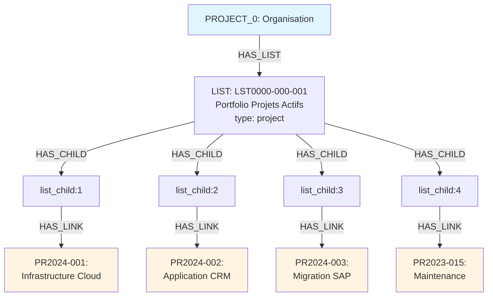

#### Exemple 2 : Vue consolidée des ressources humaines

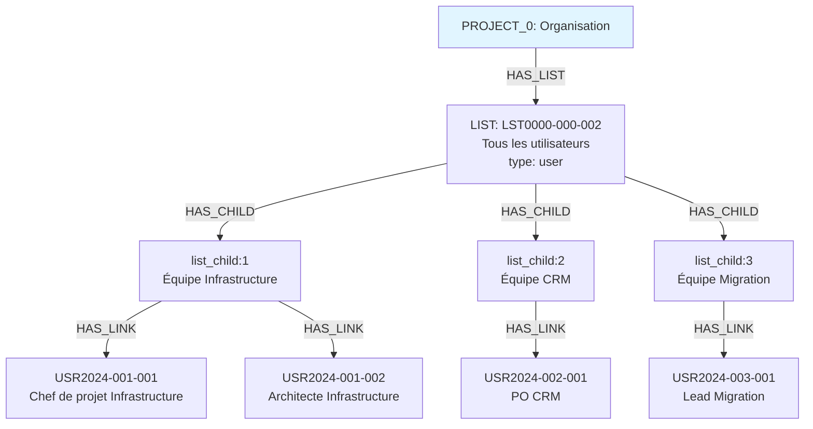

#### Exemple 3 : Structure multi-projets par domaine fonctionnel

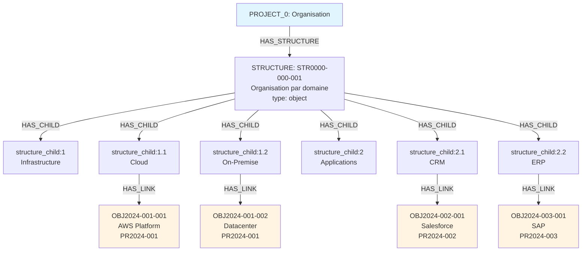

### Avantages de l'architecture multi-projets

**1. Perspectives multiples sur l'information**
- Vue consolidée au niveau organisation
- Vue détaillée au niveau projet
- Flexibilité d'analyse et de reporting

**2. Séparation logique maintenue**
- Chaque projet garde son autonomie
- Relations `HAS_{TYPE}` et `IS_FOR` restent intra-projet
- Pas de couplage fort entre projets

**3. Gestion centralisée**
- Portfolio management depuis `project_0`
- Annuaire global des utilisateurs
- Catalogue de produits/systèmes
- Référentiel de processus

**4. Évolutivité**
- Ajout de nouveaux projets sans impact
- Création de nouvelles vues consolidées
- Réorganisation flexible via stacks

### Cas d'usage typiques

**Portfolio Management :**
```
project_0 → LIST (type="project") → Tous les projets
  → Suivi global de l'avancement
  → Dashboards consolidés
  → Allocation de ressources
```

**Gestion RH :**
```
project_0 → LIST (type="user") → Tous les utilisateurs
  → Organigramme complet
  → Matrice de compétences
  → Planification de ressources
```

**Architecture d'entreprise :**
```
project_0 → STRUCTURE (type="object") → Tous les systèmes
  → Cartographie applicative
  → Architecture technique globale
  → Gestion des dépendances
```

**Gouvernance des processus :**
```
project_0 → STRUCTURE (type="processus") → Tous les workflows
  → Référentiel de processus
  → Standards et templates
  → Best practices partagées
```

### Règles et contraintes

**Ce qui est possible :**
- ✅ `list_child` dans `project_0` --HAS_LINK--> entité dans `PR2024-001`
- ✅ `structure_child` dans `project_0` --HAS_LINK--> entité dans `PR2024-002`
- ✅ Plusieurs `project_0` peuvent pointer vers la même entité
- ✅ Un projet peut avoir des listes pointant vers d'autres projets (pas seulement `project_0`)

**Ce qui n'est pas possible :**
- ❌ `PR2024-001` --HAS_REQUIREMENT--> entité dans `PR2024-002` (HAS_{TYPE} intra-projet uniquement)
- ❌ `REQ2024-001-001` --IS_FOR--> entité dans `PR2024-002` (IS_FOR intra-projet uniquement)
- ❌ Relations directes entre projets sans passer par `HAS_LINK`

### Token du project_0

Le `project_0` suit un format spécial pour le token :

```
Format: PR0000-000
Exemple: PR0000-000 (projet racine de l'organisation)

Ses entités suivent le même pattern:
- LST0000-000-001 (première liste)
- STR0000-000-001 (première structure)
- USR0000-000-001 (premier utilisateur global, si applicable)
```

---

## Cas particuliers du modèle

Certains types d'entités présentent des structures de données particulières dans le modèle d'information.

### Test Run : Connexion à deux listes

Le `test_run` est un cas particulier dans le modèle. C'est la **seule entité structurée pour être connectée simultanément à deux listes** :

1. **Liste de `test_case`** : Les cas de test à exécuter
2. **Liste de `test_case_execution`** : Les résultats d'exécution

#### Structure du modèle

**Deux listes liées au test_run :**
```
TEST_RUN: TRN2024-001-001#1
  ├─ IS_TEST_RUN_FOR_LIST → LIST (type="test_case")
  │   └─ Références vers les test_case concernés
  │
  └─ IS_TEST_RUN_FOR_LIST → LIST (type="test_case_execution")
      └─ Références vers les résultats d'exécution
```

**Notation d'itération dans le token :**
- Le token du `test_run` inclut une notation d'itération : `#1`, `#2`, `#3`, etc.
- Format : `TRN[YEAR]-[PROJECT]-[ITEM]#[ITERATION]`
- Exemples : `TRN2024-001-001#1`, `TRN2024-001-001#2`, `TRN2024-001-001#3`
- Cette notation permet de représenter plusieurs instances d'un même run de test

#### Structure d'information d'une itération

**Exemple - Itération #1 :**

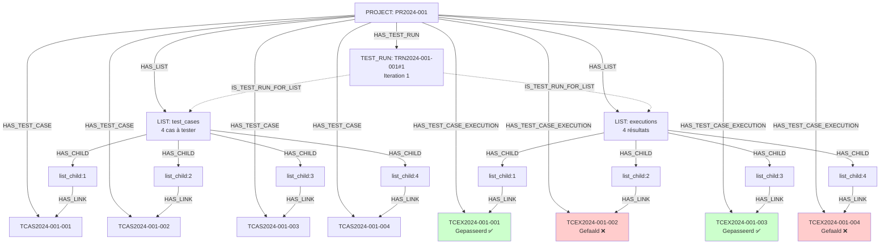

Dans cet exemple, le modèle d'information structure :
- 4 `test_case` référencés via une liste
- 4 `test_case_execution` (résultats) référencés via une seconde liste
- Relations `IS_FOR` entre le `test_run` et ses deux listes
- Résultat : 2 tests réussis ✅, 2 tests échoués ❌

**Exemple - Itération #2 :**

Dans une itération suivante, le modèle structure un sous-ensemble filtré :

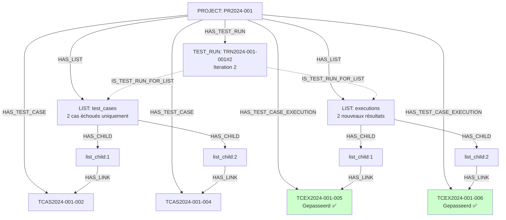

Dans cet exemple, le modèle d'information structure :
- 2 `test_case` référencés (les 2 qui ont échoué dans l'itération #1 : TC2 et TC4)
- 2 nouveaux `test_case_execution` (nouveaux résultats)
- Même pattern de relations
- Résultat : 2 tests réussis ✅, 0 test échoué → Fin du cycle


#### Principes du pattern itératif

**Progression des itérations :**

Le modèle d'information supporte la représentation de cycles itératifs via :

1. **Notation séquentielle** : `#1`, `#2`, `#3` dans le token
2. **Nouveaux test_run** : Chaque itération est un nouveau `test_run` distinct
3. **Listes indépendantes** : Chaque `test_run` possède ses propres listes
4. **Réduction progressive** : Les listes peuvent contenir des sous-ensembles des itérations précédentes

**Représentation de la chaîne itérative :**

```/dev/null/test-run-traceability.txt#L1-15
Projet: PR2024-001
├─ TEST_RUN: TRN2024-001-001#1
│   ├─ LIST: test_cases (4 cas)
│   └─ LIST: executions (4 résultats : 2 pass, 2 fail)
│
└─ TEST_RUN: TRN2024-001-001#2
    ├─ LIST: test_cases (2 cas - les 2 qui ont échoué)
    └─ LIST: executions (2 nouveaux résultats : 2 pass)

Chaque test_run est une entité distincte dans le graphe.
Les listes peuvent référencer les mêmes test_case mais créent de nouveaux test_case_execution.
```

#### Particularités structurelles

**1. Double liste par entité**
- Seul type d'entité avec deux listes attachées
- Permet la représentation de l'input (test_case) et de l'output (execution)

**2. Relations symétriques**
- Même pattern de relations `IS_TEST_RUN_FOR_LIST` pour les deux listes
- Structure cohérente et prévisible

**3. Notation d'itération**
- Extension du format de token standard
- Permet la traçabilité des cycles
- Identifiant unique pour chaque itération

**4. Flexibilité de contenu**
- Les listes peuvent contenir des sous-ensembles variables
- Support de différents patterns d'organisation
- Adaptable selon les besoins de validation

---

## Glossaire

| Terme | Définition |
|-------|------------|
| **Node** | Entité de base du modèle d'information |
| **Fragment** | Classe TypeScript représentant un type d'entité |
| **Metadata** | Propriété attachée à une entité pour stocker des informations supplémentaires |
| **Stack** | Conteneur pour créer des regroupements d'entités (Structure ou Liste) |
| **Structure** | Stack hiérarchique non ordonné |
| **Liste** | Stack séquentiel ordonné |
| **Child** | Élément enfant d'un stack (structure_child ou list_child) |
| **Token** | Identifiant unique préfixé d'une entité (ex: PR-001) |
| **RAT** | Requirements Analysis Tool - Outil d'analyse de qualité des exigences |
| **Zod** | Bibliothèque de validation de schémas TypeScript |
| **VPI** | Validation Process Infrastructure - Infrastructure du processus de validation |
