# Modèle d'Information VNV

## Introduction

Le **VNV Information Model** constitue le socle conceptuel du système de gestion de la validation et de la vérification. Il définit une architecture de graphe orienté qui structure, organise et relie l'ensemble des informations projet à travers :

- **Des entités (nodes)** : éléments fondamentaux du modèle
- **Des métadonnées** : propriétés enrichissant les entités
- **Des relations** : liens sémantiques entre entités
- **Des stacks** : structures organisationnelles hiérarchiques et séquentielles

Ce document décrit **le modèle d'information**, pas son implémentation technique. Il s'agit d'une spécification conceptuelle permettant de comprendre comment l'information est structurée, reliée et organisée dans le système VNV.

---

## Architecture Générale du Modèle

### Principes Fondamentaux

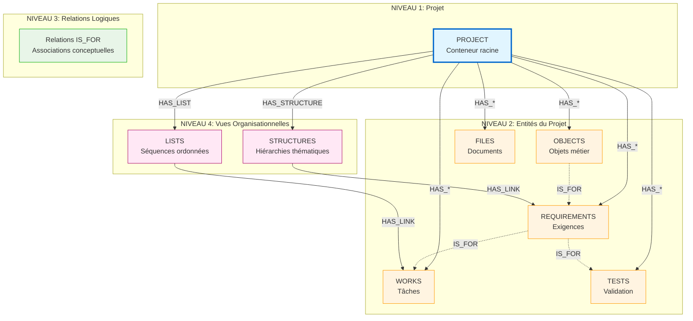

### Les 4 Piliers du Modèle

#### 1️⃣ **Entités (Nodes)**
Les **nœuds** du graphe représentent les objets métier : projets, exigences, tests, livrables, fichiers, etc. Chaque entité possède un type, un identifiant unique (token), et des métadonnées.

#### 2️⃣ **Relations**
Les **arêtes orientées** du graphe connectent les entités selon trois modes :
- **HAS_{TYPE}** : appartenance au projet (PROJECT → Entité)
- **IS_FOR** : associations logiques entre entités
- **HAS_CHILD / HAS_LINK** : organisation via stacks

#### 3️⃣ **Métadonnées**
Propriétés configurables attachées aux entités : responsables, dates, budgets, qualité, références externes, etc.

#### 4️⃣ **Stacks**
Conteneurs permettant d'organiser les entités de manière alternative :
- **Structures** : hiérarchies thématiques (arbre)
- **Listes** : séquences ordonnées (linéaire)

---

## Entités du Modèle

### Structure de Base d'une Entité

Toute entité du modèle hérite de propriétés fondamentales :

```/dev/null/entity-base.txt#L1-12
┌─────────────────────────────────────────────────┐
│  ENTITÉ DE BASE                                 │
├─────────────────────────────────────────────────┤
│  type         : string     Type d'entité        │
│  token        : string     Identifiant unique   │
│  name         : string     Nom descriptif       │
│  id           : string     UUID interne         │
│  create_dt    : number     Timestamp création   │
│  update_dt    : number     Timestamp MAJ        │
│  metadata     : object     Propriétés étendues  │
└─────────────────────────────────────────────────┘
```

### Format du Token : Identifiant Hiérarchique

Le **token** est l'identifiant canonique d'une entité. Son format encode la hiérarchie projet-entité.

#### Anatomie du Token

**Format Projet :**
```
[PREFIX][YEAR]-[PROJECT-ITERATION]
```

**Format Entité :**
```
[PREFIX][YEAR]-[PROJECT-ITERATION]-[ITEM-ITERATION]
```

#### Composants du Token

| Composant | Description | Format | Exemple |
|-----------|-------------|--------|---------|
| **PREFIX** | Type d'entité | 2-4 lettres majuscules | `PR`, `REQ`, `WRK`, `TCAS` |
| **YEAR** | Année de création projet | 4 chiffres | `2024` |
| **PROJECT-ITERATION** | Numéro du projet dans l'année | 3 chiffres (zéros préfixés) | `001`, `042`, `150` |
| **ITEM-ITERATION** | Numéro de l'entité dans le projet | 3 chiffres (zéros préfixés) | `001`, `042`, `150` |

#### Exemples de Tokens

```/dev/null/token-examples.txt#L1-30
┌─────────────────────────────────────────────────────────┐
│  PROJETS                                                │
├─────────────────────────────────────────────────────────┤
│  PR2024-001    → 1er projet de 2024                    │
│  PR2024-008    → 8ème projet de 2024                   │
│  PR2024-150    → 150ème projet de 2024                 │
└─────────────────────────────────────────────────────────┘

┌─────────────────────────────────────────────────────────┐
│  ENTITÉS DU PROJET PR2024-008                          │
├─────────────────────────────────────────────────────────┤
│  REQ2024-008-001    → 1ère exigence du projet 8       │
│  REQ2024-008-042    → 42ème exigence du projet 8      │
│  WRK2024-008-001    → 1ère tâche du projet 8          │
│  TCAS2024-008-015   → 15ème cas de test du projet 8   │
│  FIL2024-008-007    → 7ème fichier du projet 8        │
│  DEL2024-008-003    → 3ème livrable du projet 8       │
└─────────────────────────────────────────────────────────┘

┌─────────────────────────────────────────────────────────┐
│  ENTITÉS D'UN AUTRE PROJET                             │
├─────────────────────────────────────────────────────────┤
│  REQ2024-015-001    → 1ère exigence du projet 15      │
│  WRK2024-015-022    → 22ème tâche du projet 15        │
└─────────────────────────────────────────────────────────┘
```

#### Avantages du Format Token

✅ **Traçabilité immédiate** : Le token révèle l'année et le projet d'appartenance  
✅ **Unicité garantie** : Combinaison unique dans tout le système  
✅ **Lisibilité** : Format structuré et prévisible  
✅ **Tri naturel** : L'ordre alphanumérique = ordre chronologique et hiérarchique  
✅ **Encodage de l'appartenance** : Le segment `[YEAR]-[PROJECT]` identifie le projet parent

---

## Catalogue des Entités

### Vue d'Ensemble des Types

Le modèle VNV définit **plus de 30 types d'entités** organisés en 6 domaines fonctionnels :

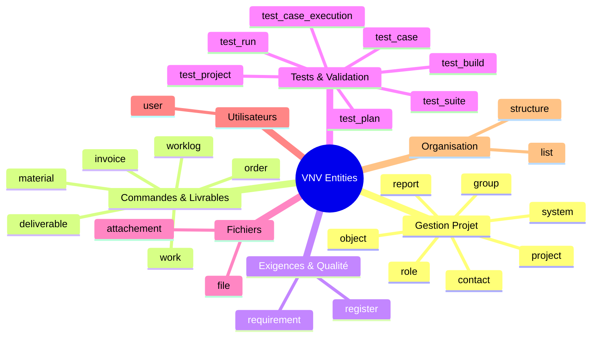

### 1. Gestion de Projet

Entités de pilotage et d'organisation du projet.

| Entité | Préfixe | Description | États disponibles |
|--------|---------|-------------|-------------------|
| **project** | `PR` | Projet principal, conteneur racine | Niet gestart, Bezig, Geblokkeerd, Geannuleerd, Afgewerkt |
| **object** | `OBJ` | Objet métier du projet (produit, système) | Finaal, Niet Finaal |
| **system** | `SYS` | Système technique ou fonctionnel | - |
| **contact** | `CNT` | Contact, stakeholder du projet | - |
| **role** | `ROL` | Rôle dans le projet | - |
| **group** | `GRP` | Groupe de travail, équipe | - |
| **report** | `REP` | Rapport de projet ou de validation | - |

**Exemple de structure :**

```/dev/null/project-example.txt#L1-10
PROJECT: PR2024-012 "Plateforme de Gestion Documentaire"
  ├─ OBJECT: OBJ2024-012-001 "Application Web GED"
  ├─ SYSTEM: SYS2024-012-001 "Module d'indexation"
  ├─ SYSTEM: SYS2024-012-002 "Module de recherche"
  ├─ CONTACT: CNT2024-012-001 "Chef de Projet Client"
  ├─ CONTACT: CNT2024-012-002 "Responsable Qualité"
  ├─ GROUP: GRP2024-012-001 "Équipe Dev Frontend"
  └─ GROUP: GRP2024-012-002 "Équipe Dev Backend"
```

### 2. Commandes et Livrables

Entités de planification et de suivi budgétaire.

| Entité | Préfixe | Description | Métadonnées clés |
|--------|---------|-------------|------------------|
| **order** | `PO` | Commande (Purchase Order) | startDate, endDate, estimateTime, estimateCost, budgetYear |
| **deliverable** | `DEL` | Livrable contractuel | status (Gealloceerd/Niet gealloceerd), estimateTime, estimateCost |
| **work** | `WRK` | Tâche de travail, activité | status, estimateTime, estimateCost |
| **worklog** | `WRKLG` | Journal de travail (temps passé) | estimateTime, estimateCost |
| **material** | `MAT` | Matériel, ressource physique | status (Aangekocht/Niet aangekocht), estimateCost |
| **invoice** | `INV` | Facture | status (cycle de facturation) |

**Chaîne de valeur typique :**

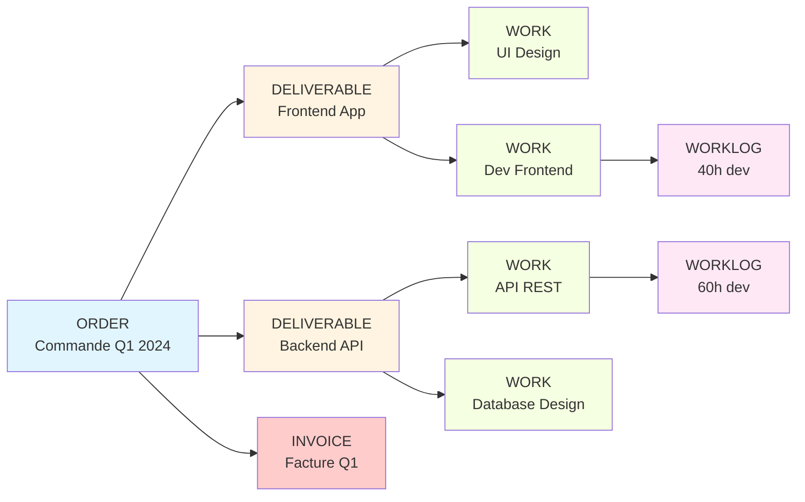

### 3. Exigences et Qualité

Entités de spécification et de suivi qualité.

| Entité | Préfixe | Description | Métadonnées clés |
|--------|---------|-------------|------------------|
| **requirement** | `REQ` | Exigence fonctionnelle ou technique | status (SMART/Niet SMART), author, category, content, rat (Requirements Analysis Tool), dataQuality, consistency, completeness, correctness |
| **register** | `REG` | Registre (problème, risque, décision) | project_id, register_dt, resolver_dt, category, assignee, remark, itemPath |

**Analyse qualité RAT (Requirements Analysis Tool) :**

```/dev/null/rat-structure.txt#L1-15
┌──────────────────────────────────────────────────┐
│  RAT : Requirements Analysis Tool                │
├──────────────────────────────────────────────────┤
│  qualityLevel     : High / Medium / Low          │
│  numericQuality   : 0-100                        │
│  qualityDate      : Date d'évaluation            │
│  qualitySummary   : Résumé de l'analyse          │
├──────────────────────────────────────────────────┤
│  Dimensions de qualité :                         │
│   • consistency     : Cohérence                  │
│   • completeness    : Complétude                 │
│   • correctness     : Correction                 │
│   • dataQuality     : Qualité des données        │
└──────────────────────────────────────────────────┘
```

### 4. Tests et Validation

Entités de vérification et validation.

| Entité | Préfixe | Description | États disponibles |
|--------|---------|-------------|-------------------|
| **test_project** | `TPRJ` | Projet de test | Finaal, Niet Finaal |
| **test_build** | `TBLD` | Build à tester (version, release) | Finaal, Niet Finaal |
| **test_plan** | `TPLN` | Plan de test | Finaal, Niet Finaal |
| **test_suite** | `TSUI` | Suite de tests (groupe thématique) | Finaal, Niet Finaal |
| **test_case** | `TCAS` | Cas de test (scénario de validation) | Revisie, Klaar voor test |
| **test_case_execution** | `TCEX` | Exécution d'un cas de test (résultat) | Niet uitgevoerd, Gepasseerd, Gefaald |
| **test_run** | `TRN` | Run de test (campagne de tests) | Niet uitgevoerd, Uitgevoerd, Deels uitgevoerd |

**Hiérarchie de validation :**

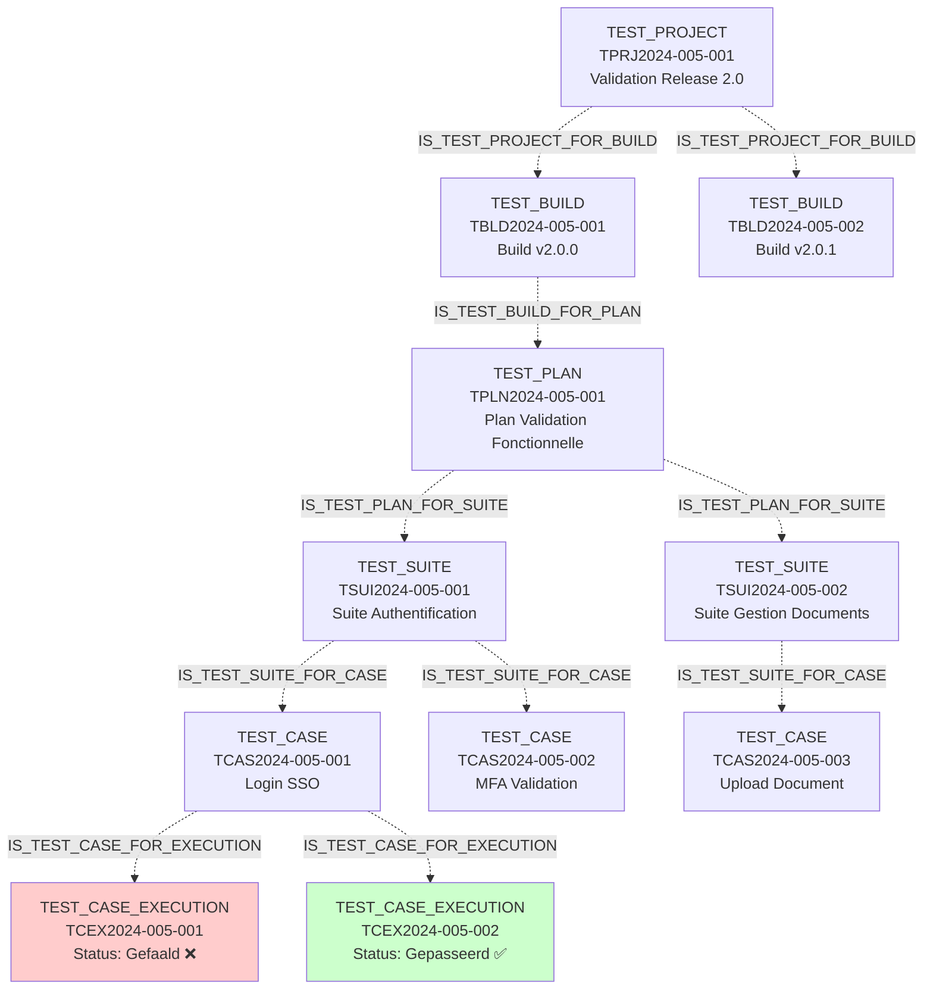

### 5. Fichiers et Documents

| Entité | Préfixe | Description | Métadonnées clés |
|--------|---------|-------------|------------------|
| **file** | `FIL` | Fichier, document | extension, fileType, mimeType, fileSize, contentDigest, url, liveview, tags, consistency, completeness, correctness |
| **attachement** | `ATT` | Pièce jointe | estimateTime, estimateCost |

### 6. Utilisateurs

| Entité | Préfixe | Description | Métadonnées clés |
|--------|---------|-------------|------------------|
| **user** | `USR` | Utilisateur du système | first_name, last_name, email, mobile, alias, groups, officeLocation, businessPhones, preferredLanguage, jobTitle, userPrincipalName |

### 7. Organisation (Stacks)

| Entité | Préfixe | Description | Mode |
|--------|---------|-------------|------|
| **structure** | `STR` | Structure hiérarchique (arbre) | hierarchical |
| **list** | `LST` | Liste séquentielle (linéaire) | sequential |

---

## Système de Métadonnées

Les **métadonnées** enrichissent les entités avec des propriétés configurables. Le modèle VNV offre **plus de 70 métadonnées** organisées en 10 familles.

### Architecture des Métadonnées

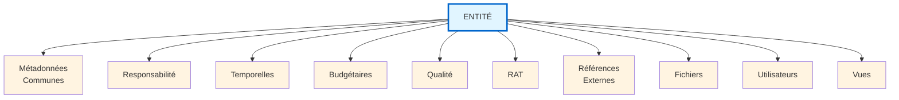

### 1. Métadonnées Communes

Applicables à tous les types d'entités.

| Clé | Type | Description |
|-----|------|-------------|
| `description` | `string` | Description textuelle détaillée |
| `userGroup` | `Array<string>` | Groupes d'utilisateurs associés |
| `path` | `Array<string>` | Chemin hiérarchique dans l'organisation |
| `tags` | `Array<string>` | Tags/étiquettes pour classification |
| `category` | `string` | Catégorie fonctionnelle ou technique |

### 2. Métadonnées de Responsabilité

| Clé | Type | Description |
|-----|------|-------------|
| `responsible_intern` | `string` | Responsable interne (organisation) |
| `responsible_extern` | `string` | Responsable externe (client, fournisseur) |
| `assignee` | `string` | Personne assignée à l'item |
| `author` | `string` | Auteur, créateur de l'entité |

### 3. Métadonnées Temporelles

| Clé | Type | Description |
|-----|------|-------------|
| `startDate` | `string` | Date de début (ISO format) |
| `endDate` | `string` | Date de fin (ISO format) |
| `dateModified` | `string` | Date de dernière modification |
| `dateModifiedValue` | `number` | Timestamp de modification |
| `register_dt` | `number` | Timestamp d'enregistrement |
| `resolver_dt` | `number` | Timestamp de résolution |

### 4. Métadonnées Budgétaires

| Clé | Type | Description |
|-----|------|-------------|
| `budgetYear` | `string` | Année budgétaire |
| `estimateTime` | `string` | Temps estimé (charge de travail) |
| `estimateCost` | `string` | Coût estimé |

### 5. Métadonnées de Qualité

| Clé | Type | Description |
|-----|------|-------------|
| `dataQuality` | `string` | Indicateur de qualité des données |
| `consistency` | `string` | Statut de cohérence |
| `completeness` | `string` | Statut de complétude |
| `correctness` | `string` | Statut de correction |

### 6. Métadonnées RAT (Requirements Analysis Tool)

Structure d'analyse qualité pour les exigences.

```/dev/null/rat-metadata.txt#L1-20
┌──────────────────────────────────────────────────────┐
│  Structure RAT                                       │
├──────────────────────────────────────────────────────┤
│  rat: {                                              │
│    qualityLevel: string      // High, Medium, Low    │
│    numericQuality: number    // 0-100                │
│    qualityDate: string       // Date d'évaluation    │
│    qualitySummary: string    // Résumé de l'analyse  │
│  }                                                   │
└──────────────────────────────────────────────────────┘

Exemple :
{
  qualityLevel: "High",
  numericQuality: 87,
  qualityDate: "2024-01-15",
  qualitySummary: "Exigence SMART avec critères mesurables et traçables"
}
```

### 7. Métadonnées de Références Externes

Le modèle supporte l'intégration avec 6 plateformes externes.

```/dev/null/external-refs.txt#L1-35
┌──────────────────────────────────────────────────────┐
│  Références Externes                                 │
├──────────────────────────────────────────────────────┤
│  external: {                                         │
│    excel: {                                          │
│      token: string                                   │
│    },                                                │
│    jira: {                                           │
│      id: string,                                     │
│      url: string                                     │
│    },                                                │
│    relatics: {                                       │
│      id: string,                                     │
│      url: string                                     │
│    },                                                │
│    testlink: {                                       │
│      id: string,                                     │
│      url: string                                     │
│    },                                                │
│    sharepoint: {                                     │
│      id: string,                                     │
│      url: string                                     │
│    },                                                │
│    graph365: {                                       │
│      id: string,                                     │
│      url: string                                     │
│    }                                                 │
│  }                                                   │
└──────────────────────────────────────────────────────┘
```

**Exemple d'utilisation :**

```/dev/null/external-example.txt#L1-15
REQUIREMENT: REQ2024-010-042
  name: "Authentification multi-facteurs"
  external: {
    jira: {
      id: "VNV-1234",
      url: "https://jira.company.com/browse/VNV-1234"
    },
    testlink: {
      id: "TC-456",
      url: "https://testlink.company.com/tc-456"
    }
  }
```

### 8. Métadonnées de Fichiers

Spécifiques aux entités `file`.

| Clé | Type | Description |
|-----|------|-------------|
| `extension` | `string` | Extension du fichier (.pdf, .docx, etc.) |
| `fileType` | `string` | Type de fichier |
| `mimeType` | `string` | Type MIME détaillé |
| `fileSize` | `number` | Taille en bytes |
| `fileSizeRaw` | `string` | Taille formatée (ex: "2.5 MB") |
| `contentDigest` | `string` | Hash SHA du contenu |
| `url` | `string` | URL d'accès au fichier |
| `liveview` | `string` | URL de prévisualisation |
| `modifiedBy` | `string` | Dernière personne ayant modifié |

### 9. Métadonnées d'Utilisateurs

Spécifiques aux entités `user`.

| Clé | Type | Description |
|-----|------|-------------|
| `first_name` | `string` | Prénom |
| `last_name` | `string` | Nom de famille |
| `email` | `string` | Adresse email (validée) |
| `mobile` | `string` | Téléphone mobile |
| `alias` | `string` | Alias/Surnom |
| `groups` | `string` | Groupes d'appartenance |
| `officeLocation` | `string` | Localisation du bureau |
| `businessPhones` | `string` | Téléphones professionnels |
| `preferredLanguage` | `string` | Langue préférée |
| `jobTitle` | `string` | Titre du poste |
| `userPrincipalName` | `string` | Nom principal utilisateur (UPN) |

### 10. Métadonnées de Vues

Configuration des visualisations de l'interface utilisateur.

```/dev/null/views-metadata.txt#L1-20
┌──────────────────────────────────────────────────────┐
│  Métadonnées de Vues                                 │
├──────────────────────────────────────────────────────┤
│  views: {                                            │
│    bubble: string,                                   │
│    forceDirectedTree: string,                        │
│    listView: {                                       │
│      views: any                                      │
│    }                                                 │
│  }                                                   │
└──────────────────────────────────────────────────────┘

Exemple :
{
  bubble: "default",
  forceDirectedTree: "hierarchical",
  listView: {
    views: {
      columns: ["name", "status", "responsible_intern"],
      sorting: "name",
      groupBy: "category"
    }
  }
}
```

---

## Relations du Modèle

Le modèle VNV utilise un système de **relations orientées** pour connecter les entités. Ces relations suivent des règles strictes d'origine et de destination.

### Architecture des Relations

```mermaid
graph TB
    subgraph "Catégorie 1: Appartenance (HAS_*)"
        P1[PROJECT]
        E1[Entités]
        P1 -->|HAS_ORDER| E1
        P1 -->|HAS_REQUIREMENT| E1
        P1 -->|HAS_WORK| E1
        P1 -->|HAS_TEST_CASE| E1
    end
    
    subgraph "Catégorie 2: Structure Logique (IS_FOR)"
        E2A[ORDER]
        E2B[DELIVERABLE]
        E2C[WORK]
        E2A -.->|IS_ORDER_FOR_DELIVERABLE| E2B
        E2B -.->|IS_DELIVERABLE_FOR_WORK| E2C
    end
    
    subgraph "Catégorie 3: Organisation (Stacks)"
        STR[STRUCTURE/LIST]
        CHILD[structure_child/list_child]
        ENT[Entité Cible]
        STR -->|HAS_CHILD| CHILD
        CHILD -->|HAS_LINK| ENT
    end
    
    style P1 fill:#e1f5ff,stroke:#0066cc,stroke-width:3px
    style E1 fill:#fff4e1
    style E2A fill:#e8f5e8
    style E2B fill:#e8f5e8
    style E2C fill:#e8f5e8
    style STR fill:#ffe8f5
    style CHILD fill:#ffe8f5
    style ENT fill:#fff4e1
```

### Les 3 Catégories de Relations

#### 1️⃣ Relations HAS_{TYPE} : Appartenance au Projet

**Principe fondamental :** Les relations `HAS_{TYPE}` partent **TOUJOURS** d'un **PROJECT** vers une entité.

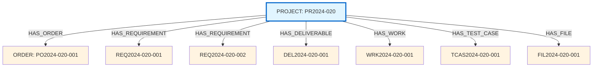

**Caractéristiques :**
- ✅ **Origine** : Toujours `:PROJECT`
- ✅ **Direction** : Unidirectionnelle (PROJECT → ENTITY)
- ✅ **Sémantique** : "Le projet possède/contient cette entité"
- ✅ **Encodage** : Reflété dans le token (ex: `REQ2024-020-001` appartient à `PR2024-020`)

**Relations HAS disponibles :**

| Relation | Origine | Destination | Sémantique |
|----------|---------|-------------|------------|
| `HAS_OBJECT` | `:PROJECT` | `:OBJECT` | Le projet possède cet objet |
| `HAS_SYSTEM` | `:PROJECT` | `:SYSTEM` | Le projet possède ce système |
| `HAS_ORDER` | `:PROJECT` | `:ORDER` | Le projet possède cette commande |
| `HAS_DELIVERABLE` | `:PROJECT` | `:DELIVERABLE` | Le projet possède ce livrable |
| `HAS_REQUIREMENT` | `:PROJECT` | `:REQUIREMENT` | Le projet possède cette exigence |
| `HAS_WORK` | `:PROJECT` | `:WORK` | Le projet possède ce travail |
| `HAS_TEST_PROJECT` | `:PROJECT` | `:TEST_PROJECT` | Le projet possède ce projet de test |
| `HAS_TEST_SUITE` | `:PROJECT` | `:TEST_SUITE` | Le projet possède cette suite de tests |
| `HAS_TEST_CASE` | `:PROJECT` | `:TEST_CASE` | Le projet possède ce cas de test |
| `HAS_FILE` | `:PROJECT` | `:FILE` | Le projet possède ce fichier |
| `HAS_CONTACT` | `:PROJECT` | `:CONTACT` | Le projet possède ce contact |
| `HAS_STRUCTURE` | `:PROJECT` | `:STRUCTURE` | Le projet possède cette structure |
| `HAS_LIST` | `:PROJECT` | `:LIST` | Le projet possède cette liste |

#### 2️⃣ Relations IS_FOR : Structure Logique

Les relations `IS_FOR` définissent des **associations conceptuelles** entre entités. Elles sont souvent **bidirectionnelles** pour faciliter la navigation.

```mermaid
graph LR
    O[ORDER<br/>PO2024-025-001]
    D[DELIVERABLE<br/>DEL2024-025-001]
    W[WORK<br/>WRK2024-025-001]
    R[REQUIREMENT<br/>REQ2024-025-001]
    T[TEST_CASE<br/>TCAS2024-025-001]
    
    O -.->|IS_ORDER_FOR_DELIVERABLE| D
    D -.->|IS_DELIVERABLE_FOR_ORDER| O
    
    D -.->|IS_DELIVERABLE_FOR_WORK| W
    W -.->|IS_WORK_FOR_DELIVERABLE| D
    
    W -.->|IS_WORK_FOR_REQUIREMENT| R
    R -.->|IS_REQUIREMENT_FOR_WORK| W
    
    T -.->|IS_TEST_CASE_FOR_REQUIREMENT| R
    R -.->|IS_REQUIREMENT_FOR_TEST_CASE| T
    
    style O fill:#e8f5e8,stroke:#00aa00
    style D fill:#e8f5e8,stroke:#00aa00
    style W fill:#e8f5e8,stroke:#00aa00
    style R fill:#e8f5e8,stroke:#00aa00
    style T fill:#e8f5e8,stroke:#00aa00
```

**Caractéristiques :**
- ✅ **Origine/Destination** : Entre entités (pas depuis PROJECT)
- ✅ **Bidirectionnalité** : Souvent en paires symétriques
- ✅ **Sémantique** : "A détermine B" / "B appartient à A"
- ✅ **Périmètre** : Relations intra-projet uniquement

**Exemples de relations IS_FOR :**

| Relation | Sens | Sémantique |
|----------|------|------------|
| `IS_ORDER_FOR_DELIVERABLE` | ORDER → DELIVERABLE | La commande détermine les livrables |
| `IS_DELIVERABLE_FOR_ORDER` | DELIVERABLE → ORDER | Le livrable appartient à la commande |
| `IS_DELIVERABLE_FOR_WORK` | DELIVERABLE → WORK | Le livrable détermine les travaux |
| `IS_WORK_FOR_REQUIREMENT` | WORK → REQUIREMENT | Le travail implémente l'exigence |
| `IS_TEST_CASE_FOR_REQUIREMENT` | TEST_CASE → REQUIREMENT | Le test valide l'exigence |
| `IS_TEST_SUITE_FOR_CASE` | TEST_SUITE → TEST_CASE | La suite contient le cas de test |

#### 3️⃣ Relations de Stacks : Organisation

Les **stacks** (structures et listes) utilisent deux relations spéciales :

**HAS_CHILD** : Du stack vers ses enfants

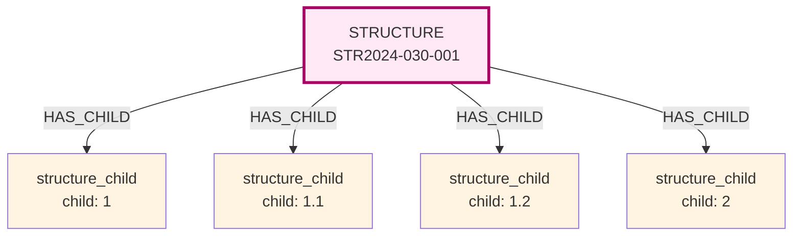

**HAS_LINK** : Du child vers une entité cible

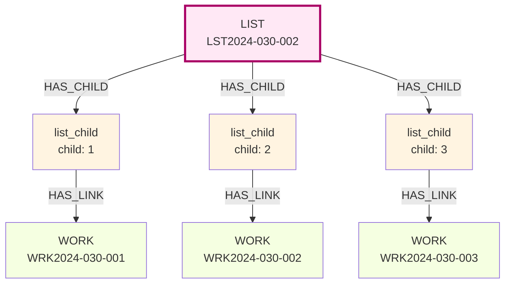

### Tableau Récapitulatif des Relations

| Catégorie | Relation | Origine | Destination | Périmètre | Bidirectionnelle |
|-----------|----------|---------|-------------|-----------|------------------|
| **Appartenance** | `HAS_{TYPE}` | `:PROJECT` | `:ENTITY` | Intra-projet | Non |
| **Structure logique** | `IS_{A}_FOR_{B}` | `:ENTITY_A` | `:ENTITY_B` | Intra-projet | Oui (paires) |
| **Stacks** | `HAS_CHILD` | `:STACK` | `:CHILD` | Intra-projet | Non |
| **Stacks** | `HAS_LINK` | `:CHILD` | `:ENTITY` | **Inter-projets possible** | Non |

### Règle Cruciale : HAS_LINK et Multi-Projets

**HAS_LINK** est la **SEULE** relation pouvant traverser les frontières de projet.

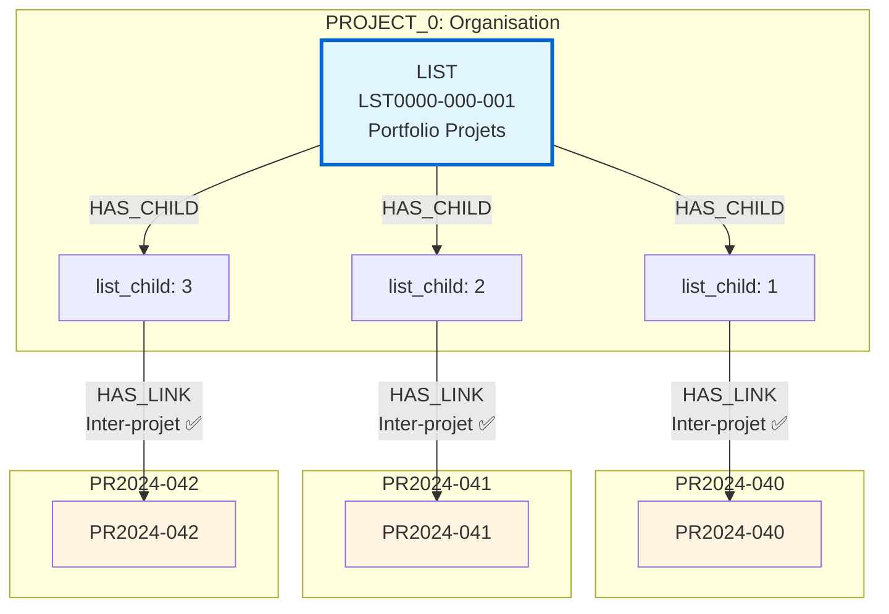

---

## Stacks : Structures et Listes

Les **stacks** permettent de créer des **vues organisationnelles alternatives** sur les entités, indépendantes de la hiérarchie naturelle projet-entités.

### Concepts Fondamentaux

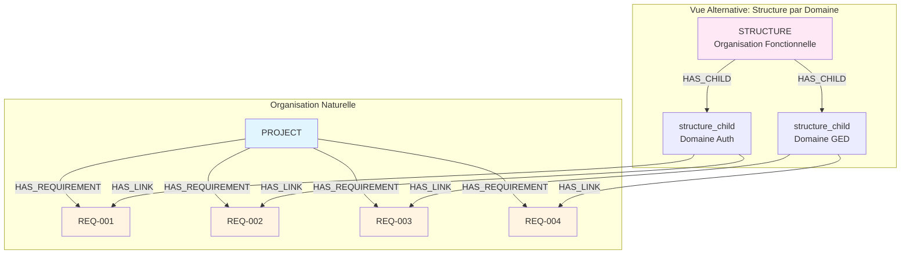

### Structure : Stack Hiérarchique

Les **structures** organisent les entités en **arborescence thématique**.

#### Caractéristiques

| Propriété | Valeur |
|-----------|--------|
| **Préfixe** | `STR` |
| **Mode** | `hierarchical` |
| **Ordonné** | `false` (ordre non significatif) |
| **Type d'enfant** | `structure_child` |
| **Imbrication** | Plusieurs niveaux via propriété `child` |

#### Propriété `child` : Encodage de la Hiérarchie

**Principe clé :** La hiérarchie n'est **PAS** encodée via des relations entre `structure_child`, mais via la **propriété `child`** avec **notation pointée**.

```/dev/null/structure-child-encoding.txt#L1-25
┌──────────────────────────────────────────────────────┐
│  Encodage Hiérarchique dans structure_child          │
├──────────────────────────────────────────────────────┤
│  child: "1"         → Niveau 1 (racine)              │
│  child: "1.1"       → Niveau 2 (enfant de "1")       │
│  child: "1.2"       → Niveau 2 (enfant de "1")       │
│  child: "1.1.1"     → Niveau 3 (enfant de "1.1")     │
│  child: "1.2.1"     → Niveau 3 (enfant de "1.2")     │
│  child: "1.2.2"     → Niveau 3 (enfant de "1.2")     │
│  child: "2"         → Niveau 1 (racine)              │
│  child: "2.1"       → Niveau 2 (enfant de "2")       │
└──────────────────────────────────────────────────────┘

Relations Réelles dans le Graphe :
┌──────────────────────────────────────────────────────┐
│  STRUCTURE: STR2024-050-001                          │
│    ├── HAS_CHILD → structure_child { child: "1" }   │
│    ├── HAS_CHILD → structure_child { child: "1.1" } │
│    ├── HAS_CHILD → structure_child { child: "1.2" } │
│    ├── HAS_CHILD → structure_child { child: "1.1.1"}│
│    ├── HAS_CHILD → structure_child { child: "2" }   │
│    └── HAS_CHILD → structure_child { child: "2.1" } │
│                                                      │
│  Tous les structure_child sont des enfants DIRECTS  │
│  La hiérarchie visuelle est reconstruite via `child`│
└──────────────────────────────────────────────────────┘
```

#### Visualisation : Perception vs Réalité

```/dev/null/structure-perception.txt#L1-25
┌────────────────────────────────────────────────────┐
│  PERCEPTION (arbre visuel)                         │
├────────────────────────────────────────────────────┤
│  STRUCTURE: Architecture                           │
│    ├─ "1" Frontend                                 │
│    │   ├─ "1.1" React App                          │
│    │   │   └─ "1.1.1" Components                   │
│    │   └─ "1.2" Vue App                            │
│    └─ "2" Backend                                  │
│        └─ "2.1" API REST                           │
└────────────────────────────────────────────────────┘

┌────────────────────────────────────────────────────┐
│  RÉALITÉ (relations dans le graphe)                │
├────────────────────────────────────────────────────┤
│  STRUCTURE                                         │
│    ├── HAS_CHILD → structure_child { child: "1" } │
│    ├── HAS_CHILD → structure_child { child: "1.1"}│
│    ├── HAS_CHILD → structure_child { child:"1.1.1"}│
│    ├── HAS_CHILD → structure_child { child: "1.2"}│
│    ├── HAS_CHILD → structure_child { child: "2" } │
│    └── HAS_CHILD → structure_child { child: "2.1"}│
│                                                    │
│  Tous au MÊME niveau relationnel !                │
│  La hiérarchie est dans la valeur de `child`.     │
└────────────────────────────────────────────────────┘
```

#### Règle HAS_LINK : Feuilles Uniquement

**Seuls les `structure_child` feuilles** (nœuds terminaux sans enfants) peuvent avoir `HAS_LINK` vers des entités.

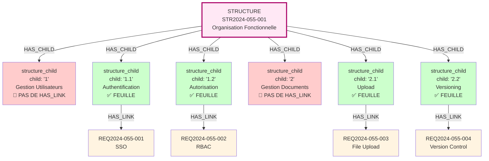

#### Métadonnées de Structure

| Métadonnée | Type | Description |
|------------|------|-------------|
| `type` | `string` | Type d'entité pouvant être lié (ex: "requirement", "work") |
| `children` | `Map<string, entity>` | Map des enfants (clé → entité) |
| `views` | `object` | Configuration des vues d'affichage |
| `default` | `boolean` | Indique si c'est la structure par défaut pour ce type dans le projet |

### Liste : Stack Séquentiel

Les **listes** organisent les entités en **séquence ordonnée linéaire**.

#### Caractéristiques

| Propriété | Valeur |
|-----------|--------|
| **Préfixe** | `LST` |
| **Mode** | `sequential` |
| **Ordonné** | `true` (ordre significatif) |
| **Type d'enfant** | `list_child` |
| **Imbrication** | **AUCUNE** (un seul niveau) |

#### Propriété `child` : Encodage de l'Ordre

Pour les listes, la propriété `child` contient un **nombre entier** représentant la position dans la séquence.

```/dev/null/list-child-encoding.txt#L1-20
┌──────────────────────────────────────────────────────┐
│  Encodage d'Ordre dans list_child                    │
├──────────────────────────────────────────────────────┤
│  child: 1         → Première position                │
│  child: 2         → Deuxième position                │
│  child: 3         → Troisième position               │
│  child: 42        → 42ème position                   │
│  child: 100       → 100ème position                  │
└──────────────────────────────────────────────────────┘

Relations Réelles dans le Graphe :
┌──────────────────────────────────────────────────────┐
│  LIST: LST2024-060-001                               │
│    ├── HAS_CHILD → list_child { child: 1 }          │
│    ├── HAS_CHILD → list_child { child: 2 }          │
│    ├── HAS_CHILD → list_child { child: 3 }          │
│    ├── HAS_CHILD → list_child { child: 4 }          │
│    └── HAS_CHILD → list_child { child: 5 }          │
│                                                      │
│  Tous les list_child sont des enfants DIRECTS       │
│  L'ordre est déterminé par la valeur numérique      │
└──────────────────────────────────────────────────────┘
```

#### Pas d'Imbrication dans les Listes

**Principe clé :** Les listes sont **TOUJOURS PLATES** (un seul niveau).

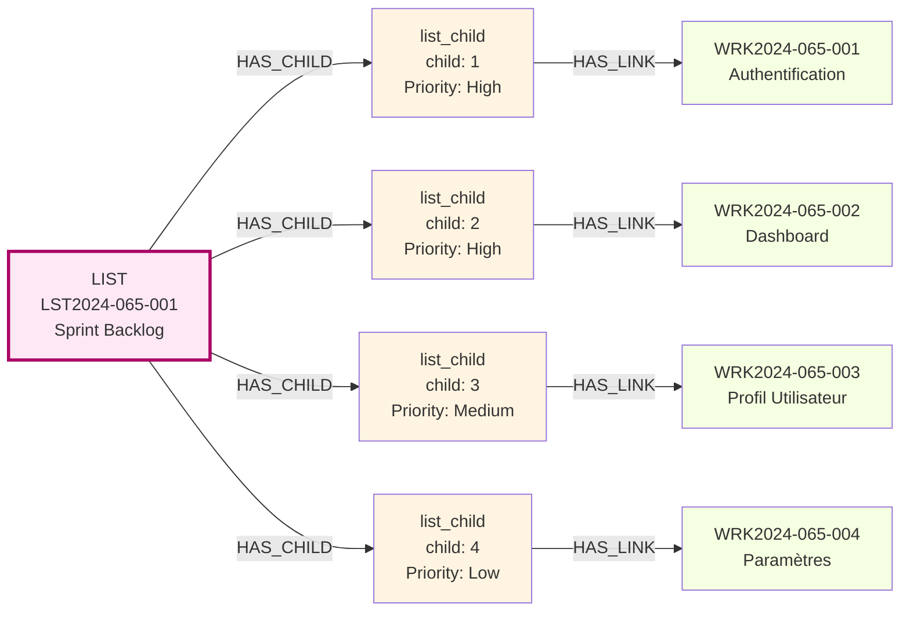

#### Métadonnées de Liste

| Métadonnée | Type | Description |
|------------|------|-------------|
| `type` | `string` | Type d'entité pouvant être lié (ex: "work", "test_case") |
| `children` | `Map<number, entity>` | Map des enfants (index → entité) |
| `views` | `object` | Configuration des vues d'affichage |
| `default` | `boolean` | Indique si c'est la liste par défaut pour ce type dans le projet |

### Comparaison Structure vs Liste

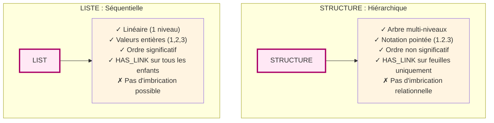

| Aspect | STRUCTURE | LISTE |
|--------|-----------|-------|
| **Organisation** | Hiérarchique (arbre) | Séquentielle (linéaire) |
| **Ordre** | Non significatif | Significatif |
| **Imbrication** | Plusieurs niveaux (via `child`) | Un seul niveau |
| **Propriété `child`** | Notation pointée : `"1"`, `"1.2"`, `"1.2.3"` | Entier : `1`, `2`, `3`, `42` |
| **HAS_LINK** | Feuilles uniquement | Tous les `list_child` |
| **Use case** | Taxonomie, regroupement thématique | Workflow, checklist, priorités |
| **Exemple** | Organisation par domaine fonctionnel | Sprint backlog, étapes processus |

---

## Architecture Multi-Projets

Le modèle VNV supporte une **architecture multi-projets** permettant de créer des vues consolidées transcendant les frontières d'un projet unique.

### Principe Fondamental : HAS_LINK Inter-Projets

**Règle clé :** `HAS_LINK` est la **SEULE** relation pouvant traverser les frontières de projet.

```/dev/null/inter-project-rules.txt#L1-15
┌──────────────────────────────────────────────────────┐
│  Règles des Relations Inter-Projets                  │
├──────────────────────────────────────────────────────┤
│  ✅ HAS_LINK peut traverser les projets              │
│  ❌ HAS_{TYPE} reste intra-projet                    │
│  ❌ IS_FOR reste intra-projet                        │
├──────────────────────────────────────────────────────┤
│  Exemple VALIDE :                                    │
│    PROJECT_0 → LIST → list_child → HAS_LINK → PR2024│
│                                                      │
│  Exemple INVALIDE :                                  │
│    PR2024-001 → HAS_REQUIREMENT → REQ2024-002-001   │
│                 (entité d'un autre projet)           │
└──────────────────────────────────────────────────────┘
```

### Pattern PROJECT_0 : Méta-Projet Racine

Le **`project_0`** représente l'**organisation globale**. Tous les autres projets sont conceptuellement des "sous-projets".

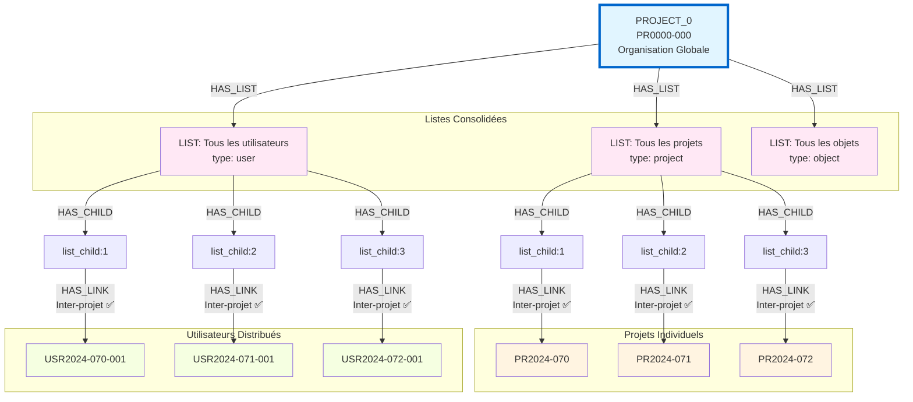

### Types de Vues Consolidées

| Type de liste | Type d'entités liées | Usage |
|---------------|---------------------|-------|
| `type="project"` | Projets d'autres projects | Portfolio global, programmes |
| `type="user"` | Utilisateurs distribués | Annuaire global, organigramme |
| `type="object"` | Objets de plusieurs projets | Catalogue de produits/systèmes |
| `type="processus"` | Processus partagés | Référentiel de workflows |

### Cas d'Usage : Portfolio Management

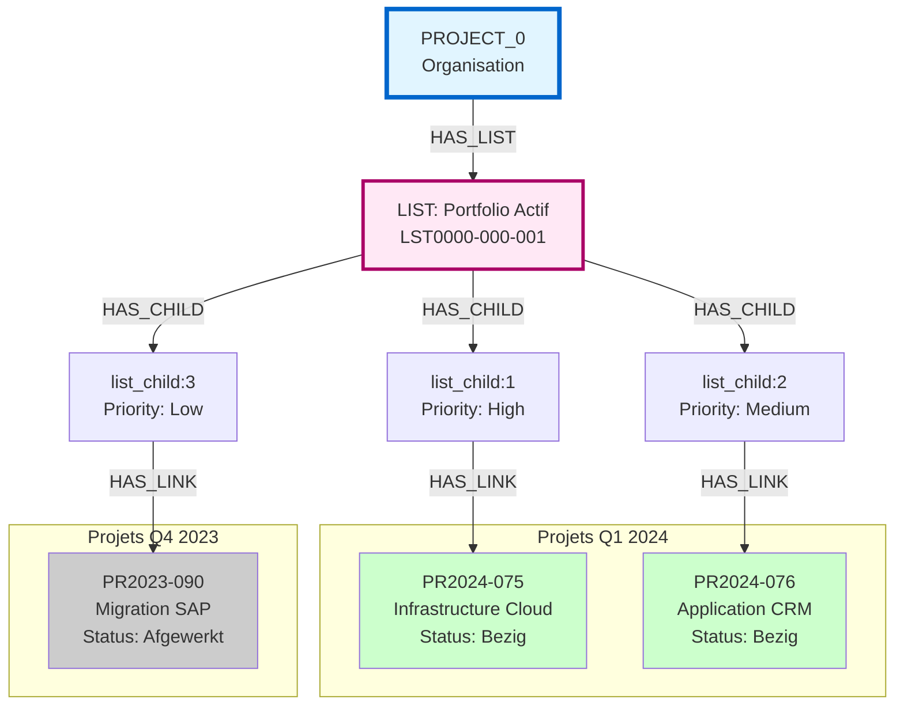

### Cas d'Usage : Structure Multi-Projets par Domaine

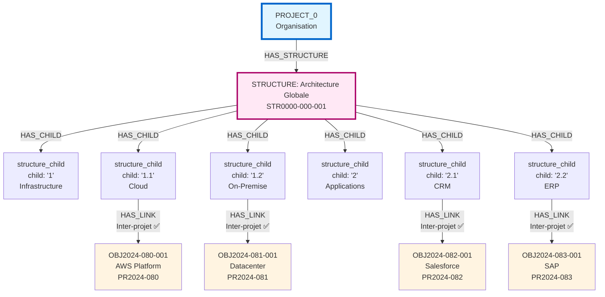

### Avantages de l'Architecture Multi-Projets

**1. Perspectives Multiples**
- Vue consolidée au niveau organisation
- Vue détaillée au niveau projet
- Flexibilité d'analyse et de reporting

**2. Séparation Logique Maintenue**
- Chaque projet garde son autonomie
- Relations `HAS_{TYPE}` et `IS_FOR` restent intra-projet
- Pas de couplage fort entre projets

**3. Gestion Centralisée**
- Portfolio management depuis `project_0`
- Annuaire global des utilisateurs
- Catalogue de produits/systèmes
- Référentiel de processus partagés

**4. Évolutivité**
- Ajout de nouveaux projets sans impact
- Création de nouvelles vues consolidées
- Réorganisation flexible via stacks

---

## Cas Particulier : Test Run

Le **`test_run`** présente une structure unique dans le modèle : c'est la **seule entité connectée simultanément à deux listes**.

### Structure du Modèle Test Run

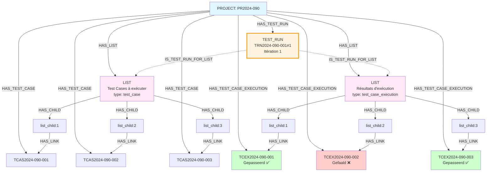

### Notation d'Itération dans le Token

Le token du `test_run` inclut une **notation d'itération** : `#1`, `#2`, `#3`, etc.

```/dev/null/test-run-token.txt#L1-15
┌──────────────────────────────────────────────────────┐
│  Format Token Test Run                               │
├──────────────────────────────────────────────────────┤
│  TRN[YEAR]-[PROJECT]-[ITEM]#[ITERATION]              │
├──────────────────────────────────────────────────────┤
│  TRN2024-090-001#1    → Itération 1                  │
│  TRN2024-090-001#2    → Itération 2                  │
│  TRN2024-090-001#3    → Itération 3                  │
├──────────────────────────────────────────────────────┤
│  Chaque itération = nouveau test_run distinct        │
│  Chaque test_run = ses propres listes                │
│  Permet la représentation de cycles itératifs        │
└──────────────────────────────────────────────────────┘
```

### Pattern Itératif : Re-Run des Échecs

Le modèle supporte la représentation de **cycles itératifs** où seuls les tests échoués sont ré-exécutés.

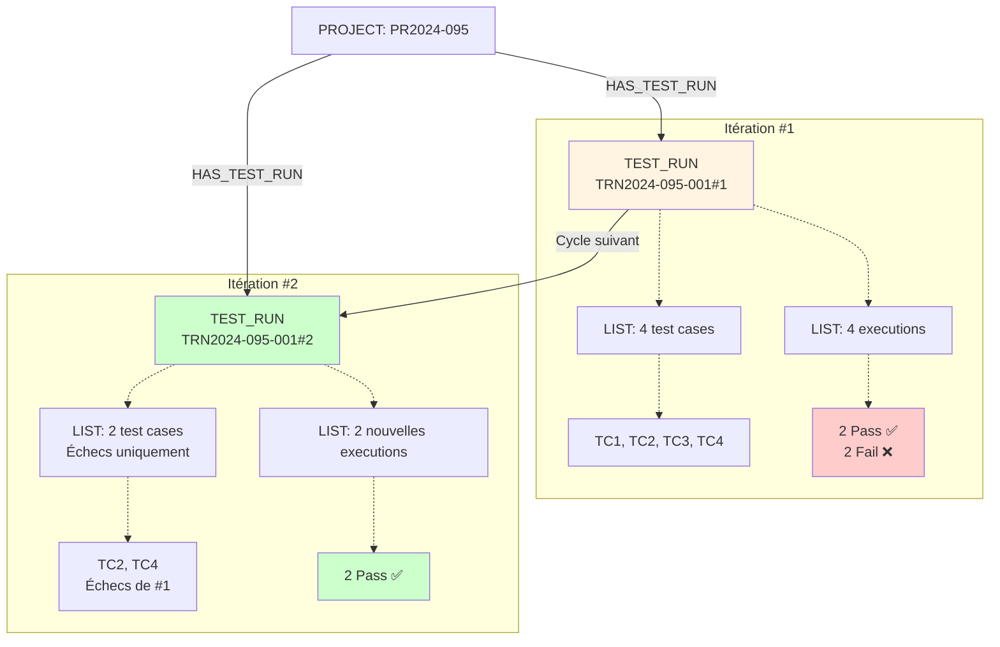

### Principes du Pattern Itératif

**1. Notation Séquentielle**
- `#1`, `#2`, `#3` dans le token du `test_run`
- Identifie l'itération du cycle de test

**2. Nouveaux Test Run**
- Chaque itération = nouveau `test_run` distinct
- Entité séparée dans le graphe

**3. Listes Indépendantes**
- Chaque `test_run` possède ses propres listes
- Liste de `test_case` (input)
- Liste de `test_case_execution` (output)

**4. Réduction Progressive**
- Les listes peuvent contenir des sous-ensembles
- Itération suivante = tests échoués uniquement
- Convergence vers zéro échec

**5. Nouveaux Résultats**
- Chaque itération crée de nouvelles `test_case_execution`
- Les anciennes exécutions sont conservées
- Traçabilité complète du cycle

---

## Exemples de Modèles Complets

### Exemple 1 : Projet de Validation avec Traçabilité

```mermaid
graph TB
    P[PROJECT: PR2024-100<br/>Système de Gestion Documentaire]
    
    subgraph "Exigences"
        R1[REQ2024-100-001<br/>Upload Documents]
        R2[REQ2024-100-002<br/>Versioning]
        R3[REQ2024-100-003<br/>Recherche]
    end
    
    subgraph "Travaux"
        W1[WRK2024-100-001<br/>Dev Upload]
        W2[WRK2024-100-002<br/>Dev Versioning]
        W3[WRK2024-100-003<br/>Dev Search]
    end
    
    subgraph "Tests"
        TC1[TCAS2024-100-001<br/>Test Upload]
        TC2[TCAS2024-100-002<br/>Test Versioning]
        TC3[TCAS2024-100-003<br/>Test Search]
        
        TCEX1[TCEX2024-100-001<br/>Gepasseerd ✅]
        TCEX2[TCEX2024-100-002<br/>Gepasseerd ✅]
        TCEX3[TCEX2024-100-003<br/>Gefaald ❌]
    end
    
    subgraph "Fichiers"
        F1[FIL2024-100-001<br/>spec-upload.pdf]
        F2[FIL2024-100-002<br/>test-report.pdf]
        F3[FIL2024-100-003<br/>screenshot-error.png]
    end
    
    P -->|HAS_REQUIREMENT| R1
    P -->|HAS_REQUIREMENT| R2
    P -->|HAS_REQUIREMENT| R3
    P -->|HAS_WORK| W1
    P -->|HAS_WORK| W2
    P -->|HAS_WORK| W3
    P -->|HAS_TEST_CASE| TC1
    P -->|HAS_TEST_CASE| TC2
    P -->|HAS_TEST_CASE| TC3
    P -->|HAS_TEST_CASE_EXECUTION| TCEX1
    P -->|HAS_TEST_CASE_EXECUTION| TCEX2
    P -->|HAS_TEST_CASE_EXECUTION| TCEX3
    P -->|HAS_FILE| F1
    P -->|HAS_FILE| F2
    P -->|HAS_FILE| F3
    
    W1 -.->|IS_WORK_FOR_REQUIREMENT| R1
    W2 -.->|IS_WORK_FOR_REQUIREMENT| R2
    W3 -.->|IS_WORK_FOR_REQUIREMENT| R3
    
    TC1 -.->|IS_TEST_CASE_FOR_REQUIREMENT| R1
    TC2 -.->|IS_TEST_CASE_FOR_REQUIREMENT| R2
    TC3 -.->|IS_TEST_CASE_FOR_REQUIREMENT| R3
    
    TCEX1 -.->|IS_TEST_CASE_EXECUTION_FOR_CASE| TC1
    TCEX2 -.->|IS_TEST_CASE_EXECUTION_FOR_CASE| TC2
    TCEX3 -.->|IS_TEST_CASE_EXECUTION_FOR_CASE| TC3
    
    R1 -.->|IS_REQUIREMENT_FOR_FILE| F1
    TCEX2 -.->|IS_TEST_CASE_EXECUTION_FOR_FILE| F2
    TCEX3 -.->|IS_TEST_CASE_EXECUTION_FOR_FILE| F3
    
    style P fill:#e1f5ff,stroke:#0066cc,stroke-width:3px
    style R1 fill:#fff4e1
    style R2 fill:#fff4e1
    style R3 fill:#fff4e1
    style W1 fill:#f5ffe1
    style W2 fill:#f5ffe1
    style W3 fill:#f5ffe1
    style TCEX1 fill:#ccffcc
    style TCEX2 fill:#ccffcc
    style TCEX3 fill:#ffcccc
```

### Exemple 2 : Structure + Liste sur Même Projet

```mermaid
graph TB
    P[PROJECT: PR2024-105<br/>Application Métier]
    
    subgraph "Organisation Hiérarchique"
        STR[STRUCTURE<br/>STR2024-105-001<br/>Par Domaine Fonctionnel]
        
        SC1["structure_child<br/>child: '1'<br/>Frontend"]
        SC2["structure_child<br/>child: '2'<br/>Backend"]
        SC3["structure_child<br/>child: '3'<br/>Database"]
    end
    
    subgraph "Organisation Séquentielle"
        LST[LIST<br/>LST2024-105-001<br/>Sprint 1 Backlog]
        
        LC1[list_child: 1<br/>High Priority]
        LC2[list_child: 2<br/>Medium Priority]
        LC3[list_child: 3<br/>Low Priority]
    end
    
    subgraph "Entités"
        W1[WRK2024-105-001<br/>UI Design]
        W2[WRK2024-105-002<br/>API REST]
        W3[WRK2024-105-003<br/>DB Schema]
    end
    
    P -->|HAS_STRUCTURE| STR
    P -->|HAS_LIST| LST
    P -->|HAS_WORK| W1
    P -->|HAS_WORK| W2
    P -->|HAS_WORK| W3
    
    STR -->|HAS_CHILD| SC1
    STR -->|HAS_CHILD| SC2
    STR -->|HAS_CHILD| SC3
    
    SC1 -->|HAS_LINK| W1
    SC2 -->|HAS_LINK| W2
    SC3 -->|HAS_LINK| W3
    
    LST -->|HAS_CHILD| LC1
    LST -->|HAS_CHILD| LC2
    LST -->|HAS_CHILD| LC3
    
    LC1 -->|HAS_LINK| W1
    LC2 -->|HAS_LINK| W2
    LC3 -->|HAS_LINK| W3
    
    style P fill:#e1f5ff,stroke:#0066cc,stroke-width:3px
    style STR fill:#ffe8f5
    style LST fill:#ffe8f5
    style W1 fill:#f5ffe1
    style W2 fill:#f5ffe1
    style W3 fill:#f5ffe1
```

### Exemple 3 : Chaîne Order → Deliverable → Work

```mermaid
graph TB
    P[PROJECT: PR2024-110]
    
    PO[ORDER: PO2024-110-001<br/>Commande Q2 2024<br/>Budget: 150k€]
    
    D1[DELIVERABLE: DEL2024-110-001<br/>Frontend Application<br/>Estimé: 60k€]
    D2[DELIVERABLE: DEL2024-110-002<br/>Backend API<br/>Estimé: 50k€]
    D3[DELIVERABLE: DEL2024-110-003<br/>Documentation<br/>Estimé: 10k€]
    
    W1[WRK2024-110-001<br/>UI/UX Design<br/>20k€]
    W2[WRK2024-110-002<br/>Dev React<br/>40k€]
    W3[WRK2024-110-003<br/>API REST<br/>30k€]
    W4[WRK2024-110-004<br/>Database<br/>20k€]
    W5[WRK2024-110-005<br/>User Guide<br/>10k€]
    
    I[INVOICE: INV2024-110-001<br/>Facturation Q2]
    
    P -->|HAS_ORDER| PO
    P -->|HAS_DELIVERABLE| D1
    P -->|HAS_DELIVERABLE| D2
    P -->|HAS_DELIVERABLE| D3
    P -->|HAS_WORK| W1
    P -->|HAS_WORK| W2
    P -->|HAS_WORK| W3
    P -->|HAS_WORK| W4
    P -->|HAS_WORK| W5
    P -->|HAS_INVOICE| I
    
    PO -.->|IS_ORDER_FOR_DELIVERABLE| D1
    PO -.->|IS_ORDER_FOR_DELIVERABLE| D2
    PO -.->|IS_ORDER_FOR_DELIVERABLE| D3
    
    D1 -.->|IS_DELIVERABLE_FOR_WORK| W1
    D1 -.->|IS_DELIVERABLE_FOR_WORK| W2
    D2 -.->|IS_DELIVERABLE_FOR_WORK| W3
    D2 -.->|IS_DELIVERABLE_FOR_WORK| W4
    D3 -.->|IS_DELIVERABLE_FOR_WORK| W5
    
    PO -.->|IS_ORDER_FOR_INVOICE| I
    
    style P fill:#e1f5ff,stroke:#0066cc,stroke-width:3px
    style PO fill:#fff4e1
    style D1 fill:#ffffcc
    style D2 fill:#ffffcc
    style D3 fill:#ffffcc
    style W1 fill:#f5ffe1
    style W2 fill:#f5ffe1
    style W3 fill:#f5ffe1
    style W4 fill:#f5ffe1
    style W5 fill:#f5ffe1
    style I fill:#ffcccc
```

---

## États (Status) par Type d'Entité

Chaque type d'entité possède des **valeurs de status spécifiques** adaptées à son cycle de vie.

### Projets

```/dev/null/status-project.txt#L1-10
project:
  • Niet gestart     (Non démarré)
  • Bezig            (En cours)
  • Geblokkeerd      (Bloqué)
  • Geannuleerd      (Annulé)
  • Afgewerkt        (Terminé)
```

### Objets et Tests

```/dev/null/status-object-test.txt#L1-10
object, test_project, test_build, test_plan, test_suite:
  • Finaal           (Final)
  • Niet Finaal      (Non final)
```

### Livrables et Matériel

```/dev/null/status-deliverable-material.txt#L1-10
deliverable:
  • Gealloceerd      (Alloué)
  • Niet gealloceerd (Non alloué)

material:
  • Aangekocht       (Acheté)
  • Niet aangekocht  (Non acheté)
```

### Exigences

```/dev/null/status-requirement.txt#L1-5
requirement:
  • SMART            (Spécifique, Mesurable, Atteignable, Réaliste, Temporellement défini)
  • Niet SMART       (Non SMART)
```

### Cas de Test

```/dev/null/status-test-case.txt#L1-5
test_case:
  • Revisie          (En révision)
  • Klaar voor test  (Prêt pour test)
```

### Exécutions de Test

```/dev/null/status-test-execution.txt#L1-6
test_case_execution:
  • Niet uitgevoerd  (Non exécuté)
  • Gepasseerd       (Réussi) ✅
  • Gefaald          (Échoué) ❌
```

### Runs de Test

```/dev/null/status-test-run.txt#L1-6
test_run:
  • Niet uitgevoerd  (Non exécuté)
  • Uitgevoerd       (Exécuté)
  • Deels uitgevoerd (Partiellement exécuté)
```

### Factures

```/dev/null/status-invoice.txt#L1-10
invoice (cycle de facturation):
  • Vorderstaat opgemaakt       (État d'avancement créé)
  • Vorderstaat goedgekeurd     (État d'avancement approuvé)
  • Factuur opgemaakt           (Facture créée)
  • Factuur goedgekeurd         (Facture approuvée)
  • Factuur betaald             (Facture payée)
```

---

## Glossaire

| Terme | Définition |
|-------|------------|
| **Node** | Entité de base du modèle d'information (nœud du graphe) |
| **Entity** | Synonyme de Node, élément fondamental du modèle |
| **Token** | Identifiant unique hiérarchique d'une entité (ex: `REQ2024-008-042`) |
| **Metadata** | Propriété attachée à une entité pour stocker des informations supplémentaires |
| **Stack** | Conteneur pour créer des regroupements d'entités (Structure ou Liste) |
| **Structure** | Stack hiérarchique non ordonné (arbre) |
| **Liste** | Stack séquentiel ordonné (linéaire) |
| **Child** | Élément enfant d'un stack (`structure_child` ou `list_child`) |
| **HAS_{TYPE}** | Relation d'appartenance du projet vers une entité |
| **IS_FOR** | Relation logique/associative entre entités |
| **HAS_CHILD** | Relation d'un stack vers ses enfants |
| **HAS_LINK** | Relation d'un child vers une entité cible (inter-projets possible) |
| **RAT** | Requirements Analysis Tool - Outil d'analyse de qualité des exigences |
| **PROJECT_0** | Méta-projet racine représentant l'organisation globale |
| **Fragment** | Classe TypeScript représentant un type d'entité (implémentation) |
| **VPI** | Validation Process Infrastructure - Infrastructure du processus de validation |
| **Notation pointée** | Format de `child` pour structures : `"1"`, `"1.2"`, `"1.2.3"` |
| **Feuille** | `structure_child` terminal sans enfants (seul autorisé pour `HAS_LINK`) |
| **Itération** | Instance d'un `test_run` identifiée par `#N` dans le token |

---

## Principes de Conception du Modèle

### 1. Séparation des Préoccupations

Le modèle distingue clairement :
- **Appartenance** (HAS_{TYPE}) : encodée dans le token et les relations depuis PROJECT
- **Structure logique** (IS_FOR) : associations conceptuelles entre entités
- **Organisation** (Stacks) : vues alternatives flexibles

### 2. Flexibilité Organisationnelle

Les stacks permettent de créer **plusieurs vues** sur les mêmes entités sans modifier la structure du projet.

### 3. Traçabilité Totale

Chaque entité :
- Possède un token unique révélant son appartenance
- Est horodatée (create_dt, update_dt)
- Peut avoir des références externes vers 6 plateformes

### 4. Évolutivité

- Ajout de nouveaux types d'entités sans impact
- Extension du système de métadonnées
- Support de l'architecture multi-projets
- Création de vues consolidées à volonté

### 5. Intégrité Référentielle

- Relations typées avec origine et destination strictes
- Encodage de la hiérarchie dans les tokens
- Règles claires pour les relations inter-projets

---

## Conclusion

Le **VNV Information Model** offre une architecture robuste et flexible pour structurer, organiser et relier l'information projet dans un contexte de validation et vérification.

**Points clés à retenir :**

1. **Entités** : Plus de 30 types organisés en 6 domaines fonctionnels
2. **Token hiérarchique** : Identifiant unique encodant l'appartenance projet
3. **3 catégories de relations** : HAS_{TYPE} (appartenance), IS_FOR (logique), HAS_CHILD/HAS_LINK (organisation)
4. **Stacks** : Structures (hiérarchiques) et Listes (séquentielles) pour vues alternatives
5. **Métadonnées** : Plus de 70 propriétés configurables en 10 familles
6. **Multi-projets** : Architecture via PROJECT_0 et HAS_LINK inter-projets
7. **Test Run** : Pattern unique à double liste avec itérations

Ce modèle constitue la **fondation conceptuelle** du système VNV, permettant une gestion complète et traçable du cycle de vie de validation des projets.
