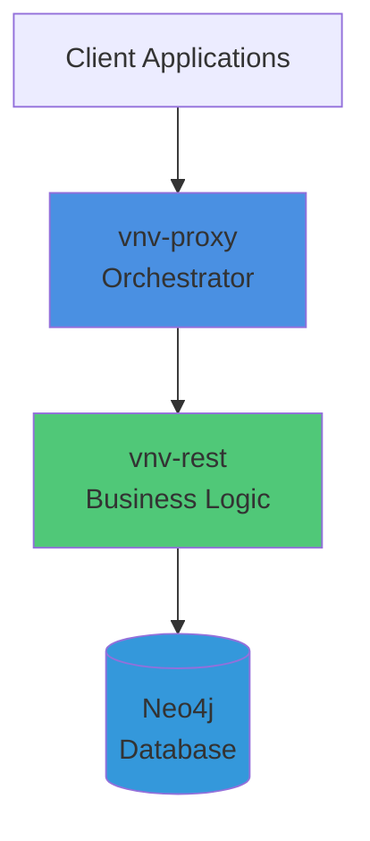

# Introduction

Welcome to the VNV (Validation & Verification) documentation. This system provides a comprehensive platform for project and document management with robust validation and transformation capabilities.

## What is VNV?

VNV is a distributed system designed to manage complex projects with interconnected data, documents, and workflows. It provides:

- **Data Validation**: Multi-level validation processes for Excel, JSON, and ZIP formats
- **Transformation Pipeline**: Bidirectional conversion between different data formats
- **Session Management**: Elastic Session System (ESS) for isolated work sessions
- **Cloud Infrastructure**: Scalable AWS-based architecture with high availability
- **Integration**: Seamless integration with Microsoft 365 services

## Key Components

### Backend Services
- **vnv-rest**: Business logic and Neo4j database interaction
- **vnv-proxy**: Central orchestrator and ESS manager
- **vnv-pnp**: Microsoft services integration
- **vnv-event-bridge**: External events handler

### Data Layer
- **Neo4j**: Graph database for business entities
- **Redis**: Cache and orchestration
- **Minio/S3**: Object storage

### SDK
- **vnv-sdk**: Shared library for business logic and data models

## Getting Started

To get started with VNV:

1. **Read the [Infrastructure](./infrastructure.md)** documentation to understand the system architecture
2. **Explore the [Guides](./guides/)** for step-by-step tutorials
3. **Check the [Packages](./packages/)** documentation for SDK usage

## Data Formats

VNV supports multiple data formats:

- **Excel (.xlsx)**: User-friendly format for initial import
- **JSON Dataset**: Intermediate pivot format
- **JSON VPI**: Database-optimized format
- **ZIP ESS**: Complete session archives

For detailed information about data formats and validation, see the [Validation Procedures](/blog/validation-procedures/) guide.

## Architecture Overview

The VNV system follows a microservices architecture deployed on AWS:

## Next Steps

- **[Infrastructure →](./infrastructure.md)**: Learn about the system architecture
- **[Guides →](./guides/)**: Follow step-by-step tutorials
- **[Packages →](./packages/)**: Explore the SDK documentation
- **[Validation Procedures →](/blog/validation-procedures/)**: Understand data validation

## Support

For questions and support:
- Check our [GitHub repository](https://github.com/thuliteio/doks)
- Use the [Data Validator](http://vnv-databuild-helper.s3-website.eu-central-1.amazonaws.com/) tool
- Access the [CLI Editor](http://vnv-cli-scf-ui.s3-website.eu-central-1.amazonaws.com/)